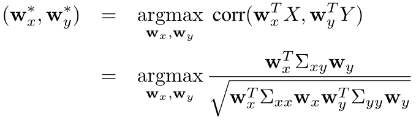

# Deep Correlation for Matching Images and Text

## 一、Introduction

在本文中，我们提出了一种基于深度典型相关分析(DCCA)的端到端学习方案。

## 二、深度典型相关性分析

典型相关性分析(CCA)及其核心版本(KCCA)使隐藏空间中的相关性最大。

DCCA使用了这样一种见解：通过优化矩阵跟踪范数，可以最大化CCA中寻求的总相关性，并且可以计算跟踪范数相对于两种模态特征的梯度。这允许在深层神经网络中向下传播梯度，实现端到端学习。

在[1]中，DCCA在中等规模的问题上进行评估，并根据在学习的潜在空间中获得的总相关性进行评估，如本文所述，这并不是实际应用的最终目标。在将DCCA应用于特征高出两个数量级的问题并实现改进的匹配性能之前，必须解决各种问题，例如时间复杂度、内存复杂度和过度拟合。

## 三、用于图像和文本匹配的深度相关性

### 3.1 网络架构

> 用于图像特征提取网络为深度卷积神经网络(DCNN)。
>
> 文本分支由n个堆叠的三元组组成，三元组分别是全连接（FC）层、ReLU层和Dropout层。 

在CCA中获得的总相关性等于矩阵迹范数（matrix trace norm）。在迹范数目标（TNO）层中 ，计算迹范数相对于X和Y的梯度，并向后传播。$X\in R^{d_x\times m}$是FC8的输出，$Y\in R^{d_y \times m}$是Dropoutn’层的输出。$d_x和d_y$是维度，m是批量大小。 

### 3.2 Trace norm objective

给定两组m个随机向量$X\in R^{d_x\times m}$和$Y\in R^{d_y\times m}$，使它们的协方差分别为$\sum_{xx}$和$\sum_{yy}$，互协方差为$\sum_{xy}$。CCA要寻找成对的线性投影，最大化两个模态的相关性。

由于目标对$W_x$和$W_y$的缩放不变性，因此投影被限制为单位方差。

> 联合表示：往往学习到共有语义，倾向于在忽略模态特定信息的同时保留模态间的共享语义，因此不能自动保证互补性。
>
> 协同表示：在某些约束条件下学习每个模态的分离但协调的表示。由于不同模态中包含的信息是不平等的，**学习分离表示有助于保持独有的、有用的模态特定特征**。

# Adversarial Cross-Modal Retrieval

## 一、Introduction

跨模态检索旨在实现跨不同模态（例如文本与图像）的灵活检索。**跨模态检索研究的核心是学习一个公共子空间，在这个子空间中，不同模态的项可以直接相互比较。**本文提出了一种新的对抗性跨模式检索（ACMR）方法，该方法基于对抗性学习寻找有效的公共子空间。

对抗性学习是两个过程之间的相互作用。第一个过程是特征投影，试图在公共子空间中生成模态不变的表示，并混淆另一个过程（模态分类器），后者试图根据生成的表示来区分不同的模态。我们进一步对特征投影器施加三重约束，以最小化具有相同语义标签的不同模式中所有项目的表示之间的差距，同时最大化语义不同的图像和文本之间的距离。

由于不同语态的特征通常具有不一致的分布和表示，因此需要弥合语态差异，即需要找到方法来评估不同语态项的语义相似性。弥合模态鸿沟的一种常见方法是表示学习。

现有的基于DNN的跨模态检索模型通常只关注保持耦合的跨模态项的成对相似性，这些项共享语义标签，并作为模型学习过程中的输入。然而，对于一个模态中的一个项目，同一模态中可能存在多个语义上不同的项目，因此只关注成对耦合的项目远远不够。因此，以这种方式学习的通用表示无法完全保留数据中潜在的跨模态语义结构。**要保持这种结构，就需要将不同模态中具有相同语义标签的所有项目的表示之间的差距最小化**（例如，将同一主题的任何文本和任何图像链接在一起），**而同一模态的语义不同项之间的距离最大化**（例如，如果两个图像或两个文本不相关，则将它们彼此分离）。 

## 二、方法

### 2.1 问题描述

假设有n个图像-文本对实例集合，表示为$O=\{o_i\}_{i=1}^n,o_i=(v_i,t_i),v_i\in R^{d_v},t\in R^{d_t}$，另外，为每一个$o_i$分配一个语义标签向量$y_i=[y_{i1},y_{i2},…,y_{ic}]\in R^c$，c是总语义类数。

如果第i个实例属于第j个语义类，则$y_{ij}=1$，否则$y_{ij}=0$。注意，$o_i$可以属于一个语义类别，但也可以属于多个语义类别。

由于图像特征V和文本特征T通常具有不同的统计特性，并且遵循未知（复杂）分布，因此无法直接相互比较以进行跨模态检索。

我们希望找到一个公共子空间S，$S_V=f_V(V;\theta_V),S_T=f_T(T;\theta_T)$。

$S_V,S_T$分别是图像和文本在S中的特征变换。**我们希望$S_V,S_T$具有模态不变性和语义区分性。**

### 2.2 对抗式跨模态检索

1. 为了简单起见，我们假设已经分别从图像和文本中提取了特征V和T。图像和文本特征首先通过各自的变换$f_V$和$f_T$。**考虑到图像和文本模态之间存在较大的统计特性，全连接层具有丰富的参数，以确保足够的表示能力。** 

2. 然后，在第二步中，引入特征投射和模态分类两个过程之间的极小极大博弈来指导表征学习。

### 2.3 模态分类器

定义一个模态分类器D，参数为$\theta_D$，充当鉴别器。来自图像的投影特征标签为01，来自文本的投影特征标签为10。

对于模态分类器，目标是在给定未知特征投影的情况下尽可能可靠地检测项目的模态。

对于分类器的实现，我们使用了一个参数为$\theta_D$的三层前馈神经网络 。（f—>50—>2）

在ACDM方法中，模态分类器充当对手。因此，我们将该过程试图最小化的分类损失称为对抗性损失。对抗性损失$L_{adv}$现在可以定义为：
$$
L_{adv}(\theta_D)=-\frac{1}{n}\sum_{i=1}^n(m_i.(logD(v_i;\theta_D)+log(1-D(t_i;\theta_D))))
$$

> $m_i$是标签真值，独热编码。

### 2.4 特征投影器

相关性损失的唯一目标是将语义耦合的跨模态项组成的单一对的相关性保留在新的表示子空间中。**正如本文前面已经讨论过的，这并不充分，因为语义匹配可能涉及两个以上的项。此外，相关损失也无法区分同一模态中语义不同的项。**这会导致特征表示的区分性不足，并会限制跨模式检索的性能。

鉴于上述情况，我们建议将特征投影建模为两个步骤的组合：**标签预测和结构保持**。特征投影体现了文本和图像的模态不变嵌入到公共子空间的过程。

1. 标签预测：使得在给定语义标签的情况下，公共子空间中每个模态的投影特征表示具有区分性。

2. 结构保留：确保了属于同一语义标签的特征表示在不同的模态中是不变的。

#### 2.4.1 标签预测

为了保证特征投影后数据中的模态识别得到保留，使用分类器预测公共子空间中投影项的语义标签。 该分类器将耦合图像和文本实例$o_i$的投影特征作为训练数据，并生成每项语义类别的概率分布作为输出。 
$$
L_{imd}(\theta_{imd})=-\frac{1}{n}\sum_{i=1}^n(y_i.(log_\hat p(v_i)+log_\hat {p_i}(t_i)))
$$

#### 2.4.2 结构保持

为了确保模态间不变性的保持，**我们的目标是最小化不同模态中所有语义相似项的表示之间的差异，同时最大化相同模态中语义不同项之间的距离。**受基于排名的跨媒体检索方法[33,39]的启发，我们通过为此目的制定的三重损失项对嵌入过程实施三重约束。

1. 首先，从图像和文本样本的角度，将来自不同模式但具有相同标签的所有样本构建为耦合样本。

2. 其次，每个耦合项对的映射表示$f_V(V;\theta_V)和f_T(T;\theta_T)$之间的所有距离都使用l2范式：
   $$
   l_2(v,t)=||f_V(v;\theta_V)-f_T(t;\theta_T)||_2
   $$

3. 我们还从具有不同语义标签的不匹配图像-文本对中选择负样本来构建三元组集。

   标签：$\{(v_i,t_i^+,t_j^-)\}$，$\{(t_i,v_i^+,v_j^-)\}$

4. 最后，我们使用以下表达式，以样本集$\{(v_i,t_i^+,t_j^-)\}$，$\{(t_i,v_i^+,v_j^-)\}$作为输入，计算图像和文本模式之间的模式间不变性损失：

$$
L_{imi,V}(\theta_V)=\sum_{i,j,k}(l_2(v_i,t_j^+)+\gamma.max(0,\mu-l_2(v_i,t_k^-)))\\
L_{imi,T}(\theta_T)=\sum_{i,j,k}(l_2(t_i,v_j^+)+\gamma.max(0,\mu-l_2(t_i,v_k^-)))\\
L_{imi}(\theta_V,\theta_T)=L_{imi,V}(\theta_V)+L_{imi,T}(\theta_T)
$$
