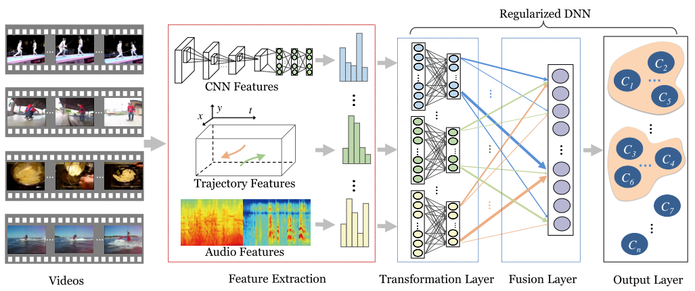

# Exploiting Feature and Class Relationships in Video Categorization with Regularized Deep Neural Networks

## 一、Introduction

**为了得到一种能够弥合语义间隔的融合表示，多个特征的融合过程通常需要学习交叉特征之间的相关性。除了特征关系之外，多个高级语义类别之间也存在一定的相关性：知道一个类别的存在可能会为识别其他相关类别提供有用的线索。**例如，包含“跑步”（“跳水”）的视频片段的高分将增加（降低）包含“足球”的视频的可信度。

本文提出了一种新的统一框架，该框架使用DNN联合学习特征关系和类关系。

1. 我们首先提取了几种常用的视频特征，包括由卷积神经网络（CNN）计算的基于帧的特征、基于轨迹的运动描述符和音频描述符。
2. 然后将特征用作DNN的输入，其中前两层分别为输入层和特征转换层，第三层称为融合层，我们对网络权重进行正则化，以识别和利用特征关系。 

3. 第三层称为融合层，我们对网络权重进行正则化，以识别和利用特征关系。 

正则化项的选择基于特征间关系的两个自然属性：相关性和多样性。 前者意味着不同的特征可能在位于原始特征和高级语义之间的中间层表示中共享一些模式 。后者强调了不同特征的独特性，这些特征是可能有助于识别视频语义的补充信息。通过使用特征相关矩阵对这两个属性进行建模，我们对网络权重进行跟踪范数正则化，以揭示特征的隐藏相关性和多样性。

