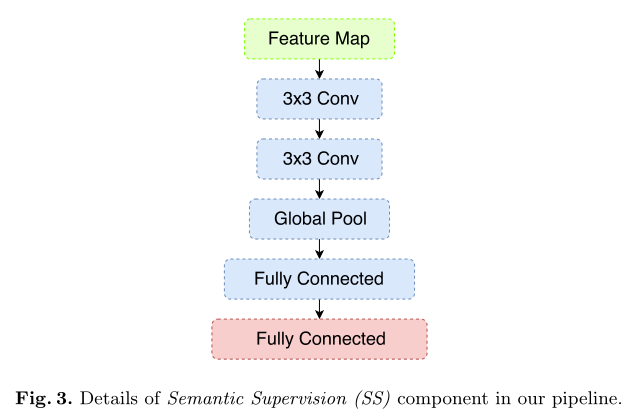

# ExFuse: Enhancing Feature Fusion for Semantic Segmentation

## Introduction

​		大多数最先进的语义分割框架遵循完全卷积网络（FCN）[25]的设计。FCN具有典型的编码器-解码器结构——首先通过编码器将语义信息嵌入到特征映射中，然后解码器负责生成分割结果。通常情况下，编码器是预训练的卷积模型，用于提取图像特征，解码器包含多个上采样组件以恢复分辨率。虽然编码器最顶层的特征图可能具有高度语义，但由于分辨率不足，其在分割图中重建精确细节的能力受到限制，这在现代主干模型中非常常见。为了解决这个问题，提出了一种“U-Net”架构[28]，并在最近的许多工作中采用。**U-Net的核心思想是将顶层的高层次低分辨率特征与底层的低层次高分辨率特征逐渐融合，这将有助于解码器生成高分辨率语义结果。** 

​		尽管U-Net取得了巨大的成功，但其工作机制仍然未知，值得进一步研究。低层次特征和高层次特征在本质上是互补的，低层次特征具有丰富的空间细节，但缺乏语义信息，反之亦然。考虑极端情况下，“纯”低级特征只编码低级概念，如点、线或边。直观地说，**高级特征与此类“纯”低级特征的融合帮助不大，因为低级特征太过嘈杂，无法提供足够的高分辨率语义指导**。相比之下，如果低级特征包含更多语义信息，例如，编码相对清晰的语义边界，那么融合就变得容易了——通过将高级特征映射与边界对齐，可以获得精细的分割结果。类似地，**空间信息很少的“纯”高级特征无法充分利用低级特征**；然而，随着其他高分辨率特征的嵌入，高级别特征可能有机会通过对齐最近的低级别边界来自我完善。图1说明了上述概念。从经验上看，低层和高层特征之间的语义和分辨率重叠对特征融合的有效性起着重要作用。换句话说，特征融合可以通过在低层特征中引入更多语义概念或在高层特征中嵌入更多空间信息来增强。

图 1

> **语义信息**
>
> 图像的语义分为视觉层、对象层和概念层。
>
> 视觉层即通常所理解的底层，即颜色、纹理和形状等等，这些特征都被称为底层语义特征；
>
> 对象层即中间层，通常包含了属性特征等，就是某一对象在某一时刻的状态；
>
> 概念层是高层，是图像表达出的最接近人类理解的东西。
>
> 通俗点说，比如一张图上有沙子，蓝天，海水等，视觉层是一块块的区分，对象层是沙子、蓝天和海水这些，概念层就是海滩，这是这张图表现出的语义。

​		基于上述观察，我们建议通过弥合低层和高层特征图之间的语义和分辨率差距来促进特征融合。我们提出了一个名为ExFuse的框架，它从以下两个方面解决了这一差距：1）为了在底层特征中引入更多的语义信息，我们提出了三种解决方案：层重排、语义监督和语义嵌入分支；2）  为了在高层特征中嵌入更多的空间信息，我们提出了两种新方法：显式通道分辨率嵌入和密集邻接预测。

## Approach

​		在这项工作中，我们主要关注“U-Net”分割框架中的特征融合问题。通常，U-Net具有如图1所示的编码器-解码器结构。通常，编码器部分基于在大规模分类数据集（例如ImageNet[9]）上预训练的卷积模型，该模型从底层生成低级别但高分辨率的特征，从顶层生成高级别低分辨率的特征。然后解码器部分混合特征以预测分割结果。特征融合的一种常见方式是将其表述为残差形式： 

​		在第1节中，我们认为，如果低级和高级特征之间存在较大的语义或分辨率差距，特征融合可能会变得不那么有效。为了研究和验证这种影响，我们选择了最新的“U-Net”框架之一——全局卷积网络（GCN）[26]——作为我们的主干分段架构（详见图2）。 

图 2

> 带有实线框的组件属于主干GCN框架，而其他带有虚线的组件则在本研究中提出。
>
> 

为了检验特征融合的有效性，我们选择了几个特征级别子集，并使用它们对整个系统进行再训练。结果如表1所示。很明显，即使分割质量随着更多特征级别的融合而提高，性能也会迅速饱和。特别是，最低的两个功能级别（1和2）只带来了微小的改进（ResNet  50为0.24%，ResNeXt 101为0.05%），这意味着在这个框架中，低级别和高级别特征的融合相当无效。

### 在底层特征中引入更多语义信息 

**Layer Rearrangement**

在我们的框架中，从编码器部分（图2中的res-2到res-5）的每个阶段的尾部提取特征。为了使低层特征（res-2或res-3）“更接近”监管，一种直接的方法是在早期阶段安排更多层，而不是在后期。例如，ResNeXt  101[37]模型分别为阶段2-5提供了{3,4,23,3}构建块；我们将分配重新安排为{8,8,9,8}，并调整通道数以确保相同的总体计算复杂度。

**Semantic Supervision**

我们提出了另一种改进低级功能的方法，称为语义监督（SS），方法是**将辅助监督直接分配给编码器网络的早期阶段（见图2）。**为了在辅助分支中生成语义输出，低层特征被强制编码更多的语义概念，这将有助于以后的特征融合。我们的语义监督方法主要关注于提高底层特征的质量，而不是提升主干模型本身。 

当对主干编码器网络进行预训练时，组件被连接到每个阶段的尾部，作为辅助监控（见图2）。总分类损失等于所有辅助分支的加权总和。然后在预训练后，我们移除这些分支，并使用剩余部分进行微调。实验表明，该方法将分割结果提高了1.1%。此外，我们发现，如果从辅助模块中的第二个卷积层提取特征进行微调（图3），则会获得更多的改进（1.5%）（参见表3，比较#1和#2），这支持了我们的直觉，即更接近监督的特征映射倾向于编码更多的语义信息。 

**Semantic Embedding Branch**

许多“U-Net”结构涉及低级特征作为上采样高级特征的残差。 但是，如果底层特征包含的语义信息很少，则不足以恢复语义分辨率。为了解决这个缺点，我们将融合概括如下： 

称之为**语义嵌入分支（SEB）**。 

### 在高级特征中嵌入更高的空间分辨率 

​		对于大多数主干特征提取网络，高级特征的空间分辨率非常有限。例如，对于224×224的输入大小，ResNet或ResNeXt中最顶端要素地图的空间大小为7×7。为了编码更多的空间细节，一种广泛使用的方法是扩展策略，它能够在不重新训练主干网络的情况下扩大特征分辨率。然而，由于高级特征映射涉及大量通道，较大的空间尺寸会显著增加计算成本。因此，在这项工作中，我们主要考虑另一个方向——我们不试图增加特征映射的“物理”分辨率；相反，我们期望在通道内编码更多分辨率信息。我们提出以下两种方法： 

**Explicit Channel Resolution Embedding**

​		在我们的整体框架中，分割损失仅与解码器网络的输出有关，直觉认为解码器网络对高层特征的空间信息影响较小。一个直截了当的解决方案是借用语义监督的思想——我们可以在高级特征图中添加一个辅助监督分支，向上采样并强制它学习精细分割图。

**Densely Adjacent Prediction**

​		在原始架构（图2）的解码器上游，空间位置（i，j）的特征点主要负责同一位置的语义信息。为了将尽可能多的空间信息编码到通道中，我们提出了一种称为密集相邻预测（DAP）的新机制，该机制允许在相邻位置预测结果，例如（i−1，j+1）。然后，为了得到最终的分割图，可以通过平均相关分数生成位置（i，j）处的结果。形式上，给定窗口大小k×k，我们将特征通道划分为k×k组，然后DAP工作如下： 

