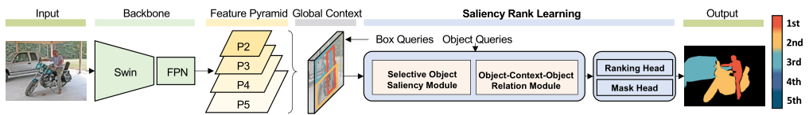
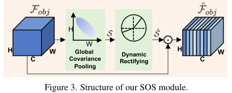
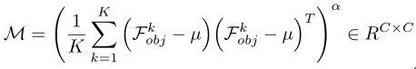
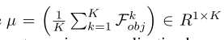
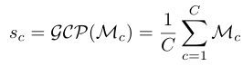

Bi-directional Object-Context Prioritization Learning for Saliency Ranking

# Abstract

最近提出的显著性排序任务是为了研究人类通常会根据其显著性程度将注意力转移到场景中不同对象上的视觉行为。现有的方法侧重于学习对象-对象或对象-场景关系。这种策略遵循了心理学中基于对象的注意的思想，但它倾向于支持那些具有强烈语义的对象（例如人类），从而导致不真实的显著性排序。**我们观察到，在人类视觉识别系统中，空间注意与基于对象的注意同时工作。在识别过程中，人类的空间注意机制会从一个区域到另一个区域（即从一个环境到另一个环境）移动、参与和分离。这启发我们在对象级推理的基础上，为显著性排序建立区域级交互模型。** 为此，我们提出了一种新的双向方法，将空间注意和基于对象的注意统一起来进行显著性排序。

我们的模型包括两个新模块：

（1）选择性对象显著性（SOS）模块，通过推断显著对象的语义表示，对基于对象的注意进行建模；

（2）对象-上下文-对象关系（OCOR）模块，通过联合建模对象-上下文和显著对象的上下文-对象交互，将显著性等级分配给对象。 

# Introduction

​		通过模仿人类如何根据显著性等级在场景中改变注意力，显著性等级可以帮助许多下游视觉任务，例如图像处理[6,49]、场景理解[37]、重要人物识别[24]和他们的交互推理[10]。 

​		在本文中，我们基于以下观察来解决显著性排序问题。心理学研究[2,8]表明，空间注意和基于对象的注意在人类视觉系统中同时起作用。虽然基于对象的注意通过对场景的预注意分割[8]将我们的视线引导到候选对象或感知组，但另一方面，人类的空间注意机制允许我们通过基于低水平视觉刺激（例如丰富的颜色）、对象的功能性、以及，以及物体之间的相互作用。这启发我们联合利用空间注意和基于对象的注意进行显著性排序。 

​		我们首先提出了一个选择性对象显著性（SOS）模块，通过基于局部上下文推断和丰富显著对象的语义表示，对基于对象的注意进行建模。然后，我们提出了一个对象-上下文-对象-关系（OCOR）模块，通过对象-上下文和上下文-对象双向推理来利用空间注意机制。

# Related Work

## Salient Object Detection (SOD)

​		SOD的目的是检测场景中明显的物体。早期的方法[1,7,31,48]主要依靠手工特征（例如颜色、亮度和纹理）来检测显著对象。这些方法在复杂场景中往往会失败，因为低级别手工制作的特征的表示能力有限。最近基于深度学习的方法[42]取得了优异的性能。**它们主要包含两种深度技术，深度特征融合[44,51]和特征注意[27,35,52,53]。**深度特征融合的目的是为SOD聚合包括低水平刺激和高水平语义在内的多层次上下文信息，而特征注意重新加权多尺度特征并增强上下文学习，以帮助模型聚焦显著区域并抑制背景区域的噪声。

​		与SOD不同，显著性排序任务需要检测显著性实例，然后确定它们的显著性排序。因此，现有的显著性目标检测方法不能直接应用于显著性排序任务。

##  Salient Instance Detection (SID)

​		Zhang等人[50]提出了一种基于最大后验优化的方法来检测具有边界盒的显著实例。Li等人[22]提出利用实例感知的**显著轮廓**来检测实例级对象。Fan等人[11]建议将对象检测模型FPN[26]与分割分支相结合，以检测显著实例。Tian等人[38,39]提出了一种弱监督方法，利用类标签和SID的子标签。

​		SID方法可以提供显著对象的实例级信息，但它们不尝试对检测到的显著实例的显著程度进行排序。

# Methdology

​		下图显示了我们的双向对象上下文优先级模型的概述。给定一幅输入图像，我们首先使用基于查询的对象检测方法[13,36]来提取全局特征，并基于对象建议生成一组对象特征，即对对象位置和丰富的对象特征进行编码的框和对象查询。然后，我们将它们输入两个新的模块，选择对象显著性（SOS）模块和对象上下文对象关系（OCOR）模块，这两个模块为推理显著性等级的两种注意机制建模。最后，我们的模型学习对象的优先级信息以进行显著性排序。

## Selective Object Saliency Module

​		遵循基于对象的注意机制的思想，**我们SOS模块的目标是捕获并增强显著对象的语义表示**。研究表明，深层特征通道对不同的语义成分做出反应[4,54]。之前的通道注意[18,45]主要是根据ground truth类别突出区分通道，同时抑制其他通道的响应。 **然而，简单地抑制来自其他通道的低响应可能不适合显著性排序，因为这些不太具辨别力的通道也可能提供信息。** 它们可以用作将对象相互关联的上下文，也可以用作全局上下文。因此，我们建议从两个方面扩展现有的通道注意。首先，**我们利用全局协方差池[23,41]来学习对象表示及其与局部和全局上下文的相关性。**其次，**我们学习一组动态校正函数，根据全局协方差池计算的高阶特征统计量将注意力重新分配给通道。**因此，他们共同捕获细粒度的对象信息，用于学习基于对象的表示。图3显示了我们的SOS模块

### Global Covariance Pooling

全局协方差池化研究用于建模高阶特征统计的跨通道相关性。给定上下文特征Fcontext和object proposal（box and object queries），我们首先利用ROIAlign提取物体特征$F_{obj}\in R^{H\times W \times C}$。然后，沿着通道维度拆分$F_{obj}$，生成通道级特征$F_{obj}=[F^1_{obj},F^2_{obj},……,F^K_{obj}]$，K=H x W，$k\in[1,K]$，用于计算协方差归一化矩阵M为：

