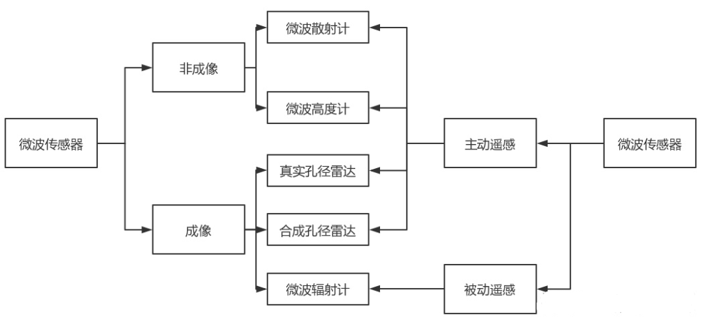
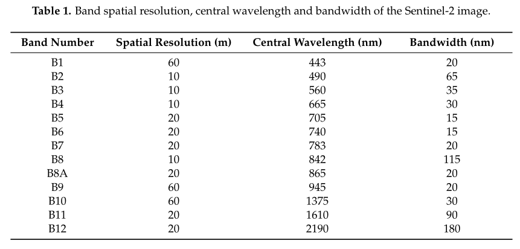
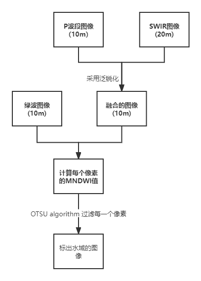

# 一、SAR图像为什么可以穿透云层检测的水体？

答：微波与大气的相互作用主要包括大气散射、大气吸收和大气衰减。在微波的工作范围内，只要微波不处于大气吸收波段，大气对微波的传输影响可以忽略不计。同时，微波对大气有较好的透过性，能够穿过浓厚的云层和一定程度的雨区，可全天时全天候工作，**相比可见光、红外波段有极大优势**。

由于SAR工作在频率较低的微波波段，雷达波束能够有效穿透云层实现全天候的观测，而且SAR的分辨率高，可以有效地识别“伪装”并且能穿透云、雾等自然掩盖物，因此，采用星载SAR观测系统能够获得全天候超高分辨率的气象灾害图像信息。

**关于SAR图像的其他信息：**

目前，能够方便使用的SAR卫星数据主要来自欧洲航天局的哨兵一号卫星以及我国的高分三号卫星。高分三号卫星是我国首颗搭载空间分辨率最优可达1米的C波段多极化SAR的民用卫星，具备迄今为止世界上最多的成像模式（包含波成像等12种成像模式）。[合成孔径雷达：穿透云雾的观测“利器”-中国气象局政府门户网站 (cma.gov.cn)](http://www.cma.gov.cn/2011xwzx/2011xqxkj/qxkjgjqy/202008/t20200820_561299.html)

因为SAR图像全天时、全天候、不受云雨限制，并且水体的后向散射系数比较低，在图像上通常呈现暗黑色的， 所以通常选用SAR图像作为检测水体的影像。

>**后向散射**
>
>在两个均匀介质的分界面上，当电磁波从一个介质中入射时，会在分界面上产生散射，这种散射叫做表面散射。在表面散射中，散射面的粗糙度是非常重要的，所以在不是镜面的情况下必须使用能够计算的量来衡量。通常散射截面积是入射方向和散射方向的函数，而**在合成孔径雷达及散射计等遥感器中，所观测的散射波的方向是入射方向，这个方向上的散射就称作后向散射。**

**微波传感器的分类**

# 二、光学图像检测水体的方法

## 2.1 介绍

数据来自Sentinel-2，**Sentinel-2宽幅高分辨率多光谱成像仪**，**13**个波段、**290**公里幅宽，**5天**重放周期。同一轨道上的两个相同卫星的星座，相距180°，以实现最佳覆盖和数据传输。它们在一起每隔五天就覆盖地球的所有陆地表面，大岛，内陆和沿海水域。

为了从不同的遥感图像中提取水体，开发了各种方法，包括单波段密度切片、无监督和监督分类和光谱水指数。在所有现有的水体制图方法中，基于光谱水指数的方法是一种可靠的方法，因为它用户友好、高效且计算成本低。**基于光谱水指数，特别是从绿色和短波红外（SWIR）波段计算的修正归一化差分水指数（MDNWI）的方法是最流行的方法之一。**

>在过去几十年中，已经提出了不同的水指标。具体而言，McFeeters（1996）提出了归一化差分水指数（NDWI），利用遥感图像的绿色和近红外（NIR）波段，基于水体在可见光到红外波长范围内具有强吸收能力和低辐射的现象。在大多数情况下，NDWI可以有效地增强水信息，但它对已建土地非常敏感，常常导致水体估计过高。**为了克服NDWI的缺点，Xu（2006）开发了改进的归一化差异水指数（MNDWI），该指数使用短波红外（SWIR）波段来取代NDWI中使用的近红外波段。**许多以前的研究工作已经证明，MNDWI更适合增强水信息，可以比NDWI更准确地提取水体。

**Sentinel-2多光谱图像共有13个波段，其中4个波段（蓝色、绿色、红色和NIR）的空间分辨率为10米，6个波段（包括SWIR波段）的空间分辨率为20米。MNDWI方法可用于从Sentinel-2图像中提取水体，因为其中包括绿色和SWIR波段。**然而，值得注意的是，绿色和SWIR波段的空间分辨率分别为10m和20m。在这种情况下，通过简单地将绿带从10m放大到20m，很容易产生分辨率为20m MNDWI。然而，这种方案会丢失空间信息。为了充分利用Sentinel-2图像提供的10m信息，通过基于pan锐化将20m分辨率的SWIR波段缩小到10m，从Sentinel-2图像生成一种新的10m空间分辨率MNDWI。

一般来说，**空间插值和图像融合（例如，平移锐化）是用于提高遥感图像空间分辨率的两种最常用的方法**。空间插值方法通常直接应用于粗略的空间分辨率图像，并且不使用任何附加数据集。相比之下，图像融合（如pan锐化）以同一场景的精细空间分辨率全色（pan）波段的可用性为前提，旨在将粗略的多光谱图像缩小到pan波段的空间分辨率。泛锐化广泛应用于具有粗糙多光谱波段和精细空间分辨率泛波段的遥感图像，如MODIS、Landsat  TM/ETM、SPOT、IKONOS和QuickBird图像。更具体地说，图像融合也被广泛应用于制作精细的空间分辨率水体图。为了从Sentinel-2生成10米MNDWI，只需提高SWIR波段的空间分辨率。更重要的是，Sentinel-2图像中的波段2、3、4和8都具有10米的分辨率。因此，Sentinel-2图像中的10米波段可以被视为泛像波段，它们可以提供重要的精细空间分辨率信息，将20米波段缩小到10米。**基于此，本文选择了平移锐化技术，利用直接观测到的10米波段2、3、4和8提供的信息，将SWIR波段11的空间分辨率提高到10米，以匹配10米绿色波段3。**

## 2.2 方法

整个算法过程：

>绿波图像空间分辨率10m，单一光谱图像
>
>SWIR图像空间分辨率20m（细节更少），多光谱图像
>
>融合后的图像，空间分辨率10m，属于多光谱图像。
>
>由于泛锐化算法基于pan或类pan波段的可用性，因此需要首先从10-m波段2、3、4和8中选择合适的类pan波段。在本研究中，通过测量它们与SWIR谱带之间的相关系数来确定最合适的PAN样谱带。选择相关系数最大的10-m波段作为类pan波段。

### 2.2.1 泛锐化

**泛锐化**旨在融合多光谱图像和全色图像，处理的结果是将前者的光谱分辨率和后者的空间分辨率结合起来。

四种常用的泛锐化算法，包括主成分分析（PCA）、亮度-色调饱和度（IHS）、高通滤波器（HPF）和小波变换（ATWT）。

**所有四种泛锐化算法生成的10-m  MNDWI比原始图像生成的20-m  MNDWI能够更详细地表示水体的空间信息。**因此，**10米分辨率的MNDWI可以提取比10米NDWI和20米MNDWI更精确的水体图**。此外，尽管HPF可以生成比其他三种基准pan锐化算法更精确的锐化图像和MNDWI图像，**但ATWT算法可以获得最佳的10米水体测绘结果。**

### 2.2.2 MNDWI计算

MNDWI 计算公式：
$$
MNDWI_{10m} = \frac{p_3-p_{11}^{10m}}{p_3+p_{11}^{10m}}
$$

>标记<10m>，表示在空间分辨率10m的图像上计算的。
>
>p3：绿波的TOA反射率，$ p_{11}^{10m}$：融合后图像的TOA反射率。
>
>与原始数字（DN）相比，TOA反射率更适合计算MNDWI。免费提供的Sentinel-2  Level-1C数据集已经是TOA反射率的标准产品。因此，无需额外的预处理。

### 2.2.3 大津算法绘制水体图

在生成MNDWI后，可以通过使用合适阈值的简单分割算法来绘制水体。通常，为了从MNDWI绘制水体，阈值通常设置为零，即MNDWI大于零的像素被视为水。但在实际应用中，不同卫星平台在不同地区、不同时间采集的多光谱图像往往具有不同的特点。因此，应根据每个场景中水指数值本身的特征确定阈值。在本研究中，**OTSU算法是一种广泛使用的动态阈值方法，旨在最大化类间方差，用于确定用MNDWI绘制水体图的最佳阈值t。**

假设MNDWI的值范围是a到b，(-1<=a<=b<=1)。基于OTSU算法，阈值可将MNDWI图像分为两类：**非水类从a到t，水类从t到b。**

[OTSU算法详解 - 知乎 (zhihu.com)](https://zhuanlan.zhihu.com/p/111101737)

# 三、SAR图像检测水体的方法

总体方法：

数据来自Sentinel-1，**Sentinel-1为C波段合成孔径雷达**，两颗相距180°的卫星组成，每6天对整个地球进行一次成像，欧洲和加拿大和主要运输线路重放周期为3天，北极重访周期不到1天。**Sentinel-1**的雷达可以在**四种模式**下运行：**干涉宽幅（IW）**，**超宽幅（EW）**，**波（WV）**和**带状图（SM）**。波动模式具有单极化（VV或HH）。其他模式，使用双极化方案（VV + VH或HH + HV）以及单极化方案（HH或VV）。[(45条消息) 哨兵1号（sentinel 1）数据各参数介绍_塞翁失马的博客-CSDN博客](https://blog.csdn.net/yuanqilian/article/details/111868347)

​		由于本研究旨在利用遥感数据对农业保险进行损害评估，因此需要一种简单且计算成本较低的实施方法。因此，我们研究了最佳阈值的自动确定。**在确定阈值时，使用伽马零（gamma-0：$\gamma^0$）代替后向散射系数（σ0），以降低对入射角的敏感性。**对于平坦地区，例如我们的试验场地和稻田，$\gamma^0$和σ0之间的关系由一个简单的方程给出
$$
\gamma^0 = \frac{σ0}{cos\theta}
$$
其中θ是地球的椭球入射角。然后，可以很容易地将导出的阈值转换为σ0阈值。

​		基于Kittler和Illingworth（KI）和Otsu的方法中描述的统计方法的自动阈值确定，先前已应用于洪水探测的CANDX波段SAR数据。本研究中使用了大津的方法，因为它具有双峰分布的快速性和鲁棒性。

​		每个SAR数据集均经辐射校准至γ0，并投影到UTM坐标（区域S48）。考虑到试验现场稻田的大小，UTM坐标上的像素间距设置为10 m。

​		由于水淹稻田的$\gamma^0$通常低于非水淹稻田，**因此我们的变化检测方法利用了描述非水淹稻田和水淹稻田的两个等级的$\gamma^0$值差异**。检测$\gamma^0$值差值大于预定阈值的位置（预设差异：$\gamma^t$），并提取满足以下$\gamma^0$等式的位置：
$$
\gamma^0_1 -\gamma^0_2 >= \gamma^t
$$
式中，$\gamma^0_1$和$\gamma^0_2$分别表示在非洪水和洪水情况下提取的$\gamma^0$样品。

​		接下来，采用大津阈值法，通过将两个类划分为最大类间方差来确定γ0值。使用两类具有明显双峰分布的样本直方图确定两类的阈值$\gamma^t$。最后，使用$\gamma^t$阈值提取被淹没的稻田。

# 四、H2O网络实现思路

# 五、变化检测

1. 在变化检测技术当中，选用两幅图像作为主影像和副影像，通过对两幅经过预处理的影像进行作差，便可获得差异图；
2. 在变化检测过程中，获取差异图是重要的一步，在很多文献当中，很多人会对如何获取差异图做明确的解释，当然获取差异图的方法也有很多，比如差值法、比值法、对数比值法和均值比值法等等，这些方法主要针对SAR图像。
3. 得到差异图之后，下面的工作就是从差异图中提取出洪水变化的地方，对于洪水区域的提取，可以使用阈值法、聚类法等。
4. 阈值的方法有OTSU(大津法)、EM算法、KI算法等，后两者需要假设差异图服从何种分布，使用算法对参数进行最优估计，之后在根据贝叶斯最小错误准则求出阈值，将差异图的变化区和非变化区区分出来。
5. 到这里，变化检测的大致步骤已经完成，之后需要对图像进行后处理，因为最终变化图会有很多的散斑，这对于之后与参考图进行精度评定的时候，会出现较大的误差，这些散斑可能是因为原图像中的斑点噪声，在预处理步骤中，使用的滤波器并不能所有的散斑消除掉，所以在后处理的步骤当中，还可以再次进行滤波处理。滤波窗口通常使用的是5*5，因为过大的窗口会使得真正变化区失真。
   最后的精度评价部分就是获取的变化检测结果图与参考图进行精度评定，精度评定的指标包括很多，比如kappa系数，总体精度（OA）,当然图像的漏检数、误检数也是作为评价指标之一。

# 六、遥感图像的相关知识

## 6.1 RGB、全色图像、高光谱图像、多光谱图像

### 6.1.1 RGB

RGB图像只记录了红绿蓝三个波段的信息，其他波段都丢掉了。

### 6.1.2 全色图像

全色图像是单通道的，其中全色是指全部可见光波段0.38~0.76um，全色图像为这一波段范围的混合图像。因为是单波段，所以在图上显示为灰度图片。全色遥感图像一般空间分辨率高，但无法显示地物色彩，也就是图像的光谱信息少。 实际操作中，我们经常将全色图像与多波段图像融合处理，得到既有全色图像的高分辨率，又有多波段图像的彩色信息的图像。

### 6.1.3 高光谱图像

高光谱则是由很多通道组成的图像，具体有多少个通道，这需要看传感器的波长分辨率，每一个通道捕捉指定波长的光。把光谱想象成一条直线，由于波长分辨率的存在，每隔一定距离才能“看到”一个波长。“看到”这个波长就可以收集这个波长及其附近一个小范围的波段对应的信息，形成一个通道。也就是一个波段对应一个通道。对高光谱上某一个像素的采样，就可以针对此像素生成一个“光谱特征”（在不同波段上的数值）。

### 6.1.4 多光谱图像

多光谱图像其实可以看做是高光谱的一种情况，即成像的波段数量比高光谱图像少，一般只有几个到十几个。**由于光谱信息其实也就对应了色彩信息，所以多波段遥感图像可以得到地物的色彩信息，但是空间分辨率较低。更进一步，光谱通道越多，其分辨物体的能力就越强，即光谱分辨率越高。**

>**为什么全色图像的空间分辨率高，而多光谱图像的空间分辨率低？**
>
>光进入相机镜头，光电感应装置将光信号转换为电信号，量化电脉冲信号，记录为一个像素值。传感器响应函数设计为，要使光电感应装置产生这个电脉冲信号，光子强度(正比于光子的数量)必须达到一个阈值。进入镜头的光子数量取决于：相机的感受野大小，镜头能通过的光子。多光谱图像要分出多个波段，镜头会分光，红滤镜只过红光，蓝滤镜只通过蓝光，假设相同的光打到全色与多光谱镜头上，显然因为滤光的缘故，多光谱感光器的接收到的光子要少于全色感光器。实际情况是多光谱传感器要拍摄更大的范围，相同大小的底片，自然多光谱图像的视角更大，但每个物体细节更模糊。

## 6.2 多光谱图像的每一个像素上不同通道的值代表什么

### 6.2.1 数字量化值（Digital Number）

DN值是遥感影像像元亮度值，记录的地物的灰度值，也就是辐射的强调。无单位，是一个整数值，值大小与传感器的辐射分辨率、地物发射率、大气透过率和散射率等有关。DN值通常被用来描述还没有校准到具有意义单位的像素值。
**如果只是想看一个图像,和不打算解释像素值的物理意义,那么就可以以DN值的方式来保存。**

所有遥感影像原始数据都是DN值，要经过辐射定标转换成具有实际物理含义的表观反射率（光学）或后向散射系数（SAR）。
DN值范围的不同是因为不同传感器量化级不同，就是存储数据时将传感器接收电平的量化级，有的是8bit量化，则DN值范围是0-255，有的是16bit量化（如高分辨的Worldview-2卫星），范围为0-65535。

### 6.2.2 反射率（Reflectance）

反射率是物体表面所能反射的辐射量和它所接受的辐射量的比值，一般在[0,1]范围，有的时候为了储存方便而扩大一定的倍数，如放大一万倍[0,10000]。一些材料可以通过他们的反射光谱来识别,因此，为了更好的识别图像特征，我们通常将图像定标为反射率图像。
**反射率图像包括两种：大气表观反射率和地表反射率**

> 辐射与遥感中**定标**是将遥感器接收的辐射强度变换为绝对亮度或变换为与地表反射率、表面温度等物理量有关的相对值的处理过程。

### 6.2.3 大气表观反射率（Top of Atmosphere Reflectance）

TOA是飞行在大气层之外的航天传感器量测的反射率。这种反射率包括云层、气溶胶和气体的贡献。

### 6.2.4 地表反射率（Surface Reflectance）

SR是地球表面的反射率，它没有云层和大气组分的影响。通常情况，地表反射率是从辐射亮度图像中计算得到，有很多的计算模型，如辐射传输模型，其实就是去除云层、大气组分、临近地物等因素影响的过程。

[一种基于遥感图像的植被和水体变化检测方法及系统与流程 (xjishu.com)](http://www.xjishu.com/zhuanli/55/202110859512.html)

[SAR图像中水域的检测与分割 - MBA智库文档 (mbalib.com)](https://doc.mbalib.com/view/292fbb0d2aec6242571060a581b2436e.html)

[基于递归OTSU算法的SAR图像水域自动检测方法与流程 (xjishu.com)](http://www.xjishu.com/zhuanli/55/201710390791.html)

[光学/SAR水域图像配准与变化检测--《南京航空航天大学》2018年硕士论文 (cnki.com.cn)](http://cdmd.cnki.com.cn/Article/CDMD-10287-1019800145.htm)

# 七、问题

1. 论文特别多，不知道该从哪里入手看？
2. 检测水域，还是检测洪水？（或者说：检测水域，还是检测水域的变化？）

# 八、下周工作

1. 将现有的SAR图像数据进行可视化；
2. 做**基于SAR图像水域检测的方法**的广度总结；
3. 编写开题报告。
