## 一、Sen1flood11数据集可视化

手工标记的图像：

1. 标记员利用sentinel-1的VH波段、sentinel-2的两个假彩色合成图（RGB:B12、B8、B4和B8、B11、B4）这三种方式的成像可以突出水体。
2. 生成的mask是单通道，上面有三个值分别为：-1，0，1。这三个值代表的含义是：
   - -1：该区域是云或其他不是水体的物体；
   - 0：背景；
   - 1：水域。

下面是一些可视化示例：

Sentinel-1拍摄：Bolivia_129334_S1Hand.tif的两个波段映射的RdYlBu（红黄蓝）上的成像（值越大，颜色越蓝）

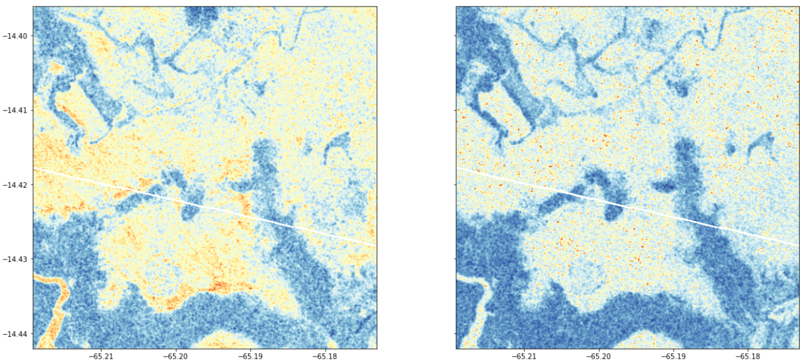

Sentinel-2拍摄：Bolivia_129334_S2Hand.tif 

左边是B12、B8、B4在RGB上的成像，右边是B8、B11、B4在RGB上的成像。（假彩色图像）

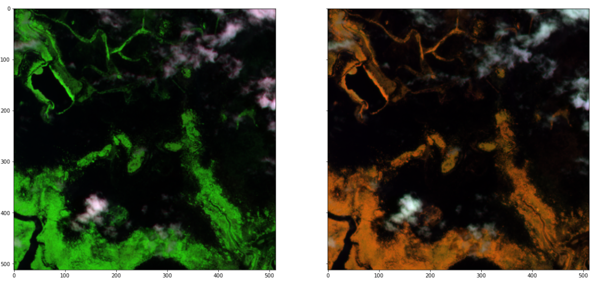

S2真彩色图像：

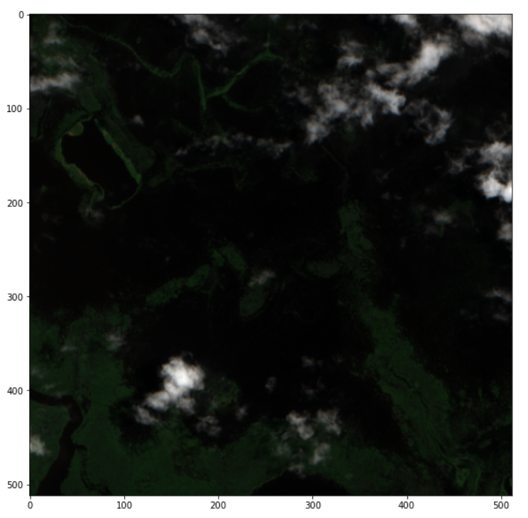

标记员手工标记的Mask：Bolivia_129334_LabelHand.tif 的成像，该图像有三个值-1，0，1

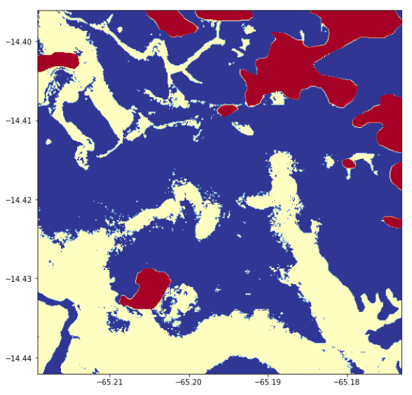

## 二、调研：深度学习水域检测算法

1. FCNN：Sen1Floods11 A Georeferenced Dataset to Train and Test Deep Learning CVPRW 2020
2. ResNet-50：FLOOD DETECTION IN TIME SERIES OF OPTICAL AND SAR IMAGES 2020
3. H2O-Net: Self-Supervised Flood Segmentation via Adversarial Domain Adaptation and Label Refinement
4. U-Net：Exploring Sentinel-1 and Sentinel-2 diversity for flood inundation mapping  using deep learning
5. BASNet：Enhancement of Detecting Permanent Water and Temporary Water in Flood Disasters by Fusing Sentinel-1 and Sentinel-2 Imagery Using Deep Learning Algorithms: Demonstration of Sen1Floods11 Benchmark Datasets

## 三、算法详细说明

## 3.1 FCN

实现全卷积网络主要基于三种技术：

- 全卷积化（Fully Convolutional）
- 反卷积（Deconvolution）
- 跃层结构（Skip Layer）

针对Sen1Floods11数据集

- 使用Resnet50为主干的完全卷积网络；
- 为了使用小批量，将Batch Normalization层转换为Group Normalization层；
- 优化器选择：AdamW，基本学习率为5e-4，权重衰减系数为1e-2；
- 利用余弦退火学习速率调度器；
- 为了增强数据，将图像从512x512随机裁剪到256x256，并随机应用水平和垂直翻转；
- 在手动标记的训练集上进行平均值和标准差的归一化。（[0.6851, 0.5235],[0.0820, 0.1102]）
- 利用IOU进行评估模型，计算平均IOU。

**FCN 的缺点**

1. 分割的结果不够精细。图像过于模糊或平滑，没有分割出目标图像的细节。
2. 因为模型是基于CNN改进而来，即便是用卷积替换了全连接，但是依然是独立像素进行分类，没有充分考虑像素与像素之间的关系

## 3.2 ResNet-50

ResNet50网络结构：

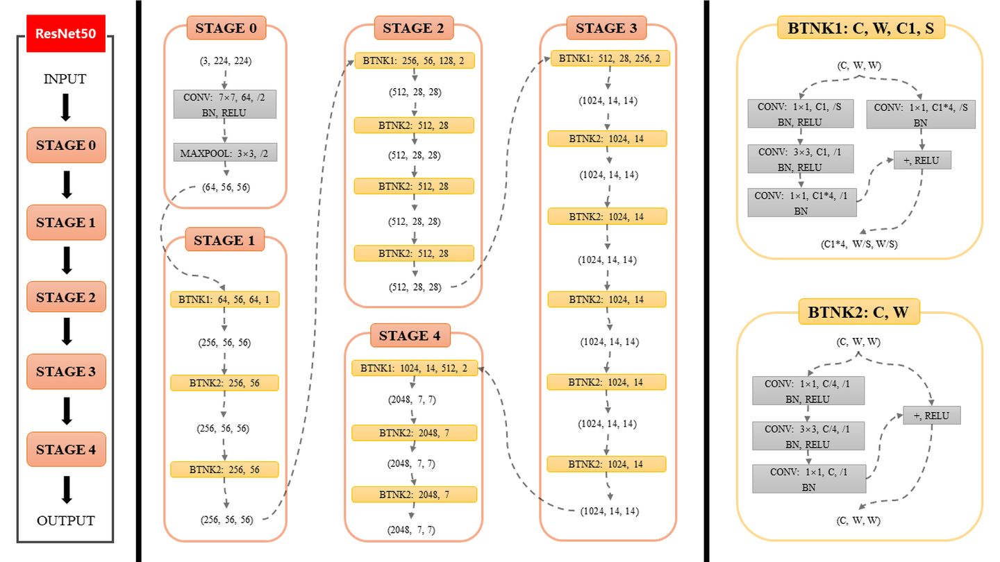

ResNet-50是为RGB图像分类设计的，我们需要对网络结构进行修改。

**针对Sen12Flood数据集，该数据集的特点：数据集由412个时间序列组成，每个序列中由4到20个光学图像和10到58个SAR图像。平均每个序列有9个光学图像和14个SAR图像。**

- 修改了第一个卷积层，以考虑多光谱（12个波段）和SAR（2个波段）数据的正确波段数；
- 在不考虑时间信息的情况下，只根据空间背景检测洪水的存在与否，光学图像似乎比SAR图像更适合；
- 为了考虑时间维度，我们利用训练好的Resnet-50提取了每个图像的特征，并对每个特征序列应用了Gated Recurent Unit（GRU）（Cho等人，2014）。
- 将来自SAR和RGB 的Resnet输出特征连接起来，并将其提供给GRU层；
- 最终结果是一系列二进制标签，给出每一帧的洪水检测任务的结果。

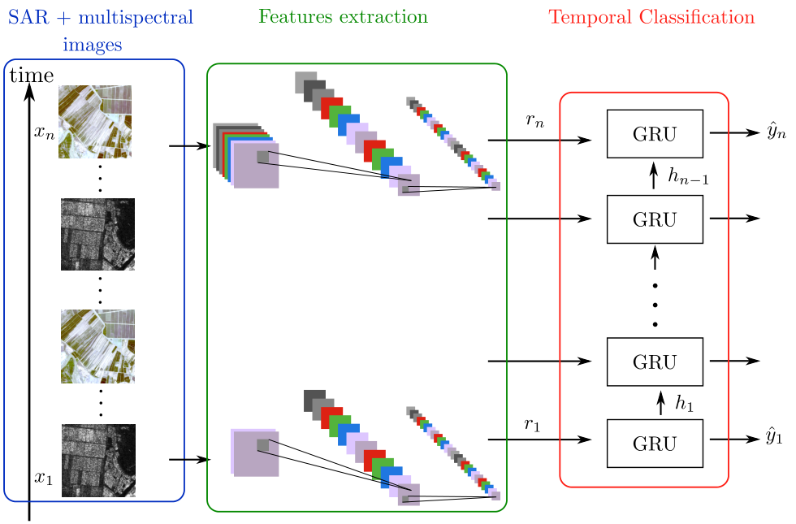

## 3.3 H2O-Net

**本文主要贡献：**

1. 我们提出了一种称为H2O网络的方法，该方法在低分辨率数据（政府卫星图像）中学习SWIR信号合成，作为一种领域自适应机制，用于在高分辨率卫星图像中使用自我监控和标签细化进行精确洪水分割。
2. 我们提出了一个简单的运行时细化器，它利用我们的自适应距离映射方法生成从粗到精的掩模。

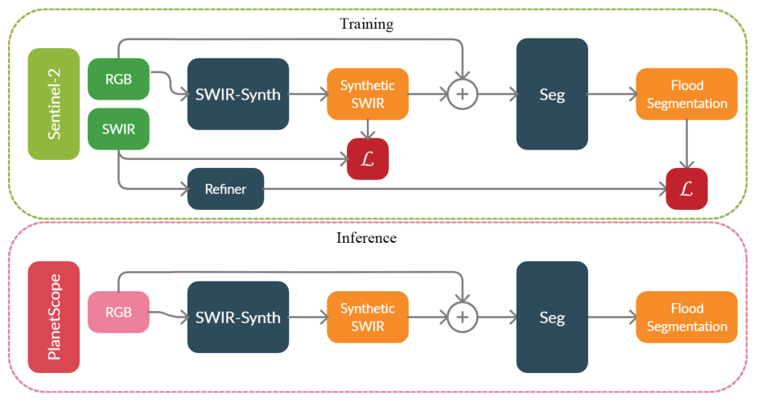

该模型包括三部分：

- SWIR-Synth是一个生成对抗网络，用于将RGB图像转为SWIR图像；

  设$x\in R^{H\times W\times 3}$是原领域的图像，$s\in R^{H\times W\times 1}$是x在SWIR中的映射。

  训练一个能够将RGB图像映射到SWIR图像的生成对抗网络。

- Refiner是一个细化器，用于精细化**那些传统阈值法生成的mask**；

  原理：令样本（$x\in R^{H\times W\times 3},m\in R^{H\times W\times 1}$）是image-MNDWI对。我们使用高阈值和低阈值（$\phi_H和\phi_L$）定义高置信度水和非水像素，以此在m上获得一组位置$(p_{wx},p_{wy}) \in P_{w},(p_{\tilde{w}x},p_{\tilde{w}y})\in P_{\tilde{w}}$），对应于水（正）和非水（负）点。其余像素属于未知类别。**给定一组小的高置信度标记像素，可以预测整个图像的标签。**

- Seg语义分割网络：我们使用U-Net作为分割网络，但实际上可以与任何其他分割方法集成。编码器-解码器结构，将RGB图像X和合成SWIR图像$\tilde S$连接成4通道作为输入。

>**域自适应旨在将知识从标记的源域转移到未标记的目标域。**传统的领域适应工作侧重于分类和检测任务[67,75,30,54,55,74]，最近的工作显示了语义分割的进展[17,61,62,77]。**大多数领域适应模型由两个网络组成：一个用于特征适应学习，另一个用于任务学习。**在这里，我们的方式学习**从源域（低分辨率卫星数据）生成SWIR数据，并将这些知识转移到目标域（高分辨率卫星数据），以改进语义分割。**
>
>这项工作的目的是学习低分辨率图像$ X_{LR}\in R^{H\times W\times 3}$和SWIR图像$S\in R^{H\times W\times 1}$之间的一个映射，以提升高分辨率卫星数据的语义分割预测$\hat{Y}\in R^{H\times W\times C}$。因为在没有ground truth的高分辨率图像上直接分割是一个挑战（$X_{HR}=>\hat{Y}_{HR}$），**我们通过学习与水存在高度相关的信号作为域适应步骤来弥合这一差距。在分割训练期间，我们添加了一种自我监督方法，使用经典遥感方法获得的粗标签$Y_C$的动态掩模细化，并使用我们的轻型细化器网络进行细化。**在训练期间，网络学习$X_{LR}=>\hat{S}_{LR}=>\hat{Y}_{LR}$，并将其应用到高分辨率数据上$X_{HR}=>\hat{S}_{HR}=>\hat{Y}_{HR}$。

## 3.4 U-Net

**通过本研究，我们旨在解决以下问题：**

- 通过深度学习方法绘制洪水淹没图时，S1和S2波段的最佳组合是什么？
- S1和S2的组合是否比S1和S2的单独性能更好？

**数据集：**Sen1Floods11

**数据预处理：**

由于S1  SAR只有两个具有VV和VH极化的可用波段，我们直接在训练设置中使用它们，而无需进行任何组合。但是，S2中的12个频带允许指定多个频带组合。

我们基于一组S2波段的光谱指数，这些光谱指数可以检测指定波长范围内的水体特征。

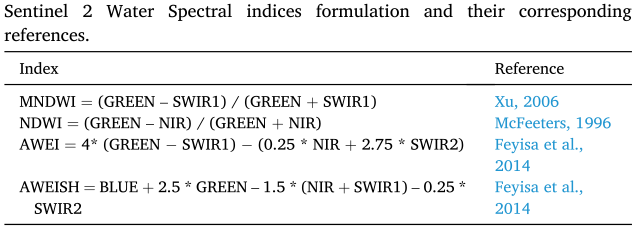

**除了光谱指数外，S2短波红外辐射（SWIR2）、近红外辐射（NIR）、红色波段可以转换为HSV（色调、饱和度和值）颜色空间。通过定义H、S和V分量之间的关系，可以有效地描述水体。随后，根据HSV值对卫星数据进行手动分类，绘制全球水资源图。**将SWIR2、NIR、red值分别指定给红色、绿色和蓝色（RGB），并使用标准化色度变换将其转换为HSV颜色空间。公式如下：
$$
V=max(R,G,B)\\
S=V-min(R,G,B)\\
H=\begin{cases}
0& \text if\ V=min(R,G,B)\\
(60^o\times \frac{G-B}{V-min(R,G,B)}+360^o)mod\  360^o& \text if\ V=G\\
60^o\times \frac{B-R}{V-min(R,G,B)}+120^o \text if\ V=G\\
60^o\times \frac{R-G}{V-min(R,G,B)}+120^o \text if\ V=B
\end{cases}
$$

> 色调（H）以度表示，范围为0◦–360◦, 表示颜色的光谱组成；
>
> 值（V）可定义为颜色的亮度；
>
> 饱和度量化颜色与亮度相等的灰色之间的距离。

U-Net最初设计用于分割生物医学图像的任务（Ronneberger等人，2015年），目标是用于训练集相对较少的应用，并使用与输入图像相同的分辨率进行分割。U-Net体系结构由两部分组成（即编码器和解码器）。**通过下采样过程，通过U-Net模型的编码器部分提取重要特征。解码器使用这些特征作为输入，并通过上采样过程构建输入的空间信息。**U-Net体系结构的这种上采样和下采样过程可以系统地结合低级特征和高级特征，同时从多个特征中执行元素分割。U-Net还包括跳过连接，以捕获解码器每一步的精确位置，如下图所示：

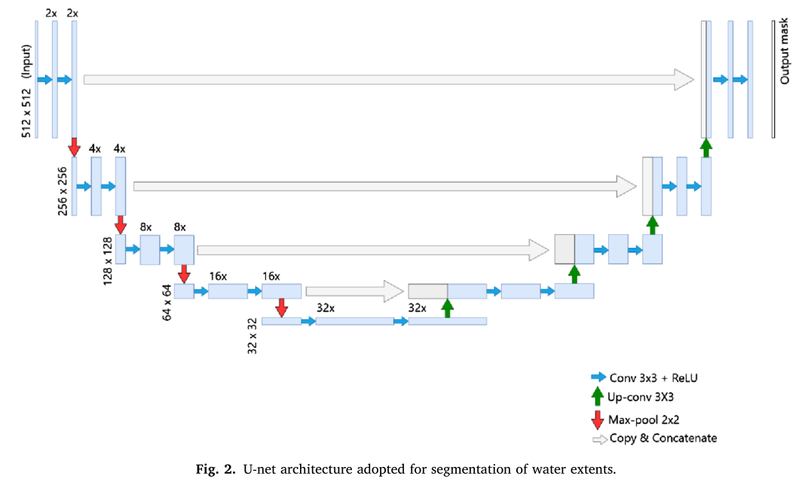

**这些跳过连接将解码器层的输出与编码器在同一级别上的特征映射连接在一起，使得像素的分割更加精确。**

## 3.5 BASNet

**BASNet：Boundary-Aware Salient Object Detection**：关注边界的显著性检测，**主要创新点在loss的设计上，使用了交叉熵、结构相似性损失、IoU损失这三种的混合损失，使网络更关注于边界质量，**而不是像以前那样只关注区域精度。

网络结构如下：

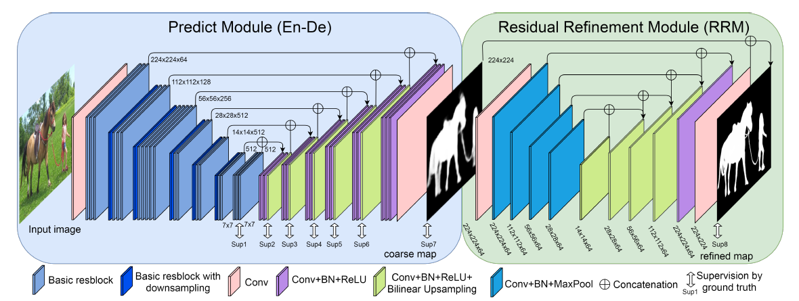

**这个网络结构的特点：**

- 采用深层编码器-解码器的结构得到一个粗糙的结果
- 采用RRM（Residual Refinement Module）修正结果，使用了残差模块

**流程：**

1. 采用**空间分辨率重采样**和**像素值归一化**方法对sentinel-1和sentinel-2图像进行融合，模型输入是一组具有永久水和临时水注释的融合图像带；
2. BASNet体系结构如图所示。该网络结合了一个类似于U-Net的密集监督编码器-解码器网络和一个新的残差细化模块；
3. 编码器-解码器根据图像输入生成粗略概率预测图，残差细化模块负责学习粗略概率预测图和ground truth之间的残差；
4. 将该网络应用于遥感数据集，对其进行调整、训练和优化，以更好地预测洪水区域。

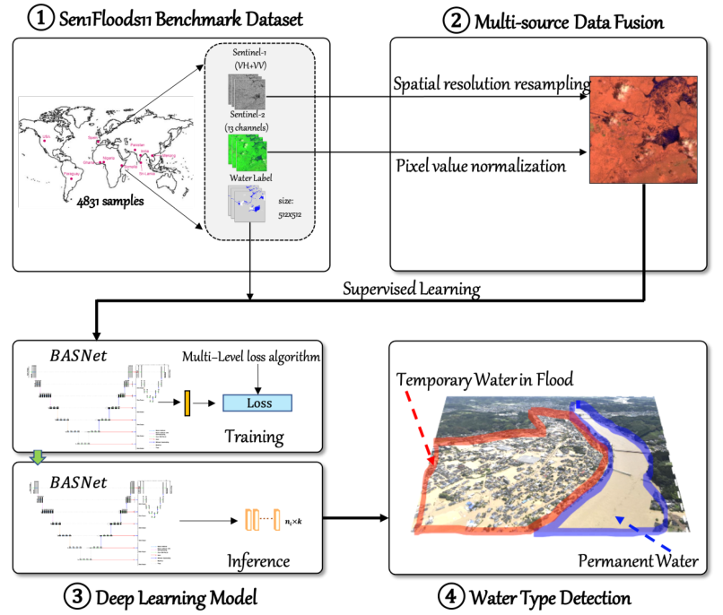

**实验结果：**

对比实验结果表明，与其他方法相比，该方法能更准确地检测永久性洪水和临时性洪水。该模型在未知测试集上表现良好，验证了其鲁棒性。由于网络结构的模块化，它可以很容易地适应来自其他传感器的数据。最后，该方法不需要先验知识、额外的数据预处理和多时相数据，这大大降低了该方法的复杂性并提高了自动化程度。

# 四、下周工作

1. FCN与FCNN的区别；

2. 学习U-Net网络，自己复现**SAR图像的水域检测**的U-Net网络，进行训练模型，给出初版网络。
