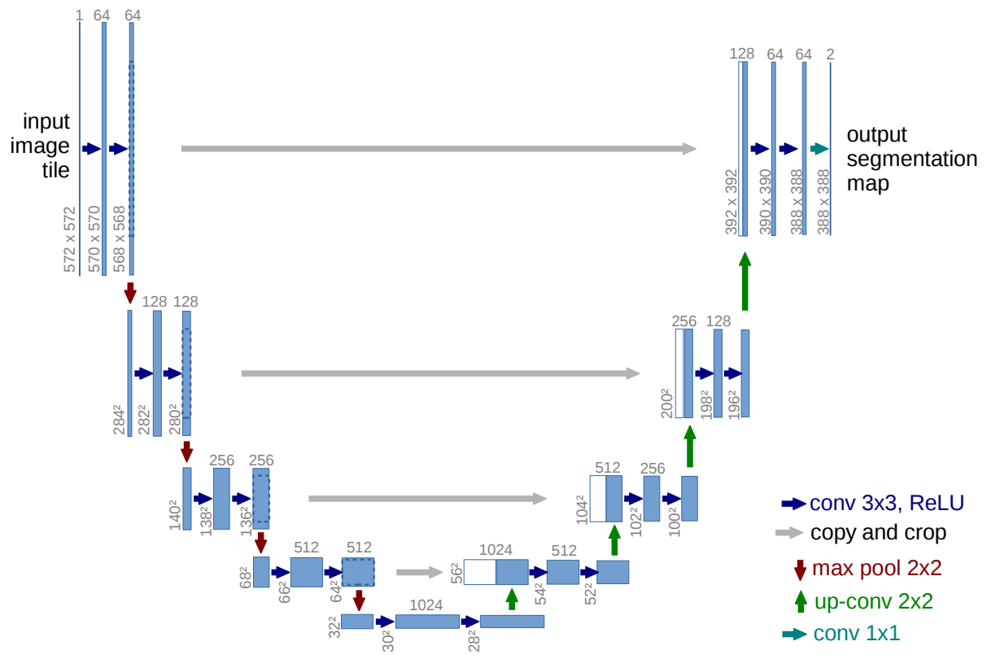
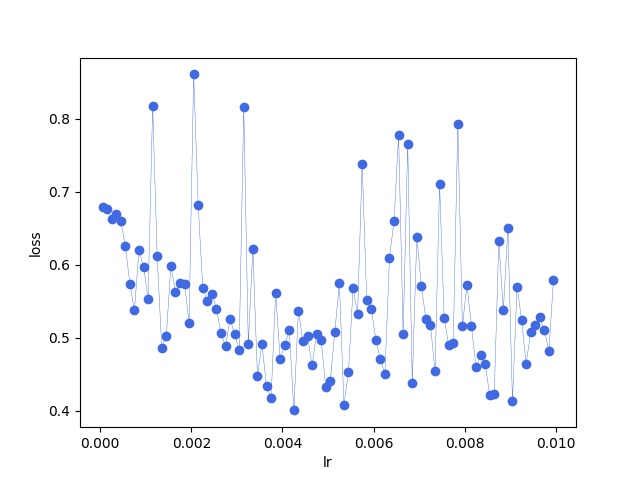
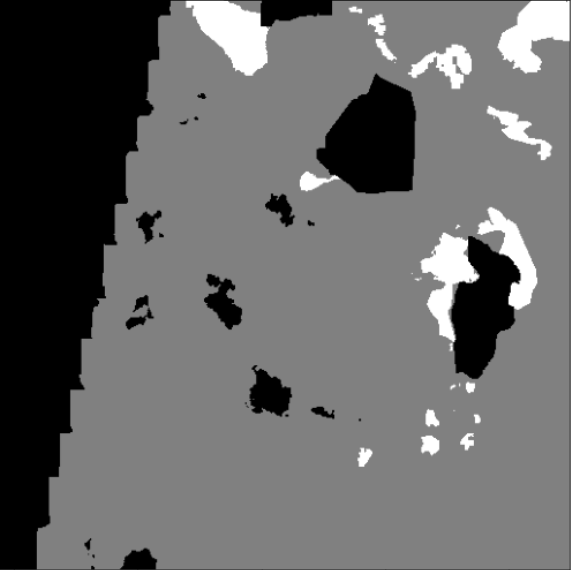
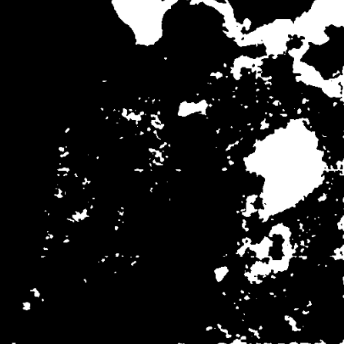

# 一、实现UNet网络



**基本组件**

dataloader：数据加载器，根据指定的文件目录和batchsize加载数据；

processAndAugment：对每张图像进行切片处理，**切片大小为256，overlap为128**，对每个切片进行水平和垂直翻转；

Evaluation：利用准确率、召回率和F1来评估模型效果；

**测试脚本：**

将图像分为9片，分别输入模型预测，合并预测结果，overlap部分取均值。

**loss计算：**

采用`criterion = nn.CrossEntropyLoss(weight=torch.tensor([1, 8]).to(device).float(), ignore_index=255)`计算loss。

模型输入intput=（batchsize,2,256,256）、最后一层通过softmax输出output=（batchsize,2,256,256）

label的形状(batch,1,256,256)

output的第一个通道表示非水的概率，第二个通道表示水体的概率。

由于非水类和水类的像素个数相差很大，在采用设置权重的方式增大水类的比重。

# 二、数据集

SAR图像：两个通道

Label：单通道，值有三个：-1，0，1。该Label是根据多光谱图像标记的，因此包含云层部分用-1标出。

目前情况：SAR图像不受云层影响，在拥有的两个通道上均不显示云层部分。

实现的模型，在计算loss更新梯度时，不考虑label中值为-1的部分。

# 三、寻找合适的初始学习率

思路：给定一个学习率范围和步长，例如[0.0005,0.01]、步长为0.0005
每一个batch更新一次学习率，并记录当前学习率对应的loss，最后画出lr-loss曲线
利用这样的方式寻找最有初始init_lr。

将采用余弦退火算法更新学习率

**参数设置：**

```python
learning_rate=0.005
weight_decay = 1e-3
batch_size=24
optim = torch.optim.Adam(unet.parameters(), lr=learning_rate, weight_decay=weight_decay)
scheduler = torch.optim.lr_scheduler.CosineAnnealingLR(optimizer=optim,T_max=30,eta_min=0.0001)
```



# 四、评估

输出可分类为
（1）真正（TP）：其中水像素被正确分类为水；
（2） 真负片（TN），其中非水像素被正确分类为非水区域；
（3） 假阳性（FP）：非水像素错误分类为水
（4）假阴性（FN）：水像素错误分类为非水。
通常使用精度、召回率和F1分数。
精确性和召回率是过度分割和欠分割的相互依存的度量。
精确性和召回率的低值分别表示过度分割和欠分割。
F1分数是精确性和召回率分数的调和平均值，将这两个方面作为一个单一指标进行描述。

label:白色表示水体，灰色背景，黑色忽略部分（云层或其他）



预测：白色表示水体，黑色表示背景



# 五、训练日志

```tex
第0轮：训练loss*110.52090647816658测试loss*22.44278120994568,准确率*0.31433807364229094,召回率*0.7260468052634007,f1分数*0.43873024064073285,学习率*0.004992370400989492
第1轮：训练loss*109.93569418787956测试loss*23.19305595755577,准确率*0.28792010582286554,召回率*0.7675069373259875,f1分数*0.41875121553715117,学习率*0.004969528642972966
第2轮：训练loss*109.2636806666851测试loss*22.234661906957626,准确率*0.32807858718282634,召回率*0.7274587533628727,f1分数*0.45221259517675694,学习率*0.004931615552984249
第3轮：训练loss*108.50489482283592测试loss*22.709701657295227,准确率*0.3051788083382208,召回率*0.714148114907226,f1分数*0.4276211404099152,学习率*0.004878864877830505
第4轮：训练loss*107.83392208814621测试loss*22.920923590660095,准确率*0.2959609232089377,召回率*0.7911894599797246,f1分数*0.43077970928359455,学习率*0.004811601842965434
第5轮：训练loss*107.34550559520721测试loss*22.353148013353348,准确率*0.3175697486931165,召回率*0.7019550252113439,f1分数*0.43730115570713246,学习率*0.00473024114736621
第6轮：训练loss*107.18972325325012测试loss*22.02802485227585,准确率*0.32973631240888635,召回率*0.687626986162828,f1分数*0.44573179914880623,学习率*0.004635284406776378
第7轮：训练loss*106.90268409252167测试loss*22.41716554760933,准确率*0.31143478964972504,召回率*0.7413182924354684,f1分数*0.4386067547973235,学习率*0.004527317061077995
第8轮：训练loss*105.9865283370018测试loss*22.233237832784653,准确率*0.3208238385687208,召回率*0.676310041798258,f1分数*0.43520010290380373,学习率*0.004407004764860077
第9轮：训练loss*106.389425188303测试loss*22.55148336291313,准确率*0.3008730734620227,召回率*0.7501349582188699,f1分数*0.42948370247877055,学习率*0.004275089283436706
第10轮：训练loss*106.52676236629486测试loss*23.11378452181816,准确率*0.2844978792816996,召回率*0.7208157259623745,f1分数*0.40797328180872766,学习率*0.004132383919617205
第11轮：训练loss*106.41081294417381测试loss*21.96740484237671,准确率*0.32842802655325054,召回率*0.7079671393109362,f1分数*0.4487019200529749,学习率*0.003979768499423871
第12轮：训练loss*106.44265487790108测试loss*21.750825881958008,准确率*0.34253644973695524,召回率*0.6835781388440484,f1分数*0.4563826134101424,学习率*0.0038181839476719736
第13轮：训练loss*106.28749603033066测试loss*22.477082312107086,准确率*0.3095865275920597,召回率*0.7483181858391298,f1分数*0.4379774959817202,学习率*0.0036486264868553784
第14轮：训练loss*106.20001319050789测试loss*22.181334912776947,准确率*0.3187747956296697,召回率*0.74232803582443,f1分数*0.44601797468739096,学习率*0.0034721414951035976
第15轮：训练loss*105.7746405005455测试loss*23.021319061517715,准确率*0.2858681064832163,召回率*0.6726865723070773,f1分数*0.40122830953116534,学习率*0.0032898170610779955
第16轮：训练loss*105.90668922662735测试loss*22.18150222301483,准确率*0.3209084196389763,召回率*0.6663544676862972,f1分数*0.4331951740309417,学习率*0.003102777275543367
第17轮：训练loss*105.72417625784874测试loss*22.27911674976349,准确率*0.31285816182860104,召回率*0.7223630856677898,f1分数*0.4366162068280943,学习率*0.002912175300974572
第18轮：训练loss*105.37648656964302测试loss*21.691155672073364,准确率*0.3388560011062183,召回率*0.7214416016291306,f1分数*0.4611249059302667,学习率*0.002719186261926417
第19轮：训练loss*105.1214027106762测试loss*22.617934614419937,准确率*0.3057384330396279,召回率*0.5705078358384145,f1分数*0.39812134547381006,学习率*0.0025250000000000003
第20轮：训练loss*105.28942614793777测试loss*22.20176187157631,准确率*0.31435893711530705,召回率*0.7509802732291859,f1分数*0.4431966047894749,学习率*0.002330813738073584
第21轮：训练loss*105.03461793065071测试loss*21.9220989048481,准确率*0.3270000008211954,召回率*0.722154930624725,f1分数*0.4501616602647359,学习率*0.0021378246990254295
第22轮：训练loss*105.04551181197166测试loss*21.302969068288803,准确率*0.35754255456034845,召回率*0.7200600808399227,f1分数*0.47782385135835787,学习率*0.0019472227244566344
第23轮：训练loss*105.29960232973099测试loss*21.93560618162155,准确率*0.33634192879976127,召回率*0.626108606959149,f1分数*0.4376049857704538,学习率*0.0017601829389220054
第24轮：训练loss*105.2374981045723测试loss*21.44768860936165,准确率*0.34554312460332137,召回率*0.7672832663697418,f1分数*0.4764974293706533,学习率*0.001577858504896403
第25轮：训练loss*105.39131924510002测试loss*21.604614049196243,准确率*0.3437818066927143,召回率*0.7445919486112955,f1分数*0.4703846708816294,学习率*0.0014013735131446219
第26轮：训练loss*105.33352175354958测试loss*21.711130559444427,准确率*0.33510677546664,召回率*0.7009942476263171,f1分数*0.45344598008691084,学习率*0.0012318160523280268
第27轮：训练loss*105.02659666538239测试loss*21.250600904226303,准确率*0.361901213700362,召回率*0.7189515998216275,f1分数*0.4814521520639415,学习率*0.0010702315005761294
第28轮：训练loss*104.46429684758186测试loss*21.7937271296978,准确率*0.3324826548912458,召回率*0.7335444169210504,f1分数*0.45756960900427396,学习率*0.000917616080382796
第29轮：训练loss*104.81391873955727测试loss*21.631899297237396,准确率*0.33911096250665096,召回率*0.6981229976663663,f1分数*0.45648555827690024,学习率*0.0007749107165632952
第30轮：训练loss*104.33040285110474测试loss*21.711446851491928,准确率*0.33277052178913963,召回率*0.7363036298975123,f1分数*0.4583782008566393,学习率*0.0006429952351399235
第31轮：训练loss*104.41608667373657测试loss*21.907595068216324,准确率*0.3306960022834444,召回率*0.6392173370380767,f1分数*0.43588763939803393,学习率*0.0005226829389220054
第32轮：训练loss*104.05454123020172测试loss*21.868656158447266,准确率*0.33045422186341783,召回率*0.6804741501863824,f1分数*0.44486941313569983,学习率*0.0004147155932236219
第33轮：训练loss*104.24292865395546测试loss*21.43325799703598,准确率*0.3515015542679806,召回率*0.6888958654524491,f1分数*0.4654912879357011,学习率*0.00031975885263378975
第34轮：训练loss*103.93280810117722测试loss*21.767820835113525,准确率*0.3368078509407462,召回率*0.6708105573497369,f1分数*0.4484520337270282,学习率*0.00023839815703456533
第35轮：训练loss*104.13860628008842测试loss*21.928734213113785,准确率*0.3269202446904021,召回率*0.6709457674503143,f1分数*0.4396296733231452,学习率*0.000171135122169495
第36轮：训练loss*103.87326502799988测试loss*21.604684561491013,准确率*0.347995058647522,召回率*0.6777635000031234,f1分数*0.4598710816373811,学习率*0.00011838444701575053
第37轮：训练loss*103.63283428549767测试loss*21.637616902589798,准确率*0.34415052628736553,召回率*0.7036841427568795,f1分数*0.46223564694752034,学习率*8.04713570270343e-05
第38轮：训练loss*103.3829493522644测试loss*21.825992554426193,准确率*0.3333771344245728,召回率*0.6881154351699809,f1分数*0.4491505053655737,学习率*5.7629599010508296e-05
第39轮：训练loss*103.70403921604156测试loss*21.744713813066483,准确率*0.33988641977856826,召回率*0.6769163714445133,f1分数*0.45254533910754746,学习率*5e-05
第40轮：训练loss*103.43837031722069测试loss*21.736473470926285,准确率*0.3396867526526476,召回率*0.6851134082275044,f1分数*0.45418405992386485,学习率*5.7629599010508296e-05
第41轮：训练loss*103.23357665538788测试loss*21.816297084093094,准确率*0.3356132790218994,召回率*0.6779460638647077,f1分数*0.44896769605147724,学习率*8.047135702703514e-05
第42轮：训练loss*103.26146283745766测试loss*22.01593169569969,准确率*0.32618515188466646,召回率*0.6813212787449924,f1分数*0.4411622160084867,学习率*0.00011838444701575278
第43轮：训练loss*103.1007808148861测试loss*22.0269837975502,准确率*0.3294735578421529,召回率*0.6464868446214288,f1分数*0.43649377630055514,学习率*0.00017113512216949896
第44轮：训练loss*103.17175218462944测试loss*21.96483013033867,准确率*0.3283257241413066,召回率*0.6826038603995005,f1分数*0.4433867802357716,学习率*0.00023839815703457205
第45轮：训练loss*103.34048390388489测试loss*22.091704219579697,准确率*0.3222756581655307,召回率*0.641188059517431,f1分数*0.4289508781624021,学习率*0.0003197588526337995
第46轮：训练loss*103.54771476984024测试loss*21.275415003299713,准确率*0.36020584807340633,召回率*0.7006718390407377,f1分数*0.4758062066313719,学习率*0.00041471559322363576
第47轮：训练loss*103.34149280190468测试loss*21.792598962783813,准确率*0.3349134274051453,召回率*0.6878978093747148,f1分数*0.45049605392976944,学习率*0.0005226829389220224
第48轮：训练loss*103.58660316467285测试loss*21.712220072746277,准确率*0.338887061641294,召回率*0.6801670560086179,f1分数*0.4523799296695573,学习率*0.0006429952351399445
第49轮：训练loss*103.63387635350227测试loss*21.558425217866898,准确率*0.3504334999731539,召回率*0.6799409669879805,f1分数*0.4624999948600558,学习率*0.0007749107165633214
第50轮：训练loss*103.65526589751244测试loss*21.14721393585205,准确率*0.3693153988951382,召回率*0.6811439540229236,f1分数*0.47894656825357373,学习率*0.0009176160803828267
第51轮：训练loss*103.77023223042488测试loss*21.411444932222366,准确率*0.3497919869179463,召回率*0.6958596893955987,f1分数*0.4655587494067281,学习率*0.0010702315005761665
```
