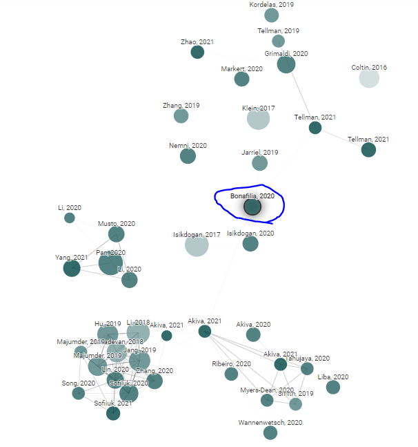

# 一、论文阅读

1. 详细阅读`Sen1Floods11 A Georeferenced Dataset to Train and Test Deep Learning CVPRW`论文的Introduction部分，并记录研究现状（在该论文目录下的`笔记.md`中）。
2. 阅读该论文作者的另一篇论文`H2O-Net: Self-Supervised Flood Segmentation via Adversarial Domain Adaptation and Label Refinement`，了解研究现状，记录在该论文所在目录下的`阅读记录.md`中。

# 二、相关文献查询

1. 利用`Web of Science`网站，搜索flood detection，Sentinel等关键词查询最近相关文献；

2. 利用`connected papers`网站，搜索与`Sen1Floods11 A Georeferenced Dataset to Train and Test Deep Learning CVPRW`论文相关的文献；

   **下面是网站给出的论文相关性关系图**

   

 3. 查找该论文作者的相关文章。
   
   **相关文献**：放在项目根目录下的`相关论文`文件夹中。

# 三、下周工作

1. SAR图像为什么可以穿透云层检测的水体？
2. 从方法角度分析：SAR图像检测水体和光学图像检测水体，掌握这两种图像有哪些检测水体的方法。
3. 了解H2O网络实现思路。
