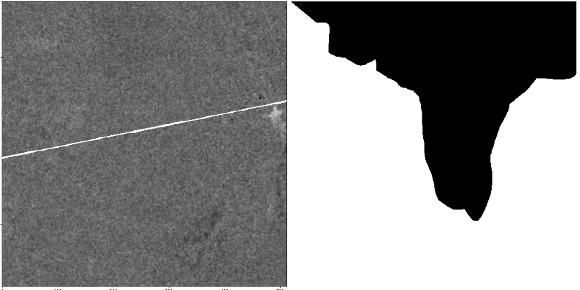
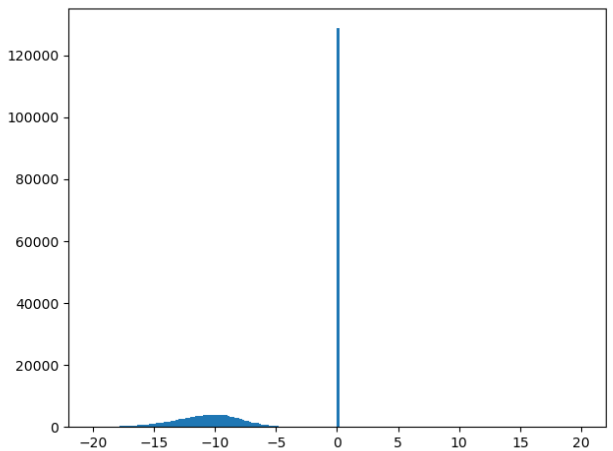
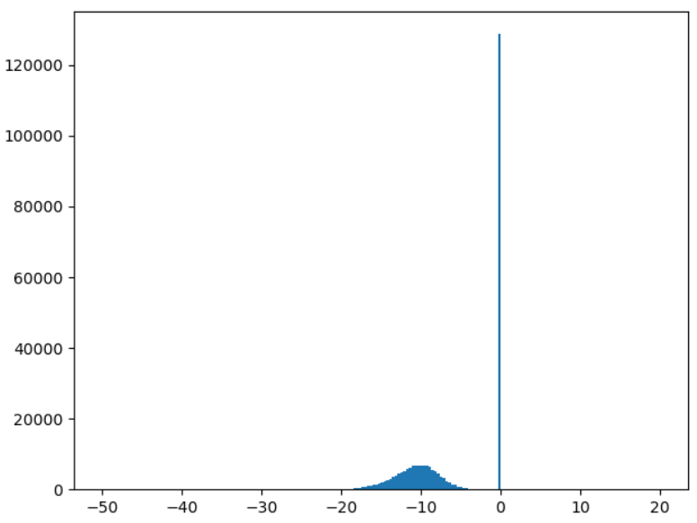
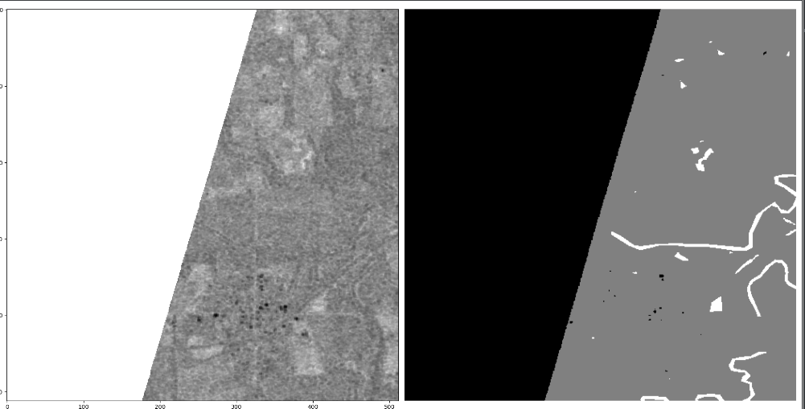
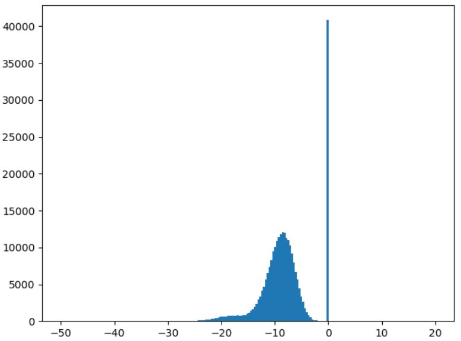
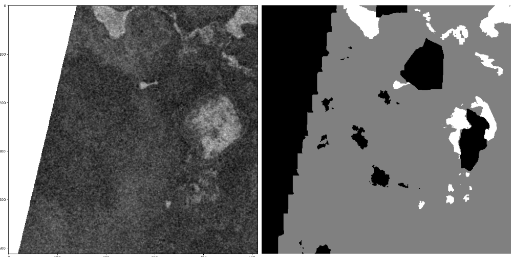

阈值：0.5,精确率：0.8907507604197532,召回率：0.6996962543741325,f1：0.7837481724939858

# 数据存在的问题

1. 52张图像中没有水像素；

   直接删除这52张图像

   

   下面是删除的52张图像

   ```python
   Ghana_7496、Ghana_168875、Ghana_97059、Ghana_134751、Ghana_45911、Ghana_146222、Ghana_167233、Ghana_194723
   Ghana_49890、Ghana_154838、Ghana_187318、Ghana_11745、Ghana_26376、Ghana_156478、Ghana_277、Ghana_161233
   Ghana_132163、Ghana_5079、Ghana_142312、Ghana_234935、Ghana_83483、Ghana_128663、Ghana_53713、Ghana_264787
   Ghana_124834、Ghana_144050
   ```

   ```python
   Pakistan_65724、Pakistan_760290、Pakistan_132143、Pakistan_740461、Pakistan_336228、Pakistan_210595
   Pakistan_528249、
   ```

   ```python
   Somalia_7931、Somalia_93023、Somalia_195014、Somalia_61368
   ```

   ```python
   Paraguay_224845、Paraguay_7894、Paraguay_284928、Paraguay_205585、Paraguay_40936、Paraguay_36015
   Paraguay_36146、Paraguay_198534、Paraguay_12870、Paraguay_215904
   ```

   ```python
   India_44475、India_136196
   ```

   ```python
   Sri-Lanka_52223、Sri-Lanka_135713
   ```

   ```python
   Mekong_221789
   ```

2. 执行步骤1后，剩余的图像中有40中图像存在Nan数据

   

如果简单地将Nan值赋值为0，部分图像会出现下面这种状况：



​	0值特别多，在后面计算均值和方差时，很影响结果。

​	解决方法：

​	① 在采样时，计算每个片段中nan的像素个数，如何个数大于整片段的5%的时候，舍去当前片段的；

​	② 当满足条件1时，用当前片段（除去nan像素）的均值填充nan像素。

3. 每个片段利用自己的最大值和最小值进行标准化时，模型的loss计算为nan。

   估计导致这种情况的原因是nan像素过的，我们的处理是将nan变为0处理。

   做了下面的测试：

   情况一：下面这种nan（像素0）比例会导致loss为nan

   

   

   情况二：这种比例，可以正常得到loss

   

   

   

   > 解决方法：在输入模型之前，数据求取normalization时，舍去这些无效值，这样求出的均值和方差就是有效数据的。

4. 统计出394张图像：

- 通道1中所有水像素的平均最大值为-1.1699967010320178，平均最小值为-32.34447985373173
- 通道2中所有水像素的平均最大值为-8.88018676065627，平均最小值为：-44.92737342137371

# 纠正一个代码问题

在测试时，使用model.eval()，这是因为测试时虽然没有更新梯度，但是由于模型中存在batch_normalization层，执行测试代码时，该层的数据会变化，使用eval()固定normalization层。

# 一个问题

对于无效数值，我们将其赋值为0。这个赋值操作，是在标准化和归一化之前进行，还是在之后进行。如果之前进行，那么输入到模型中的数据就不是0，反之，输入到模型中的数值为0。

