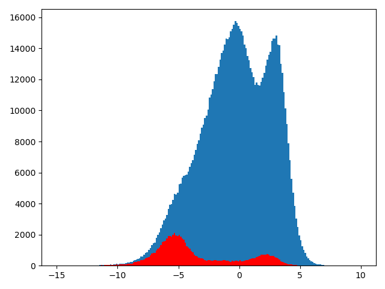

# 一、前半周工作

1. 修改UNet卷积操作，由于pytorch的Conv2d默认加入随机bias，因此会存在输入全0数据，得到的输出非全0，将bias设置为False。

2. 将模型跑了500多轮，绘制loss-epoch曲线：

   

> 图中200多轮和300多轮的时候train loss增高是因为修改了学习率，之后模型是在前面最好结果的基础上训练的（并非最近的结果）。

# 二、后半周工作

## 2.1 结果展示

分析val loss一直存在震荡的情况，认为是normalization过程中存在问题，训练集和验证集不符合独立同分布。目前求出全部数据的均值和方差 `([0.625678774083458, 0.7125976882787971], [0.03397823636075616, 0.04145355663413591])`。利用该数值对训练集和验证集输入模型前进行归一化。此外，在标准化时，最大值和最小值在一张图像(512x512)上求得，而非之前的每一个分块。

修改后，发现依然无法解决前面的问题。目前的分数为**(0.8674549672047769, 0.7542593038764634, 0.8069066066389432)**，相较于上周的结果F1分值提升了0.02。

**另外，修改UNet**将3、4、5、6、7组各增加一个卷积操作，为了不影响训练和推理速度，把原来的普通卷积改为深度可分离卷积。

其他结构和原模型一致，数据预处理、输入方式保持不变。

新模型的结果

目前分值为：**(0.861298758906211, 0.7743251162645047, 0.8154995433273633)**

## 2.2 问题分析

**是否过拟合：**

上面是loss-epoch图像，现在绘制loss-batch图像，每隔4个batch记录一次loss，以此来判断loss曲线是什么时候开始震荡。

其实，val loss不断震荡而train loss在缓慢下降这种情况的原因有两种：

1. 数据分布存在问题：训练集和验证集符合的分布存在较大的差异；
2. 在前面几个epoch中，模型就已经过拟合了。

针对可能过拟合的情况：

1. 对每一个分块除了进行上下左右翻转外，在多加上一个旋转；
2. 改进UNet网络结构。

**数据分布情况：**

按照前面的对每一张图像进行标准化（利用自身的最大值和最小值）和归一化（利用整合数据集的均值和方差）后绘制直方图：

训练集：

测试集：

> 绘制时摒弃了数值0，0过多无法正常显示其他数据。
>
> 蓝色：全部数据
>
> 红色：水域数据

问题：我们做的这些标准化和归一化工作，都是在输入模型之前。而在模型进行过程中，模型内部有batch normal层，它们所拟合的分布是以batch=32得到的，与整体相比可能会有很大的差距。并且好像在输入模型之前，我们无论是否做归一化或者怎么做归一化，对模型最终输出的影响并不大，中间层已经淡化了输入的影响。

上面两张图是从整体角度观察的，通过显示预测结果，发现原图中的背景和水域对比明显时很容易识别，而对比模糊的情况下基本识别不出来。

**容易识别：**

**不容易识别：**

绘制这四张图像的标准化后的直方图：

> -5附近的是容易识别的，可以发现它和整体的分布类似，0-5直接的分布是难以识别的图像。

我现在的解决思路是：

1. 将所有图像的均值求出，利用**img-(img_mean-0.5)**，这样把所有的图像调整为以0.5为均值；
2. 之后，再求取全部数据集的均值和方差；
3. 输入模型之前进行归一化。

下面是进行上述操作后得到的四张图的直方图：

另外，难以识别的图像，无非是因为水域和背景像素之间太相近，如果可以将二者之间的差异扩大，也可以增加识别效果。

或者有一个模型能够使图像中像素差异扩大，不同图像扩大指数不同。
