# 一、nan的问题

对于BatchNormal层中如何解决nan置为0后，对均值和方差的影响？

**如果利用mask解决，就需要修改BN代码，在计算mean和std时利用上mask，但是修改代码难道比较大。**

BatchNormal中有四个参数，mean，std，running_mean，running_std

mean和std是在训练时，每一个batch中计算来的，而running_mean和running_std用于测试中，其值时根据每一个batch的mean和std累计来的，能够作为整个数据集的均值和标准差。

我们为了消除无效值的影响，应该将修改计算mean和std的程序。

下面展示什么情况下，无效值在BatchNormal层会有效。

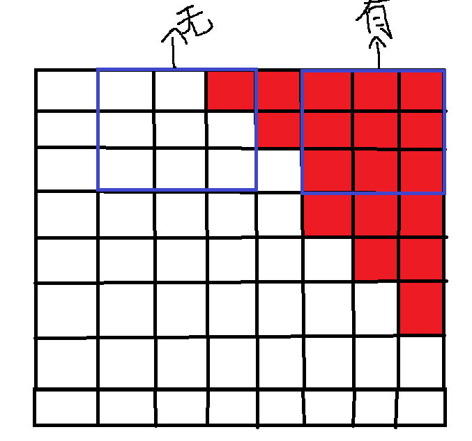

> **蓝色矩形是卷积核，红色区域是nan值（将会置为0）**
>
> 在卷积层计算后，只有输入卷积核进行计算的数值，全部是来自nan的区域才会在下一层中保留。也就会在BN层中计算mean时作用在除数上，使得mean变小。

希望修改重写BN代码，在输入时传入一个mask能够标记哪些位置的0，在卷积前是来自全nan区域。我查看源码后，发现在最后计算中,调用了下面代码：

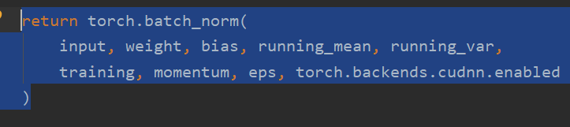

而torch.batch_norm指向一个pyi文件，无法查看到源码。最后在网上查询到，该函数并非python代码，是利用C实现的。

https://stackoverflow.com/questions/58193798/how-to-find-built-in-function-source-code-in-pytorch

基于上面的内容，利用重写BN的思路其实不通，因为BN是一个网络层，不仅仅是计算mean和std，还涉及许多可学习参数。

**还有一点就是，这种影响仅在训练，测试中BN参数已经固定，不受影响。**

**目前，一种方法就是在数据集筛选上，不使用这种带有无效值的片段（既然nan存在时，我们要想办法消除其影响，不如直接选择没有nan的片段）。**据统计存在nan的图像一共有40多张。

# 二、分别对SAR图像的两个通道进行训练

## 2.1 第一个通道

**全部:**

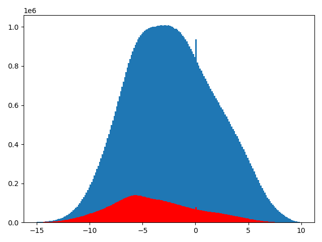

**val:**

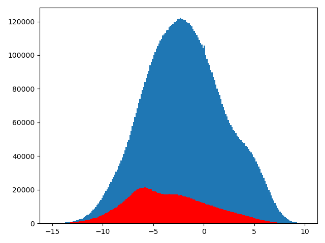

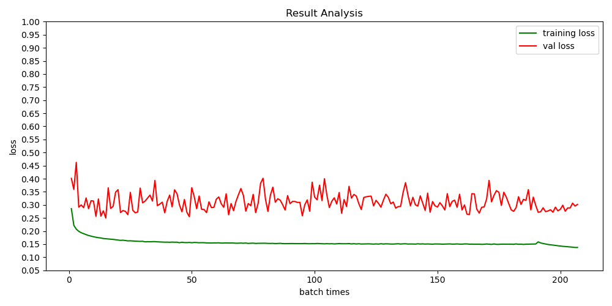

## 2.2 第二个通道

**全部：**

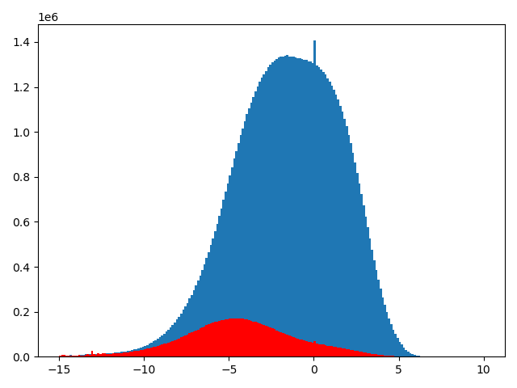

**val:**

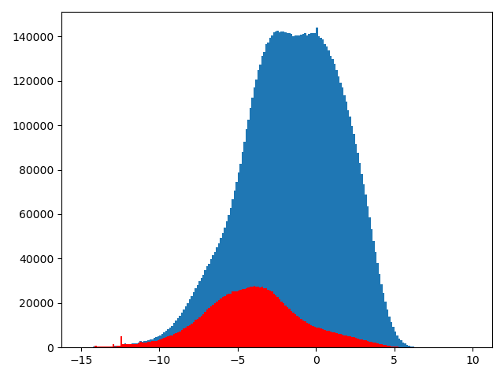

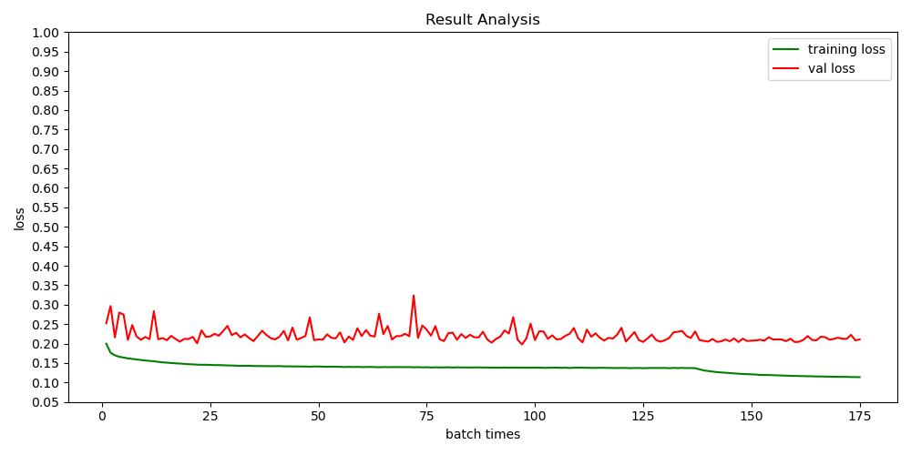

# 三、模型输出的直方图分析

**蓝色代表非水分布，靠近0的越多越好，红色代表水的分布，靠近1的越多越好**

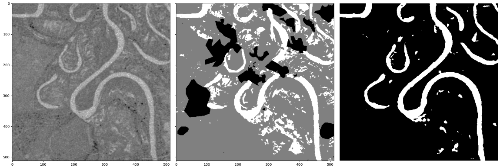

| 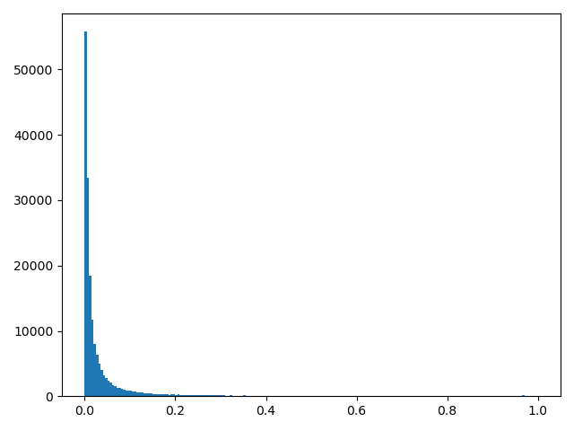 | 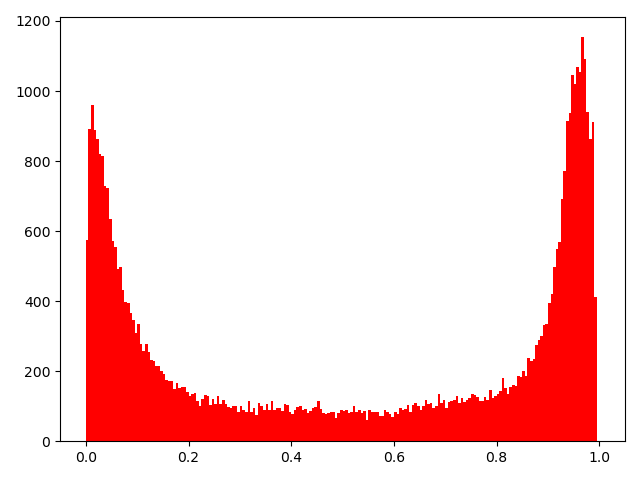 |
| ------------------------------------------------------------ | ------------------------------------------------------------ |

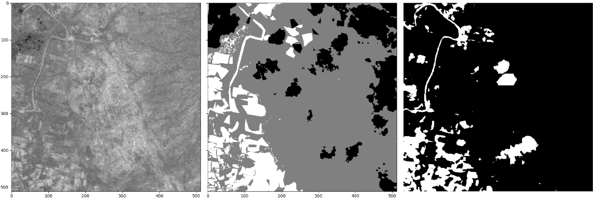

| 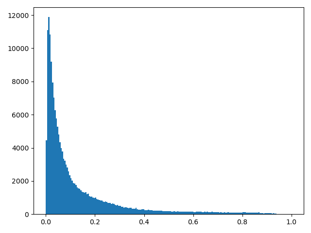 | 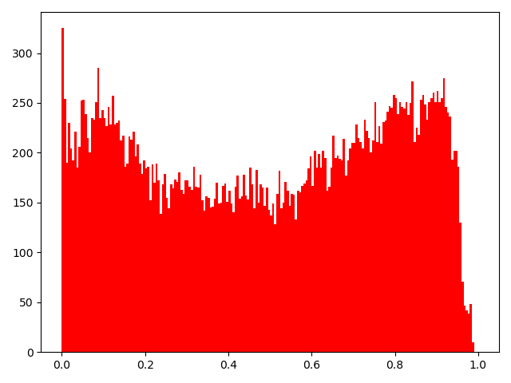 |
| ------------------------------------------------------------ | ------------------------------------------------------------ |

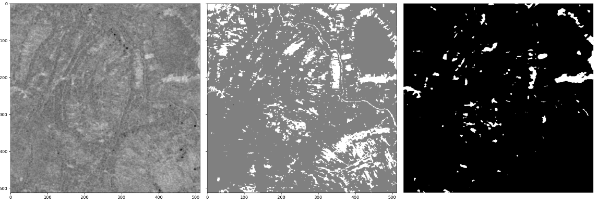

| 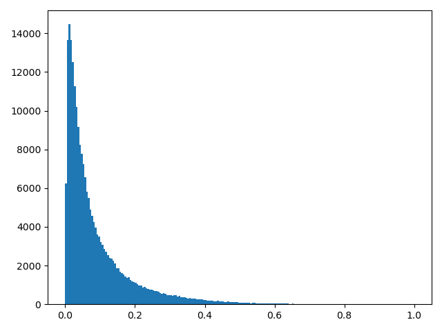 | 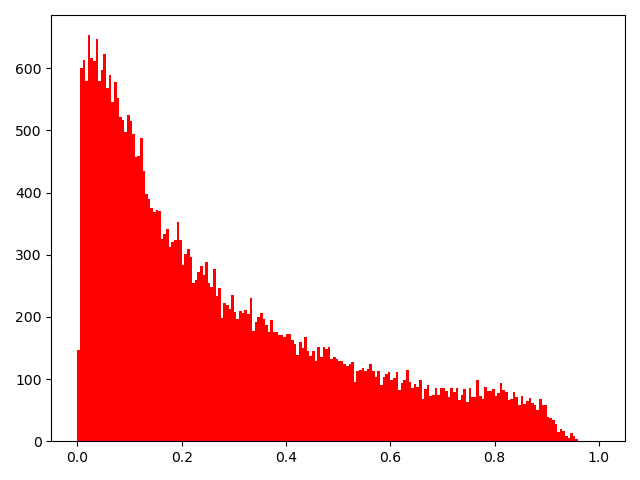 |
| ------------------------------------------------------------ | ------------------------------------------------------------ |

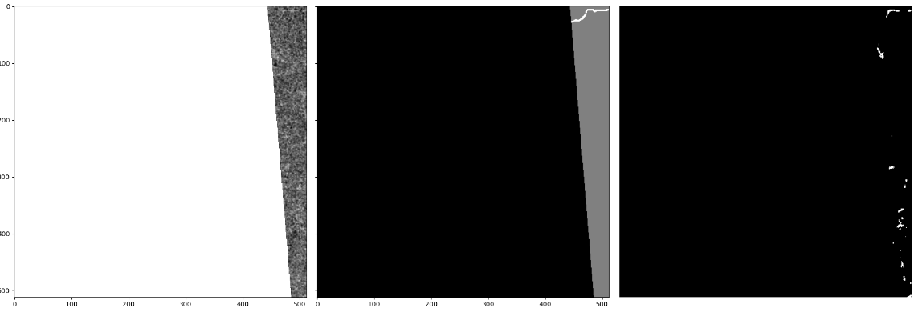

| 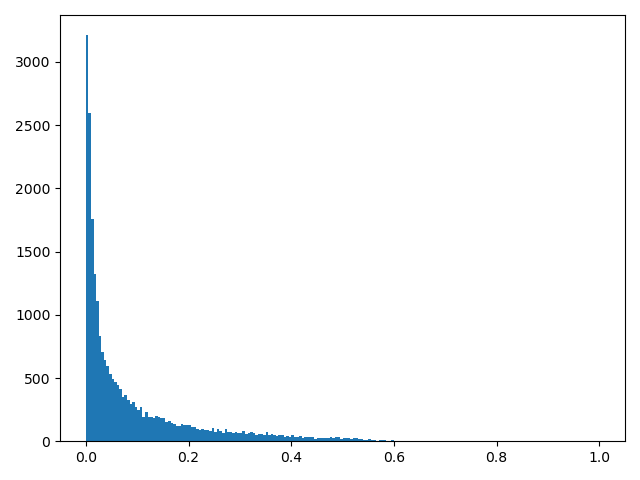 | 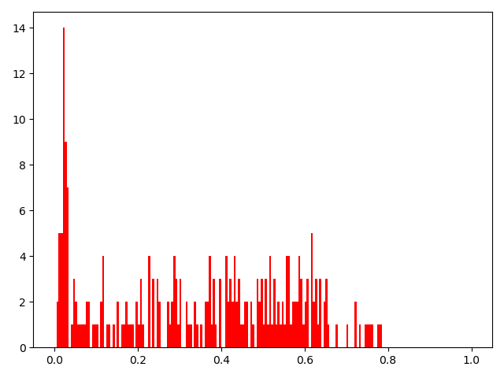 |
| ------------------------------------------------------------ | ------------------------------------------------------------ |

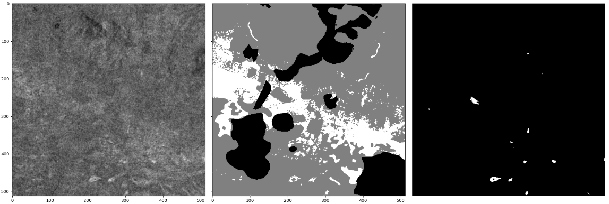

| 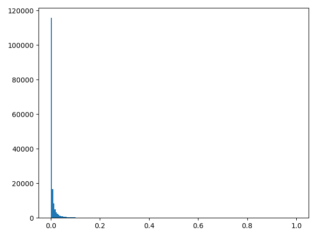 | 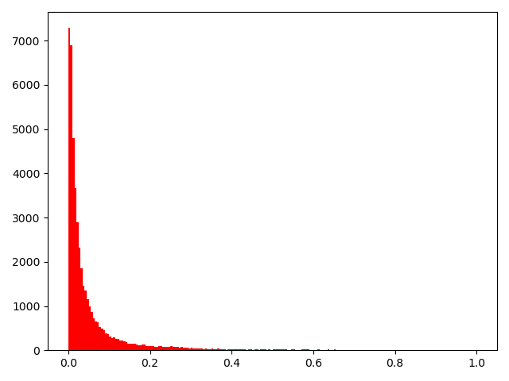 |
| ------------------------------------------------------------ | ------------------------------------------------------------ |

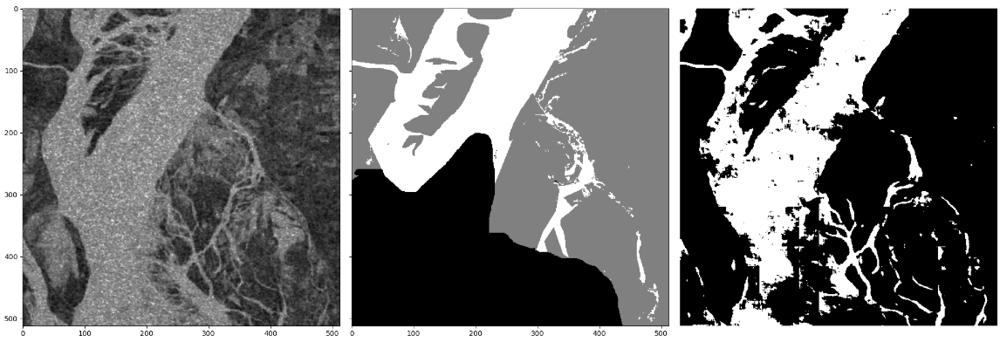

| 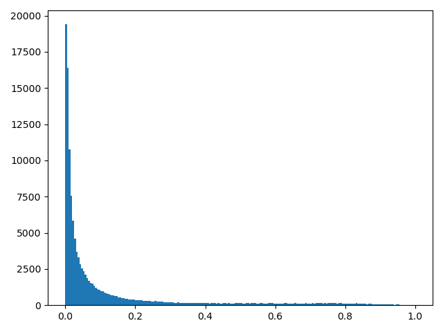 | 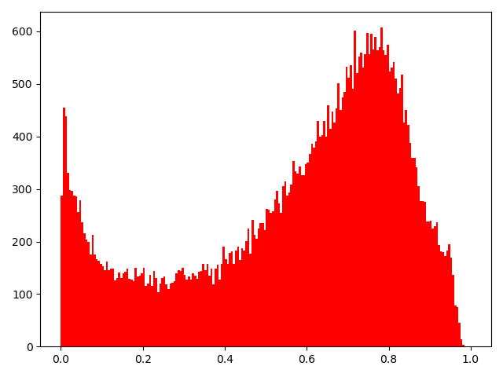 |
| ------------------------------------------------------------ | ------------------------------------------------------------ |

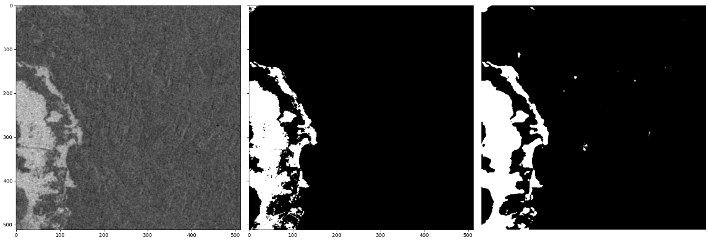

| 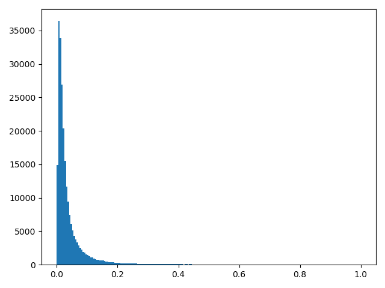 | 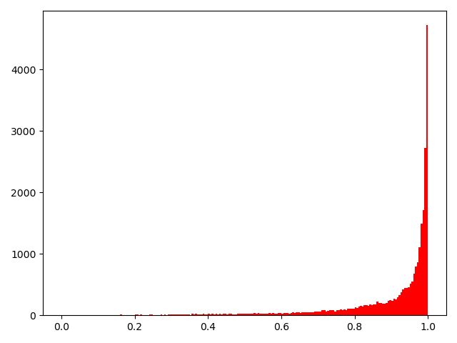 |
| ------------------------------------------------------------ | ------------------------------------------------------------ |

> 分析：通过这几张模型输出概率直方图可以推出，对于整个测试集来说，负样本能够很好地分布在0周围（小于0.5），而正样本无法收敛到1周围（大于0.5），目前模型的最大问题是，对正样本误判。

# 四、UNet使用单通道和双通道对比

下面表数据是在全部验证集中的得分：

| 通道      | 通道1              | 通道2              | 双通道             |
| --------- | ------------------ | ------------------ | ------------------ |
| accuracy  | 0.9298981828590654 | 0.9427790178851664 | 0.9518534234915119 |
| precision | 0.8669497394318095 | 0.867056079474119  | 0.9034104538666138 |
| recall    | 0.6743075095431112 | 0.7673350123962064 | 0.7896647859194836 |
| F1        | 0.7585894179367135 | 0.8141533453050254 | 0.8427167392042574 |

> 分析：
>
> 1. 通过结合上一节的分布直方图和上面三个模型均是precision大于recall可知，由于数据集中负样本数量较多，模型学习负样本的特征比较全，因此很少把负样本错误地分为正样本，故precision高，而正样本特征学习不全，导致存在不少正样本的概率小于0.5，故被分为负样本。
> 2.  通过对整个验证集的得分可以知道，使用两个通道效果好于单个通道，通道2效果好于通道1。

下面分别计算每一张图像的F1值，统计通道1、通道2和双通道最优的次数。

这里是单通道优于双通道的F1分值：

```python
0.6946863337480007 0.6230180642107755 0.6532244046584391
0.13222980024756678 0.28779214321233215 0.2297056501635277
0.46092896174863385 0.3948874010955569 0.4359988697372139
0.2751345532831001 0.3914919852034525 0.37839721254355396
0.009381898454746136 0.11477619632874757 0.019005196733481812
0.543179360420207 0.7942042110029431 0.7501472031403338
0.9601078436267412 0.9534120061570036 0.9166938199196263
0.09057665260196907 0.4715933361811192 0.46669459572685373
0.4050962038481539 0.5803078710426953 0.535873912020701
0.8308061866391786 0.8536940648166188 0.8408876123413324
0.5836843198588628 0.9958749083490069 0.9931026230545038
0.09500000000000001 0.02112337974075852 0.046247818499127395
0.6699293235627172 0.6715903882668762 0.6238811209266952
0.912910712104556 0.921679770829524 0.9198045757864632
0.16143039591315453 0.3856671381423857 0.16622488242838818
0.09840497431738308 0.13582089552238805 0.10842412968376294
0.9278580535486612 0.853598582290059 0.8937430167597764
0.12962962962962965 0 0.03764705882352941
0.8721922511034821 0.9086676016830295 0.9056444105949057
0.8759298953473711 0.8343018879286983 0.8486145867880724
```

验证集一共45张图像：

通道1分值最高次数：7

通道2分值最高次数：13

双通道分值最高次数：25

> 通过上面的分析可知，两个通道简单的输入模型中的效果并不一定优于单一通道。是否可以通过调整两个通道的权重进而取得最优结果，在后面尝试使用通道加权模型。
>

# 五、目前所有模型对比

下面均是针对UNet网络，做的修改：

1. UNet原始网络

   最好的分数：(0.9521255050054863,0.8974278665991864, 0.7981244588957538, 0.8448682115644728)

2. AlterUNet：修改UNet将3、4、5、6、7组各增加一个卷积操作，为了不影响训练和推理速度，把原来的普通卷积改为深度可分离卷积。

   最好分数：(0.9540996778510683,0.8682166295078664, 0.8476502548109086, 0.8578101879104592)

3. 图像通道加权的UNet：

   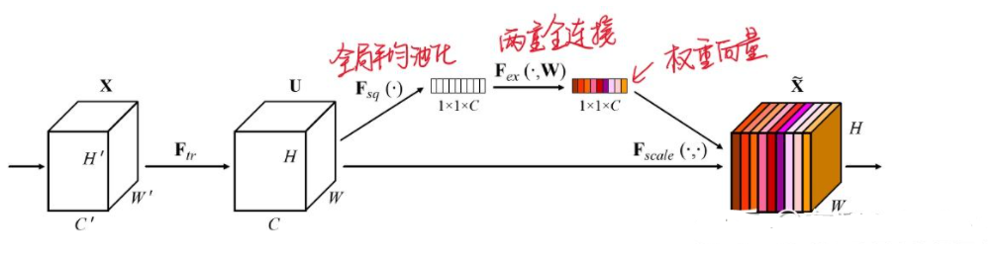


考虑**特征通道间的相关性**。通过给不同的**通道加权**以强化更重要的特征，弱化不重要的特征通道，从而提高模型准确度。

目前仅考虑输入到UNet模型之前，对两个通道进行加权，不过按照现在的效果，它和UNet原始网络的F1分值差不多。

最好分数：(0.9514295829640212,0.8962865808786555, 0.7945869898862697, 0.8423783642837935)

> 分析：通过上一节对不同通道训练多个模型，发现每个通道对结果的贡献不同，并非使用两个通道效果就一定好。针对这个现象，希望模型能够自动选择好的通道组合方式，这样是模型能够取到最优的分数。在后面尝试利用通道加权的方法训练模型（目前仅在输入UNet网络之前加权处理），但得到的结果和普通UNet网络相差不大，并没有取得很好的提升。

# 七、下周任务

由于在最新尝试的通道加权模型中没有得到很好的提升，可能这种通道比重选择并不能解决选择最优组合的问题，这周尝试使用多模态方法训练任务。

学习视频：https://www.bilibili.com/video/BV1m54y1G7nL?from=search&seid=6088802245362861842
