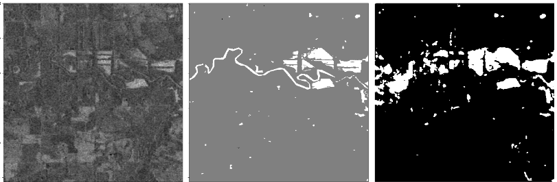
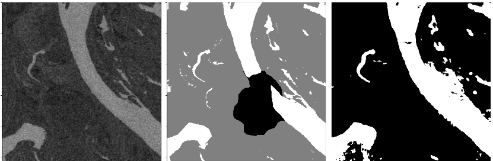
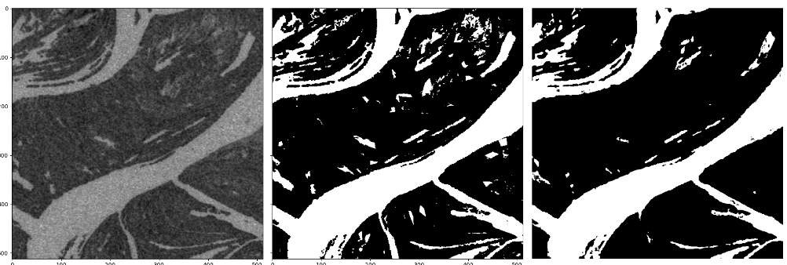
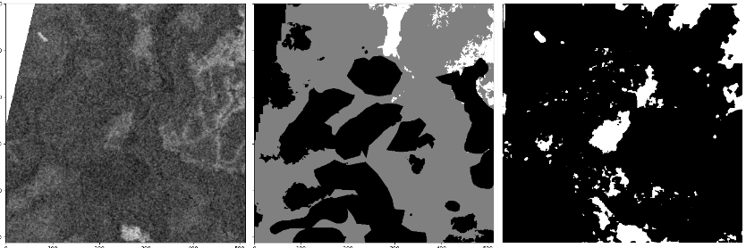
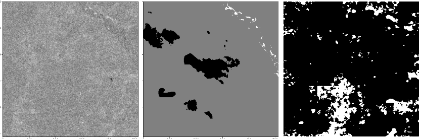
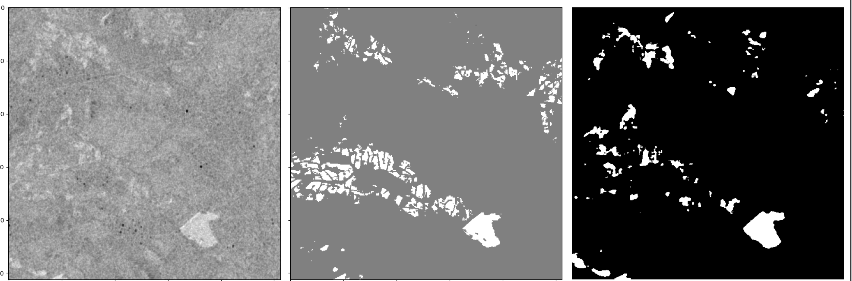
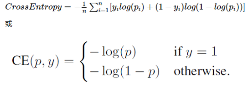
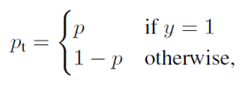
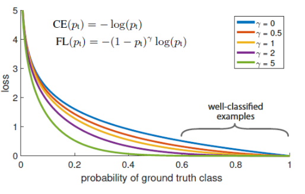
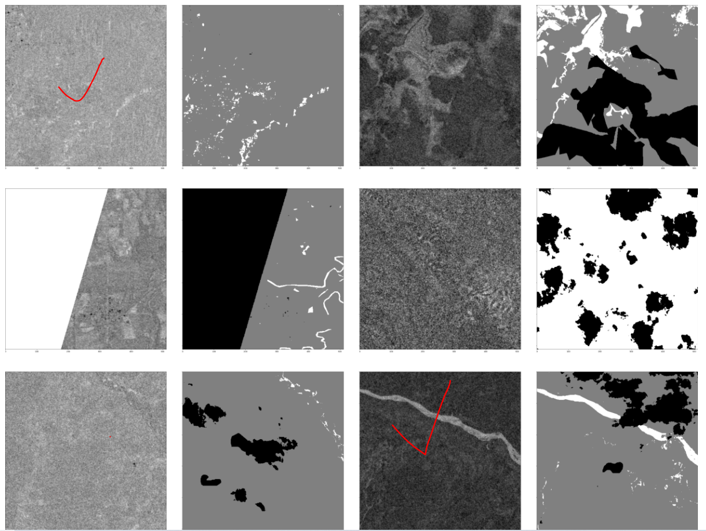

# 一、实验发现

下面水与非水类的阈值设为0.5。

交叉熵损失计算不设置weight参数：结果显示精确率达到0.58，而召回率为0.42，F1值为0.49；

交叉熵损失计算设置**weight=[1,3]**(非水：水)：结果显示精确率达到0.48，而召回率为0.49，F1值为0.489；

下面是调整阈值大小，得到的一系列指标：

未设置weight：

```python
阈值：0.1,精确率：0.39532081814450143,召回率：0.6553800566701685,f1：0.49316677354844696
阈值：0.2,精确率：0.46211260821339084,召回率：0.5863028637147625,f1：0.5168522457150007
阈值：0.3,精确率：0.5115121411533063,召回率：0.5294602877801707,f1：0.520331486080863
阈值：0.4,精确率：0.5511538724362458,召回率：0.47482606827753104,f1：0.510150765877102
阈值：0.5,精确率：0.5870579189158597,召回率：0.42164399556226184,f1：0.4907880970687267
阈值：0.6,精确率：0.6213249413270749,召回率：0.3673728127564648,f1：0.46173441860936276
阈值：0.7,精确率：0.6591359297270649,召回率：0.309225267073763,f1：0.4209616919412492
阈值：0.8,精确率：0.7019724519699099,召回率：0.2419141985894833,f1：0.3598252036927388
```

设置weight=[1,3]:

```python
阈值：0.1,精确率：0.2838059622999249,召回率：0.7204932813681577,f1：0.40720988358505733
阈值：0.2,精确率：0.34513486862855985,召回率：0.6556905301387038,f1：0.4522300598269239
阈值：0.3,精确率：0.3936798675856907,召回率：0.6015973614661075,f1：0.4759212060493191
阈值：0.4,精确率：0.4402899680218713,召回率：0.5487692144881078,f1：0.48858063131306834
阈值：0.5,精确率：0.4819995278564684,召回率：0.49796930727972677,f1：0.4898542941163696
阈值：0.6,精确率：0.5221959194725592,召回率：0.44602212000815783,f1：0.4811125625952537
阈值：0.7,精确率：0.565733428370674,召回率：0.391050094158263,f1：0.4624454857836206
阈值：0.8,精确率：0.6226803074805817,召回率：0.3259803217290078,f1：0.4279328575825031
```

设置weight=[1,8]：训练次数少于前面两种

```python
阈值：0.1,精确率：0.2815545867813619,召回率：0.7026708427567521,f1：0.4020221238716274
阈值：0.2,精确率：0.3025945966858853,召回率：0.6687374242476275,f1：0.41665738762424637
阈值：0.3,精确率：0.31636037944087825,召回率：0.6448674110087024,f1：0.42447898586109567
阈值：0.4,精确率：0.3274173248722307,召回率：0.6242745398439783,f1：0.42954722510422844
阈值：0.5,精确率：0.33745556368130214,召回率：0.6047462492632387,f1：0.4331874204137019
阈值：0.6,精确率：0.34727561646756255,召回率：0.5844722616835791,f1：0.43568216197521753
阈值：0.7,精确率：0.35769024993904036,召回率：0.5613297235244276,f1：0.4369484339910187
阈值：0.8,精确率：0.3703533004410592,召回率：0.5327612585178712,f1：0.4369542899777319
```

做出一个分析：

- 无论是否设置weight，当我们逐渐增大阈值时，精确率都是再增大，而召回率都是在减小。
- 对于不设置weight时，我们仅看精确率可以认为大部分识别为水的像素都正确了，但考虑到召回率时发现大部分真实是水的像素，却被分成了非水。我们可以认为该模型识别水体比较保守。
- 对于设置weight=[1,8]时，我们仅看精确率可以认为大部分识别为水的像素都错了，但考虑到召回率时发现大部分真实是水的像素，很少被识别成非水。我们可以认为该模型识别水体比较激进。
- 不设置weight的最好F1的阈值并不在0.5处，这应该是数据中类别不平衡造成的。
- 针对不设置weight的情况，训练200多轮，将学习率从0.01一直调整到1e-6，其实学习率为1e-5训练70轮，发现后面20轮左右测试集的损失值已经在上下徘徊了，在调整为1e-6后训练40轮，loss值也是一直在徘徊，效果反而变差了。

**数据集中存在难以区分的水体**


预测一些样本：

SAR图像、真实标签、预测标签



(0.3606662911402591, 0.7397870760089131, 0.4849206134537881)



(0.7945987836312483, 0.9567131179131423, 0.8681527021057283)



(0.9732030445232918, 0.8482728519765557, 0.9064536332502698)



(0.33987525987525985, 0.4268407310704961, 0.37842592592592594)



(0.026523272702123245, 0.6781609195402298, 0.05104995174548237)



(0.45320888742050053, 0.3029483215547703, 0.3631490122108607)

# 二、Focal Loss

**论文：Focal Loss for Dense Object Detection**

设计用于解决单阶段目标检测中前景与背景极其不平衡的问题，例如**1:1000**。

我们的数据集中非水与水像素数量之比大于1000有77张，其中训练集占69张，测试集占8张。123张图像的比例小于10，10到100之间的数量有171。

训练时正负样本数目相差较大，常见的做法就是给正负样本加上权重，给数量较少的正样本的loss更大的权重，减小负样本loss的权重。主要用于FCN/U-net等分割，边缘检测的网络，用于对像素级别的二分类样本不平衡进行优化。
**负样本数量太大，占总的loss的大部分，而且大部分是容易分类的，因此使得模型的优化方向并不是我们所希望的那样。**

focal loss，这个损失函数是在标准交叉熵损失基础上修改得到的。这个函数可以通过减少易分类样本的权重，使得模型在训练时更专注于难分类的样本。

对于二分类来说，标准的交叉熵损失：



> y表示真值1/0。
>
> p是预测输出为1的概率。

为了方便使用p<sub>t</sub>代替p：



**对基本交叉熵的改进—Balanced Cross Entropy**
$$
CE(p_t)=-\alpha_tlog(p_t)
$$

> 增加一个系数$\alpha_t$，当label=1时，$\alpha_t$=a，当label=0时，$\alpha_t$=1-a，a的范围（0-1）。因此可以通过设定a的值，来控制正负样本对总loss的权重。
>
> 当正样本很小时，可以设置a>0.5。

Balanced Cross Entropy虽然可以控制正负样本的权重，但其缺点是无法控制易分类和难分类样本的权重。

**Focal loss**

公式：$FL(p_t)=-(1-p_t)^\gamma log(p_t)$

>  $\gamma$称为focusing parameter,>=0
>
> $(1-p_t)$称为调制系数。

focal loss的两个重要性质：

1. 当一个样本被分错的时候，$p_t$很小，因此调制系数就趋于1，相比于原来的loss变化不大。当$p_t$趋于1时，此时分类正确且样本是易分类样本，调制系数趋于0，也就是对总的loss贡献很小；
2. 当$\gamma =0$时，focal loss就是传统的交叉熵损失。

作者最终的公式为：

$FL(p_t)=-\alpha(1-p_t)^\gamma log(p_t)$

这样既可以调整正负样本的权重，同时也可以控制难易分类样本的权重。



下次讨论任务：

求出选中图像的最大值、最小值和直方图。



修改模型：

1. 每个patch一个normaliztion；
2. 考虑分片方式，可以有目的的选取分片。