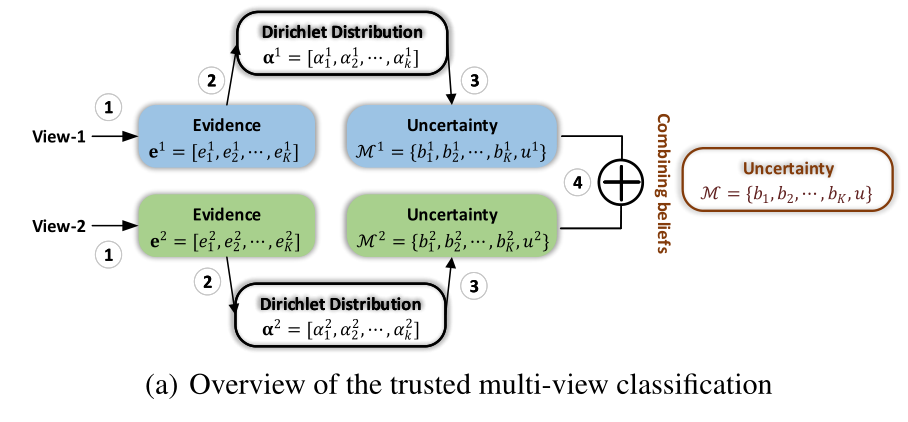
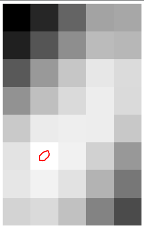
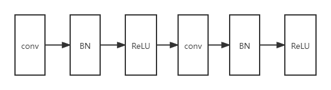

# 一、Trusted multi-view classification

## 1.1 Introduction

​		多视图数据通常与多模态或多类型的特征相关。最先进的多视图学习方法在广泛的实际应用中取得了巨大的成功。然而，这种成功通常依赖于复杂模型，这些模型倾向于将多视图信息与深度神经网络相结合。 尽管这些模型可以提供准确的分类结果，但它们通常容易产生不可靠的预测，特别是当呈现的视图没有很好地表示时（例如信息来自异常传感器）。因此，它们在安全关键应用（例如，计算机辅助诊断或自动驾驶）中的部署受到限制。这启发我们引入一种新的多视图分类范式，以产生可信的决策。 

​		对于多视图学习，传统算法通常假定不同视图的值相等，或为每个视图分配/学习固定权重。潜在的假设是，对于所有样本，这些视图的质量或重要性基本上是稳定的。 通常，我们不仅需要知道分类结果，还应该能够回答“这个决定的可信度？”以及“为什么对决策的信心如此之高/如此之低？”。为此，模型应为每个样本的预测提供准确的不确定性，甚至为每个样本的不同视图提供不确定性。

​		基于不确定性的算法可以大致分为两大类，即贝叶斯方法和非贝叶斯方法。传统的贝叶斯方法通过推断参数的后验分布来估计不确定性 。然而，与普通的神经网络相比，由于模型参数的加倍和收敛困难，这些方法的计算成本很高。最近的算法通过在测试阶段引入dropout来估计不确定性，从而降低计算成本。已经提出了几种非贝叶斯算法，包括深度集成（Lakshminarayanan等人，2017年）、证据深度学习（Sensoy等人，2018年）和确定性不确定性估计（van  Amersfoort等人，2020年）。不幸的是，所有这些方法都侧重于估计单视图数据的不确定性，尽管通过不确定性融合多个视图可以提高性能和可靠性。 

​		在本文中，我们提出了一种新的多视图分类算法，旨在优雅地集成多视图信息以进行可信决策。我们的模型在证据级别组合不同的视图，而不是像以前那样在特征或输出级别，这产生了稳定和合理的不确定性估计，从而提高了分类可靠性和鲁棒性。 Dirichlet分布用于模拟类别概率的分布，通过不同观点的证据进行参数化，并与Dempster-Shafer理论相结合。

## 1.2 Related Work

### 1.2.1 Uncertainty-based Learning

​		深度神经网络在各种任务中取得了巨大的成功。然而，由于大多数深层模型本质上是确定性函数，因此无法获得模型的不确定性。 贝叶斯神经网络（BNNs）通过用分布代替确定性权重参数，赋予深度模型不确定性。

### 1.2.2 Multi-View Learning

事实证明，使用多视图学习数据在各种任务中都是有效的。 

### 1.2.3 Dempster-Shafer Evidence Theory(DST)

DST是一种关于信念函数的理论，最早由Dempster（Dempster，1967）提出，是贝叶斯理论对主观概率的推广。后来，它被发展成一个通用框架来模拟认知不确定性。与贝叶斯神经网络不同，DST直接对不确定性建模，贝叶斯神经网络通过对权重参数进行多次随机抽样间接获得不确定性。DST允许将来自不同来源的信念与各种融合算子相结合，以获得考虑所有可用证据的新信念。当面对来自不同来源的信念时，Dempster的组合规则试图融合它们的共享部分，并通过规范化因素忽略冲突的信念。

## 1.3 Trusted multi-view classification

​		已经证明使用softmax输出作为预测的置信度通常会导致高置信度，即使是错误的预测也会高置信度，这是因为最大的softmax输出会作为最终的预测。因此，我们引入了一种基于证据的不确定性估计技术，该技术可以提供更准确的不确定性，并允许我们灵活地集成多个视图以进行可信决策。

### 1.3.1 Uncertainty and the theory of evidence

​		在这个小节中，我们详细阐述了证据深度学习来量化每一个视图的分类不确定性，同时建模每个类的概率和当前预测的总体不确定性。

​		我们需要确定与不确定度密切相关的浓度参数。我们详细阐述了主观逻辑，它定义了一个理论框架，以获得不同类别的概率(信念质量)和能够从数据中收集证据的多分类问题的总体不确定性。具体来说，**对于K分类问题，主观逻辑试图根据证据为每个类别标签分配一个信念质量，并为整个框架分配一个总体不确定性质量。**

1. 对于第v个视图，K+1个质量值都是非负数且它们之后为1。

$$
u^v+\sum _{k=1}^Kb_k^v=1
$$

> $ u^v>=0,b_k^v>=0$ 分别表示整体不确定性和第k类的概率。

2. 对于第v个视图，主观逻辑将证据$e^v=[e_1^v,…,e_K^v]$和狄利克雷分布$\alpha ^v=[\alpha_1^v,…,\alpha_K^v]$的参数联系起来。具体来说，狄利克雷分布的参数是由证据导出的：$\alpha_k^v=e_k^v+1$
   $$
   b_k^v=\frac{e_k^v}{S^v}=\frac{\alpha_k^v-1}{S^v},u^v=\frac{K}{S^v} \\
   S^v=\sum_{i=1}^K(e_i^v+1)=\sum_{i=1}^K\alpha_i^v
   $$


   > $S^v$是狄利克雷强度
   >
   > 上面的式子描述了一个现象，第k类的证据越多，类别k的概率就越大。相应地，观察到的全部证据越少，总的不确定性就越大。



### 1.3.2 Dempster rule of combination for multi-view classification

在为单视图案例引入了证据和不确定性之后，我们现在关注的是它们对多视图数据的适应性。Dempster-Shafer证据理论允许将来自不同来源的证据组合在一起，得到一个考虑了所有可用证据的信念程度(由一个叫做信念函数的数学对象表示)。具体来说，我们需要结合V个独立的概率质量分配集合${M^v}_1^V,M^v=\{\{b_k^v\}_{k=1}^K,u^v\}$，最后获得一个联合质量$M=\{\{b_k\}_{k=1}^K,u\}$

**定义3.1(两个独立质量集的Dempster组合规则)**

联合质量M由两个质量集合M1和M2计算来的：
$$
M=M1\bigoplus M2
$$
更具体的计算规则：
$$
b_k=\frac{1}{1-C}(b_k^1b_k^2+b_k^1u^2+b_k^2u^1),u=\frac{1}{1-C}u^1u^2\\
C=\sum_{i\neq j}b_i^1b_j^2
$$

> C是两个质量集中冲突量的度量（两个视图预测不同的数量），$\frac{1}{1-C}$用于标准化。

组合规则确保：

1. 当两个视图都具有高不确定性时，最终的预测一定为低信度；
2. 当两个视图都是低不确定性时，最终的预测可能时高信度；
3. 当只有一个视图的不确定性较低，最终预测仅依赖于信度视图。

**根据上述组合规则，我们可以得到估计的多视图联合证据和联合Dirichlet分布α的相应参数，从而得到每一类的最终概率和总体不确定性。**

### 1.3.3 Learning to form opinions

在本节中，我们将讨论如何训练神经网络来获取每个视图的证据，然后利用这些证据获得相应的质量$\{M^v\}_{v=1}^V$和M。神经网络可以从输入中捕获证据，从而归纳出分类意见，传统的基于神经网络的分类器可以很自然地转化为基于证据的分类器，变化很小。**具体来说，将传统的基于神经网络的分类器的softmax层替换为激活函数层(即RELU)，以保证网络输出的是非负值作为证据向量。据此，可以得到狄利克雷分布的参数。**

# 二、代码实现

## 2.1 简要描述思路

1. 每一个模型的输出称为证据，输出形状(batch,class_num)，一个样本在所有类别上都有一个数值，为了保证数值非负数激活函数使用ReLU或Softplus；
2. 多个模型就可以产生多个证据，之后利用公式$\alpha_k^v=e_k^v+1$，这些证据转为狄利克雷分布参数；
3. 损失函数的计算：利用狄利克雷参数和label（独热编码）计算
   - 首先，求出每个样本的所有类别上数值之和$ S^v=\sum_{i=1}^K(e_i^v+1)=\sum_{i=1}^K\alpha_i^v$；
   - 利用S减去样本每个类别上的值，即$S^v-\alpha_i^v$；
   - 最后，将上一步求出的值乘以label，这样就保留了ground truth的$S^v-\alpha_i^v$，如果分类正确，那么该值就是最小的；
4. 整个项目中需要求(v+1)个损失值，v代表视图个数，1代表融合后的数据，将这些损失值相加取平均，就是最终的损失值。
5. 预测时，利用融合后的狄利克雷参数，每个样本的所有类别值最大的就是预测值。

## 2.2 代码实现需要考虑的问题

1. 该论文给出的代码示例：是手写字符识别，属于图像分类问题，而我们要解决的是图像语义分割问题；

2. 论文中给出了损失函数计算公式，更符合图像分类任务；

3. 数据输入格式为：

   ```python
   # 0，1代表视图
   官方代码：
   输入：
   {
       0:data,shape=(batch,feature_num),
       1:data,shape=(batch,feature_num)
   }
   输出：
   {
       0:data,shape=(batch,10),
       1:data,shape=(batch,10)
   }
   # 后面的损失函数输入数据shape=(batch,10)
   # 我们由于是语义分割问题，就需要对数据的输入和输出格式做调整
   我们代码：
   输入：
   {
       0:data,shape=(batch,1,128,128),
       1:data,shape=(batch,1,128,128)
   }
   输出：
   {
       0:data,shape=(batch,2,128,128),
       1:data,shape=(batch,2,128,128)
   }
   # 后面计算损失函数的时候，我们需要将每一个像素看作是一张图像，为了方便理解将数据的shape->(batch,128,128,2)，这一步转换利用permute(0, 2, 3, 1)实现，而不是reshape或view
   ```

4. 主要问题就是如何将论文中的损失函数计算公式应用到语义分割上面。

## 2.3 损失函数

以像素为单位计算损失值

```python
# loss function
def KL(alpha, c):
    '''
    :param alpha: shape=(batch,2,128,128)
    :param c:类别数
    :return:shape=(batch,1,128,128)
    '''
    beta = torch.ones((1, c)).cuda(0) # shape=(1,2)
    S_alpha = torch.sum(alpha, dim=1, keepdim=True) # shape=(batch,1,128,128)
    S_beta = torch.sum(beta, dim=1, keepdim=True) # shape=(1,1)
    lnB = torch.lgamma(S_alpha) - torch.sum(torch.lgamma(alpha), dim=1, keepdim=True) - torch.lgamma(S_beta) # shape=(batch,1,128,128)
    dg0 = torch.digamma(S_alpha)
    dg1 = torch.digamma(alpha)
    kl = torch.sum((alpha - 1) * (dg1 - dg0), dim=1, keepdim=True) + lnB # shape=(batch,1,128,128)
    return kl

def ce_loss(label, alpha, c, global_step, annealing_step):
    '''
    :param label:shape=(batch,128,128)
    :param alpha:shape=(batch,2,128,128) 第一个通道表示该像素是非水的狄利克雷值，第二个通道表示该像素是水的狄利克雷值，
    :param c:
    :param global_step:
    :param annealing_step:
    :return:shape=(batch,1,128,128)
    '''
    S = torch.sum(alpha, dim=1, keepdim=True)
    E = alpha - 1
    # la.shape=(batch,2,128,128) la 每一个像素是独热编码表示
    la = torch.stack([1-label,label],dim=1)
    # A.shape=(batch,1,128,128)
    A = torch.sum(la * (torch.digamma(S) - torch.digamma(alpha)), dim=1, keepdim=True)

    annealing_coef = min(1, global_step / annealing_step)

    alp = E * (1 - la) + 1
    B = annealing_coef * KL(alp, c)

    return (A + B)
```

## 2.4 运行代码后存在的问题

首先整个代码可以运行，但是在每一轮结束后，输出的loss值保持不变。

```python
第0轮：训练loss*nan测试loss*3.000000238418579,学习率*0.0001
第1轮：训练loss*3.0000001986821494测试loss*3.000000238418579,学习率*0.0001
第2轮：训练loss*3.0000001986821494测试loss*3.000000238418579,学习率*0.0001
第3轮：训练loss*3.0000001986821494测试loss*3.000000238418579,学习率*0.0001
```

针对这个问题，利用pycharm的调试工具设置断点，分析UNet网络的第一层后发现：网络在执行过程中会发生weight的grad为nan的情况。

两种可能：

①UNet网络最后一层设置为Softplus不合适；

②损失函数代码有问题；

针对第一种可能，我将激活函数更换为Softmax、ReLU等依然会出现相同的问题，可以判断网络结构没有问题；

针对第二种可能，我做了下面实验：

1. 损失函数由三部分组成，视图1loss+视图2loss+融合loss

   去掉后面两个loss，只保留视图1loss（因为计算代码都一样），视图1loss=交叉熵loss+KL散度；先去掉KL散度，发现输出的loss为负数（新问题），进一步排查到问题出在Label上。因为label由0，1和255三个值，在执行下面步骤时，会出现-254，255

   ```python
   # la.shape=(batch,2,128,128) la 每一个像素是独热编码表示
   (batch,128,128,2)
   la = torch.stack([1-label,label],dim=1)
   ```

   解决方法：在最后计算loss均值时，舍去255的位置。

2. 按照第一步执行后，loss没有负数的情况了，我们加上KL散度后，问题依然存在，其实也是因为KL散度计算时要用到Label，第一步只是在最终输出时保证loss均值不受255的影响，但是在其他地方255值依然存在。

   解决方法：在KL散度计算时，将label中的255和-245赋值为0。

> **虽然保证这种问题不再出现，但是这种方法是否合理，并且KL散度计算时，矩阵之间都是对应元素相乘或相加，所有的计算过程均是在一个像素的两个通道之间，就算255，它也无法影响其周围的像素，根据KL的输出结果显示，不同像素之间是独立的，不会影响。所以问题的根本原因确实是因为255的存在，但255这个值是怎么起作用的并没有找到。**

**周四汇报总结：**

1. 融合网络的适用场景：一定要是多个视图之间有较大的差异信息，比如：道路车辆识别的视图：水平摄像头和卫星拍摄。这种情况两个视图之间的差异较大，融合才会产生大的提升。像SAR图像的两个通道之间的信息，其实就是两种极化方式，信息差异很小，这种情况应用融合方法，效果往往提升不大。
2. 根据目前结果，UNet网络似乎已经达到最好的结果了，下面就是探究“为什么有些水识别不出来？“、”UNet在该问题上有哪些不足？”、”重点研究可信度0.5周围的像素，为什么这个像素从模型输出的结果是0.49，而另一个却是0.51？“。

# 三、分析发现

研究步骤：

1. 利用一个训练好的模型，然后找一张图像（USA_770353）输入到模型中，打印模型输出结果，寻找到合适的位置用于进一步实验；

   寻找USA_770353图中的**[67:75, 427:432]**范围，下面是这块区域的是水的概率值，只有红笔圈出的区域概率大于0.5。

   ```python
   [[0.0717174  0.13690983 0.24040356 0.34689735 0.35216139]
    [0.12561755 0.21458411 0.31017732 0.38575098 0.37884936]
    [0.22249207 0.32904678 0.40429956 0.4597389  0.44013385]
    [0.3180431  0.39294181 0.4378065  0.46938951 0.43863813]
    [0.41006988 0.46654654 0.47249841 0.46971982 0.40717276]
    [0.45469812 0.50106298 0.47757705 0.42251065 0.32795936]
    [0.45801004 0.4791256  0.45231169 0.37303135 0.27291798]
    [0.42567453 0.43763043 0.39641161 0.29404045 0.19826273]]
   ```

   

2. 我们打印模型倒数第二层的输出，该层的输出shape=(batch,64,128128)，通过统计发现该层输出的64个通道中有40个通道的方差为0，即通道上的数值相同（每一张图像都是这种现象），因为最后一层是卷积核为1x1的卷积（起到全连接的作用将64个通道映射到2个通道上），模型的输出还需要经过一个Softmax层，就会导致这40个通道对于最后的结果没有任何贡献。（这种现象不同模型是不一样的，我测试了一下另一个模型34通道）

3. 分析模型的第一个模块，下面是该部分的流程：

   


# 四、任务

1. 可信分割不要以像素为单位计算，现在考虑一个像素和其周围像素作为一个超像素，并使用中心像素的label作为该超像素的label；
2. unet网络损失函数计算之前，不要使用阈值，将概率值输入loss函数；
3. 现在需要基础unet 1通道、2通道、1和2通道、可信分割四个模型的accuracy、precision、recall、F1；
4. 数据集的详细介绍；
5. 详细写出可信分割的流程。

