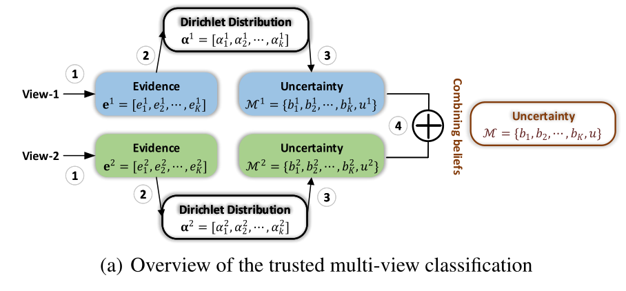
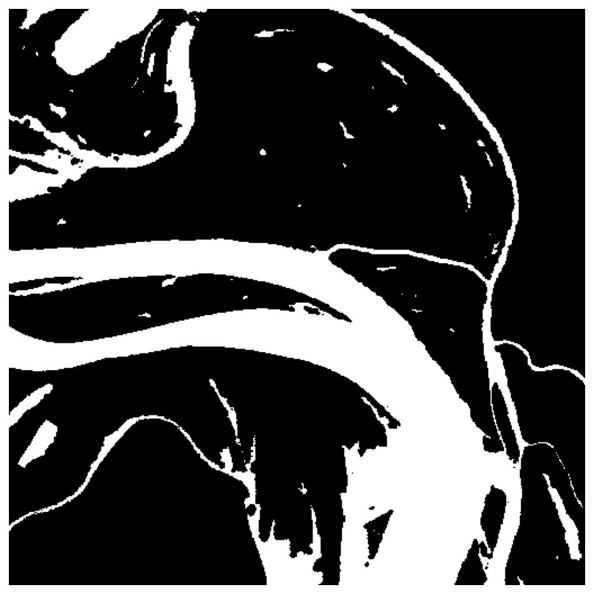
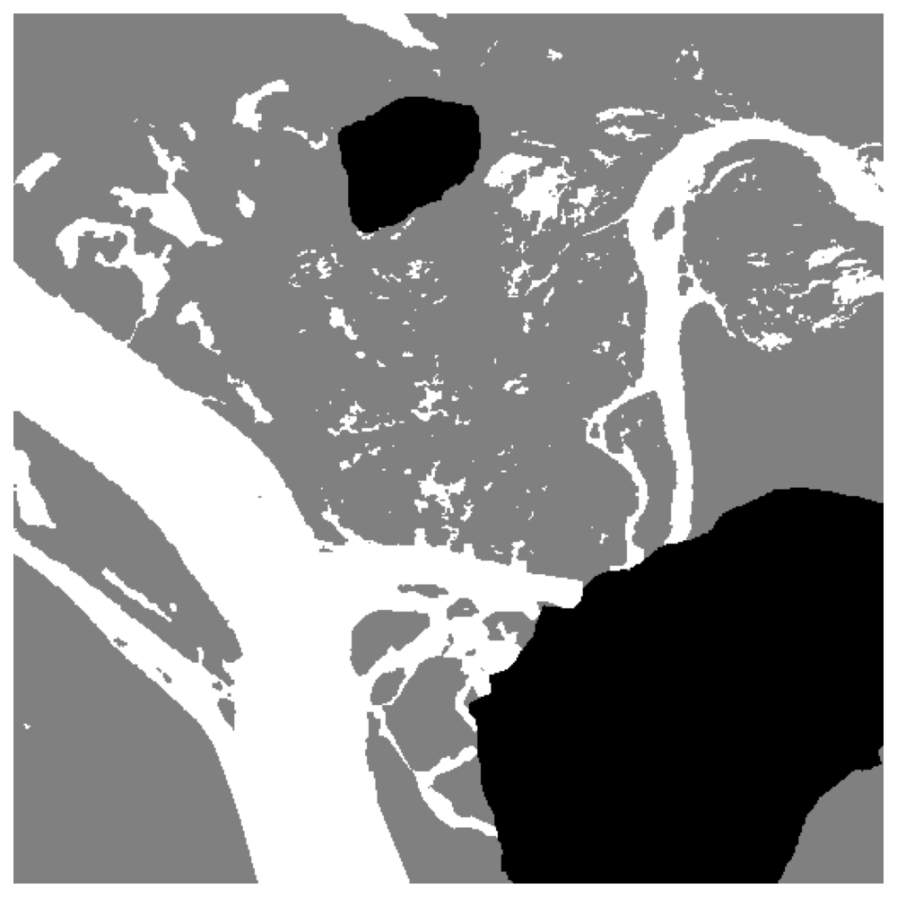
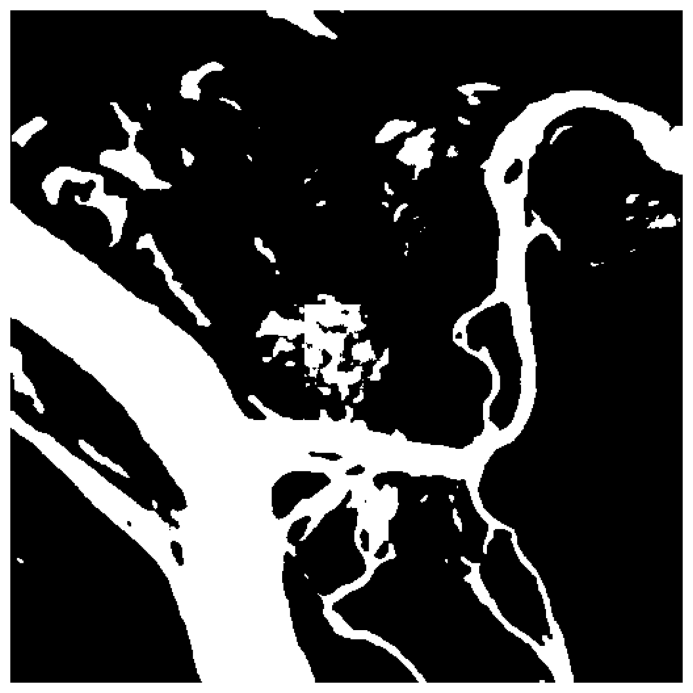
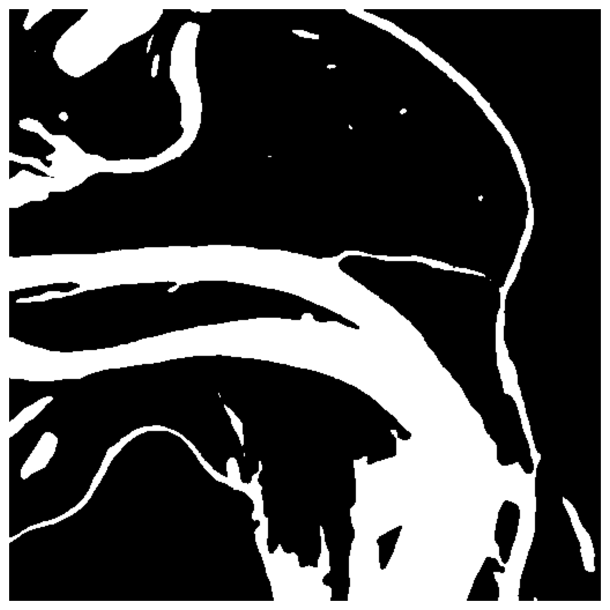
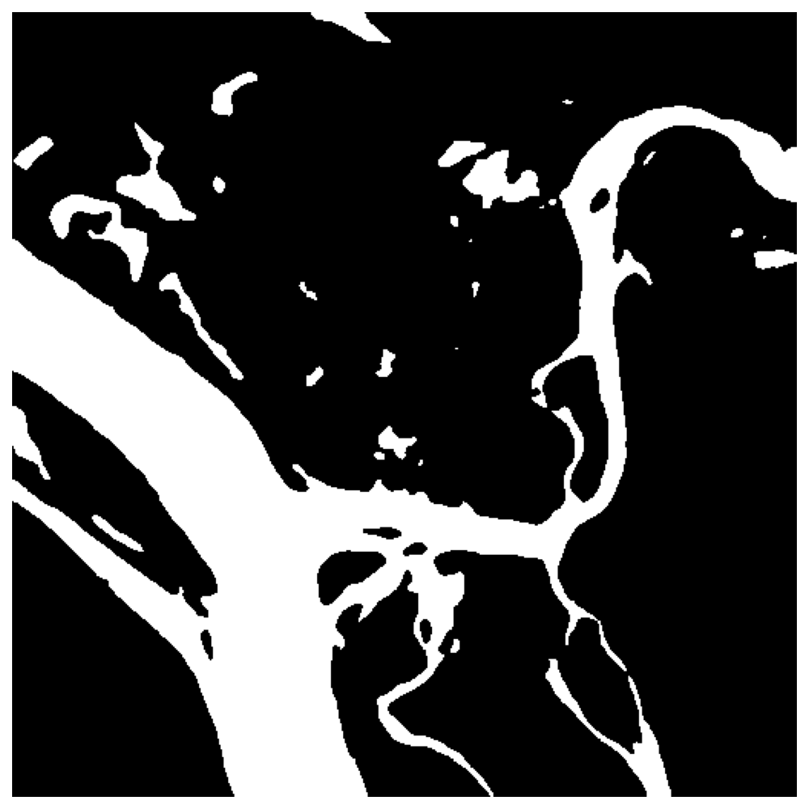
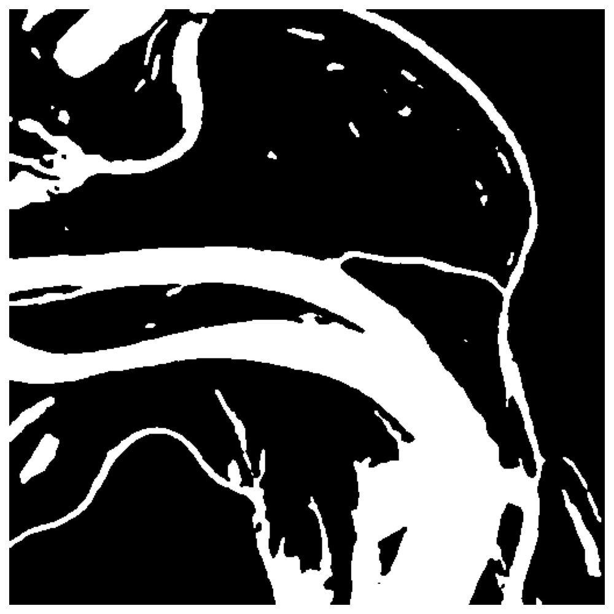
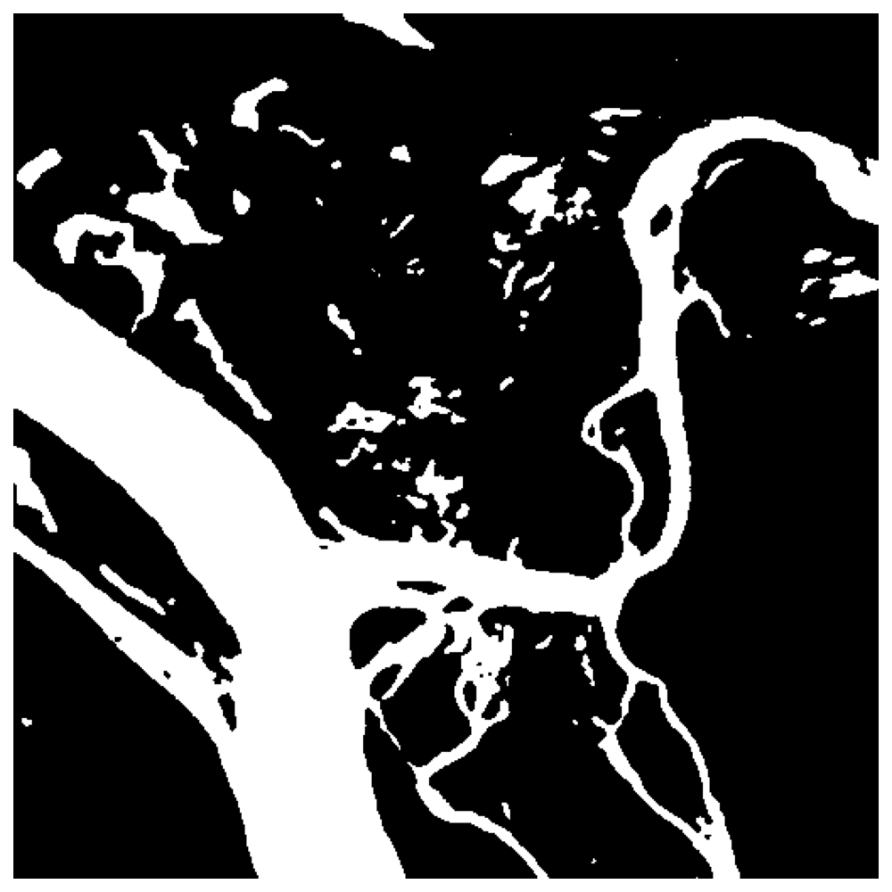
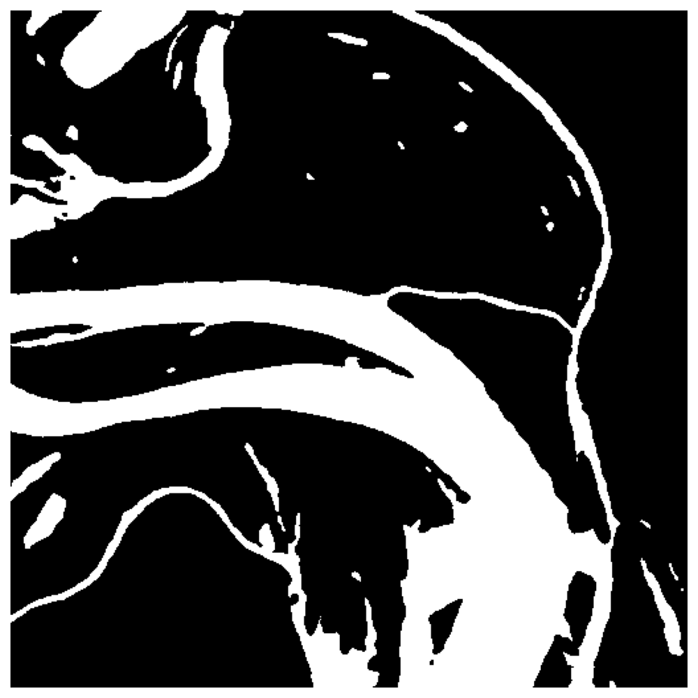
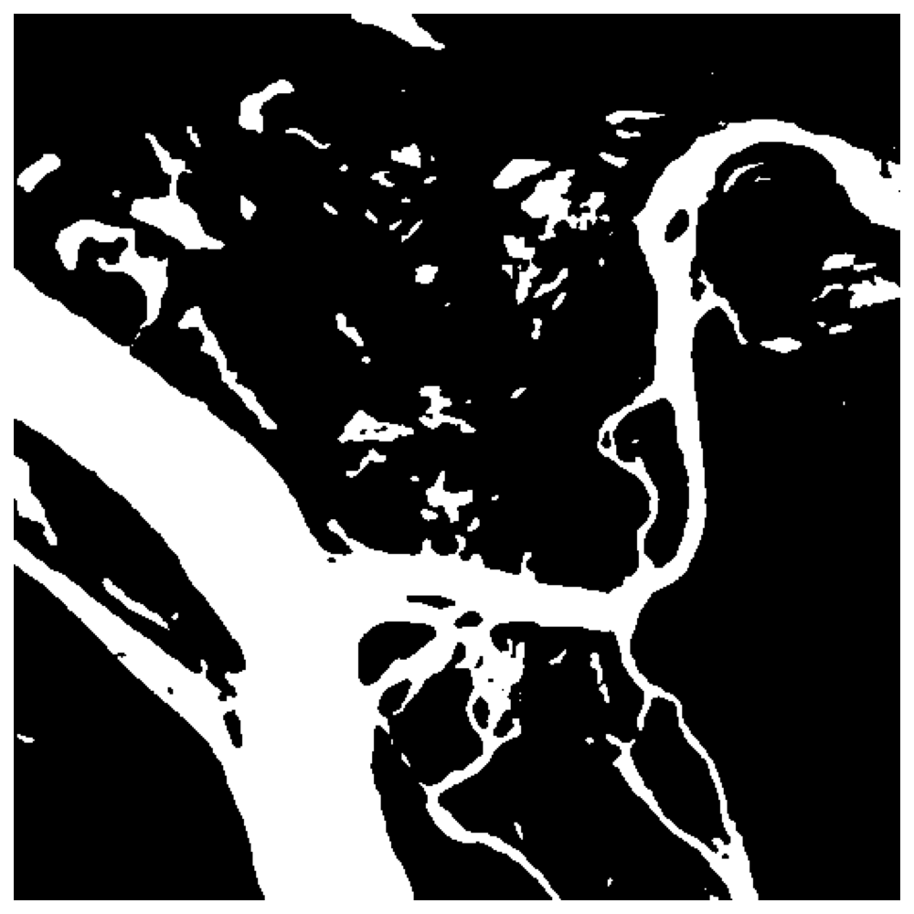

# 一、数据集

1. 训练集：338张，512x512，训练时分块为128x128，每张图像进行64次采样，之后进行上下左右翻转，训练数据大小为338x64x3=64896;
2. 测试集：46张，512x512，测试时分块为128x128，每张图像按顺序分块，overlap=32。测试数据大小为46x25=1150。
3. 数据集的特点：由于数据标签是根据多光谱图像制作的，因此其中存在云层，此外图像中还存在一些无效像素点，和云层一起利用-1表示，该部分需要忽略。

# 二、预处理

1. 计算训练集和测试集整体的均值和标准差；
2. 读取图像，求出该图像的除无效区域之外的最大值和最小值，并进行归一化，再利用整体的均值和标准差进行标准化处理；
3. 随机采样，将从一张图像上采取64个128x128的块，保证每一个块中水域像素不少于40，无效区域占比小于0.4；
4. 之后对每一个块进行水平和垂直翻转，这样一张图像产生64x3=192张分块；

# 三、模型训练

## 3.1 前期结果

我们选择UNet主框架进行训练：

| 模型      | 通道1       | 通道2       | 双通道      | 可信融合(1,2) | 可信融合(1+2,1,2) | 通道加权    | 双通道加权+池化 |
| --------- | ----------- | ----------- | ----------- | ------------- | ----------------- | ----------- | --------------- |
| accuracy  | 0.942236173 | 0.956551772 | 0.962072314 | 0.959003708   | 0.962980842       | 0.962868492 | 0.963367031     |
| precision | 0.790609577 | 0.875901883 | 0.888388765 | 0.894630118   | 0.913532715       | 0.893208307 | 0.882449731     |
| recall    | 0.802632145 | 0.805822832 | 0.835841685 | 0.803716678   | 0.814360279       | 0.836493362 | 0.853747416     |
| F1        | 0.796575500 | 0.839402228 | 0.861314521 | 0.846740075   | 0.861100496       | 0.863921025 | 0.867861324     |

> 可信融合(2)：模型最后一层采用3x3的平均池化，通道1和通道2模型融合；
>
> 可信融合(3)：模型最后一层采用3x3的平均池化，通道1、通道2和双通道模型融合；
>
> 通道加权：在unet横向连接前，对每一个encoder输出进行通道加权，之后再和上采样输出进行拼接；
>
> 通道加权+池化：在加权的基础上，模型最后一层采用3x3的平均池化。

利用S2数据集跑了双通道模型，得到的结果为：

accuracy：0.9741152、precision：0.8968545、recall：0.92238、F1：0.9094385

**补充实验：**

| 模型      | 通道1+加权池化 | 通道2+加权池化 | 可信融合(1+加权池化,2+加权池化,未使用超像素) | 可信融合(1+加权池化,2+加权池化,使用超像素) |
| --------- | -------------- | -------------- | -------------------------------------------- | ------------------------------------------ |
| accuracy  | 0.9534983907   | 0.9572835858   | 0.9600833621                                 | 0.9597585507                               |
| precision | 0.8661385073   | 0.8763720759   | 0.8796704757                                 | 0.8820992928                               |
| recall    | 0.7924583265   | 0.8112947309   | 0.8302918322                                 | 0.8246312007                               |
| F1        | 0.8276618621   | 0.8425786946   | 0.8542681995                                 | 0.852397729                                |

| 模型      | 可信融合(1+加权池化,2+加权池化（3x3池化）) |      |
| --------- | ------------------------------------------ | ---- |
| accuracy  | 0.9610643486                               |      |
| precision | 0.8929930023                               |      |
| recall    | 0.8222029689                               |      |
| F1        | 0.8561371529                               |      |

## 3.2 可信融合

修改可信融合代码实现下面要求：

1. 子模型（m个）输出结果中的像素，在输入到可信模块之前，利用一个kxk大小的滑动窗口选择其周围的像素，构成一个超像素；
2. 超像素中每一个子像素的labal与中心像素一致；
3. 超像素将参与loss计算和证据融合，最终的可以得到每一个超像素的融合证据（kxk个证据值），该证据的平均值代表中心像素的证据值。

**滑动窗口大小k=3**

| 子模型数量（m） | 2(1,2)       | 2(1+2,1)     | 2(1+2,2)     | 3(1+2,1,2)   |
| --------------- | ------------ | ------------ | ------------ | ------------ |
| accuracy        | 0.9608538137 | 0.9578338670 | 0.9617247632 | 0.9633571069 |
| precision       | 0.9105006580 | 0.8458818549 | 0.8693823536 | 0.9007170096 |
| recall          | 0.8009116639 | 0.8568731404 | 0.8571446155 | 0.8316163845 |
| F1              | 0.8521974367 | 0.8513420233 | 0.8632201136 | 0.8647885280 |

**滑动窗口大小k=5**

| 子模型数量（m） | 2(1,2)       | 2(1+2,1)     | 2(1+2,2)    | 3(1+2,1,2)   |
| --------------- | ------------ | ------------ | ----------- | ------------ |
| accuracy        | 0.9606001120 | 0.9624968528 | 0.964194717 | 0.9621282000 |
| precision       | 0.9113790787 | 0.9030485125 | 0.918775809 | 0.8965249487 |
| recall          | 0.7979780918 | 0.8221065508 | 0.818229996 | 0.8266375178 |
| F1              | 0.8509170005 | 0.8606786875 | 0.865592877 | 0.8601639981 |

# 四、可信多视图分割

## 4.1 思路

> 1. 图中view-1和view-2是来自两个视图的数据，①是证据生成模型，也就是我们使用的UNet，要求模型输出的结果是非负数。每一个样本输出两个值，分别是属于0的证据值和属于1的证据值，抽象表示为：$ e^1=[e^1_1,e^1_2,…,e^1_K]$，要得到每一个样本属于每一个类别的证据值。
>
> 2. 步骤②是求出每一个视图对应的狄利克雷分布参数，公式$\alpha_k^v=e_k^v+1$。
>    $$
>    b_k^v=\frac{e_k^v}{S^v}=\frac{\alpha_k^v-1}{S^v},u^v=\frac{K}{S^v} \\
>    S^v=\sum_{i=1}^K(e_i^v+1)=\sum_{i=1}^K\alpha_i^v
>    $$
>
>
>    > $b_k^v$：v视图中表示该样本属于k的概率，$u_v$：表示v视图的可信度。
>    >
>    > $S^v$是狄利克雷强度。
>    >
>    > 上面的式子描述了一个现象，第k类的证据越多，类别k的概率就越大。相应地，观察到的全部证据越少，总的不确定性就越大。
>
> 3. Dempster-Shafer证据理论允许将不同来源的证据组合在一起，得到一个考虑了所有可用证据的可信度(由一个叫做信念函数的数学对象表示)。具体来说，我们需要结合V个独立的概率质量分配集合$\{M^v\}_1^V,M^v=\{\{b_k^v\}_{k=1}^K,u^v\}$，最后获得一个联合质量$M=\{\{b_k\}_{k=1}^K,u\}$
>
> 4. **两个独立质量集的Dempster组合规则**
>
>    联合质量M由两个质量集合M1和M2计算来的：
>    $$
>    M=M1\bigoplus M2
>    $$
>    更具体的计算规则：
>    $$
>    b_k=\frac{1}{1-C}(b_k^1b_k^2+b_k^1u^2+b_k^2u^1),u=\frac{1}{1-C}u^1u^2\\
>    C=\sum_{i\neq j}b_i^1b_j^2
>    $$
>
>
> > C是两个质量集中冲突量的度量（两个视图预测不同的数量），$\frac{1}{1-C}$用于标准化。

## 4.2 损失函数实现思路

要计算三部分的损失值：视图一、视图二和融合后的视图。这三部分计算方法相同，需要使用到视图的狄利克雷分布参数和独热编码形式标签。

计算公式：
$$
L_{overall}=\sum_{i=1}^N[L(\alpha_i)+\sum_{v=1}^VL(\alpha_i^v)]
$$

> 这个公式说明损失值由单独每一个视图和融合视图构成。

$$
L(\alpha_i)=L_{ace}(\alpha_i)+\lambda_tKL[D(p_i|\hat\alpha_i)||D(p_i|1)]
$$

> 这个公式说明损失值由两部分：损失值+KL散度

KL：
$$
\\
KL=log(\frac{\gamma(\sum_{k=1}^K\hat\alpha_{ik})}{\gamma(K)\prod_{k=1}^K\gamma(\hat\alpha_{ik})})+\sum_{k=1}^K(\hat\alpha_{ik}-1)[\digamma(\hat\alpha_{ik})-\digamma(\sum_{j=1}^K\hat\alpha_{ij})]
$$
$L_{ace}$
$$
L_{ace}(\alpha_i)=\sum_{j=1}^Ky_{ij}(\digamma(S_i)-\digamma(\alpha_{ij}))
$$
整个项目中需要求(v+1)个损失值，v代表视图个数，1代表融合后的数据，将这些损失值相加取平均，就是最终的损失值。预测时，利用融合后的狄利克雷参数，每个样本的所有类别值最大的就是预测值。

# 五、实验展示

label：

|  |  |
| ------------------------------------------- | ---------------------------------------------------------- |

通道1：

|  |  |
| ----------------------------------------------------- | ----------------------------------------------------- |

通道1+通道加权+池化：

|  |  |
| ------------------------------------------------------------ | ------------------------------------------------------------ |

通道2:

|  |  |
| ------------------------------------------------------------ | ------------------------------------------------------------ |

通道2+通道加权+池化:

|  |  |
| ------------------------------------------------------------ | ------------------------------------------------------------ |

通道1，通道2，融合:

|  |  |
| ------------------------------------------------------------ | ------------------------------------------------------------ |

通道1+通道加权+池化，通道2+通道加权+池化，融合:

|  |  |
| ------------------------------------------------------------ | ------------------------------------------------------------ |

通道1+通道2:

|  |  |
| ------------------------------------------------------------ | ------------------------------------------------------------ |

通道1+通道2+通道加权+池化:

|  |  |
| ------------------------------------------------------------ | ------------------------------------------------------------ |

