# 本周工作

**后面的水域检测工作需要考虑SAR图像和多光谱图像的融合方法，这周寻找了有些融合相关的方法。下面是2021年的一个数据融合大赛，通过学习获奖选手的方法，来寻找思路。**

# 2021 IEEE GRSS 数据融合大赛：Track DSE

Track DSE ( The detection of settlements without electricity challenge track ) 的任务目标是使用多模态和多时段的遥感数据生成无电人类居住点的分类预测。

## 数据

竞赛数据集由 98 个 800×800 像素的图块组成，分别分布在训练集、验证集和测试集上，如下所示：60、19 和 19 个图块。每个图块包括来自下面列出的卫星图像的 98 个频道。**请注意，所有图像都已重新采样到 10 m 的地面采样距离 (GSD)。**因此，每个图块对应一个 64 平方公里的区域。

### 卫星数据

**Sentinel-1 极化 SAR 数据集**

2 个通道对应于 VV 和 VH 偏振的强度值，空间分辨率为 5×20 m重采样到空间分辨率为 10×10m。

- 文件名前缀：“S1A_IW_GRDH_*.tif”
- 大小：2.1 GB (float32)
- 图片数量：4
- 采集模式：干涉宽幅
- 原生分辨率：5x20m
- 用户指南：[链接](https://sentinel.esa.int/web/sentinel/user-guides/sentinel-1-sar/acquisition-modes/interferometric-wide-swath)

**Sentinel-2 多光谱数据集**

12 通道反射率数据，覆盖 VNIR 和 SWIR 范围，GSD 为 10 m、20 m 和 60 m。卷云带 10 被省略，因为它不包含地面信息。

- 文件名前缀：“L2A_*.tif”
- 大小：6,2 GB (uint16)
- 图片数量：4
- 用户指南：[链接](https://sentinel.esa.int/web/sentinel/user-guides/sentinel-2-msi/processing-levels/level-2)

**Landsat 8 多光谱数据集**

11 通道反射率数据，覆盖 VNIR、SWIR 和 TIR 范围，GSD 为 30m 和 100m，全色波段为 15m。

- 文件名前缀：“LC08_L1TP_*.tif”
- 大小：8.5 GB（float32）
- 图片数量：3
- 用户指南：[链接](https://www.usgs.gov/core-science-systems/nli/landsat/landsat-8-data-users-handbook)

**Suomi 可见红外成像辐射计套件 (VIIRS) 夜间数据集**

VIIRS（可见红外成像辐射计套件）的昼夜波段 (DNB) 传感器在 1 个通道上提供 750 m GSD 的夜间可见光和近红外 (NIR) 光的全球每日测量。VNP46A1 产品是原始 DNB 数据的修正版本，具有 500m GSD 分辨率。

- 文件名前缀：“DNB_VNP46A1_*.tif”
- 大小：1,2 GB（uint16）
- 图片数量：9
- 产品名称：VNP46A1的500x500m传感器辐射数据集
- 原始分辨率：750m（原始分辨率）
- 用户表：[链接](https://viirsland.gsfc.nasa.gov/PDF/VIIRS_BlackMarble_UserGuide.pdf)

### 语义标签

提供的训练数据分布在 60 个名为 TileX 的文件夹中，X 是图块编号。每个文件夹包含 100 个文件。98 个文件对应于前面列出的卫星图像。

我们还为每个图块提供参考信息（“groundTruth.tif”文件）。请注意，标签的执行如下：

- **人居**：如果在一块500×500m的范围内有建筑物，则认为该区域有人居
- **有电**：如果一块 500×500m 的小块被照亮，则无论被照亮区域的大小如何，都认为该区域被照亮。

参考文件（'groundTruth.tif'）大小为 16×16 像素，分辨率为 500m，对应于上述标注策略。像素值（1、2、3 和 4）对应于以下四个类别：

- **1** : 没有电力的人类住区**（感兴趣的区域）**
- **2**：没有电就没有人类住区
- **3** : 人类住区用电
- **4**：没有人类住区有电

以 RGB 格式提供了一个额外的参考文件 ('groundTruthRGB.png')，分辨率为 10m，以便于可视化。

| **班级编号** | **班级名称**                         | **颜色**   |
| ------------ | ------------------------------------ | ---------- |
| 1            | 没有电力的人类住区**（感兴趣区域）** | **ff0000** |
| 2            | 没有电力就没有人类住区               | **0000ff** |
| 3            | 人类住区用电                         | **ffff00** |
| 4            | 没有用电的人类住区                   | **b266ff** |

比赛中使用的训练数据和高分辨率分类图的可视化示：

| (a) Sentinel-1 图像（RGB：VV、VH、VV-VH）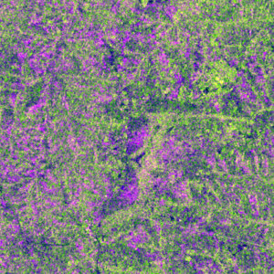 | (b) Sentinel-2 图像（RGB：波段 4、3、2）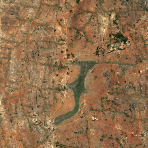 |
| ------------------------------------------------------------ | ------------------------------------------------------------ |
| (c) VIIRS 图像（累积 9 个时间图像）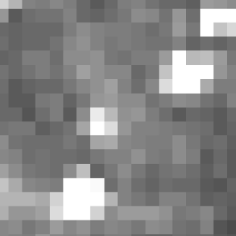 | (d) 参考数据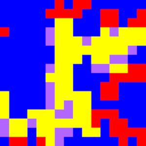               |

# 解决方案

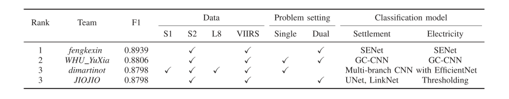

## top1

**提出了两种独立的探测任务：**

1. 利用Sentinel-2数据集构建住区探测的注意SENet；
2. 利用Suomi可见光红外成像辐射计套件(VIIRS)夜间数据集，构建光照探测的注意SENet；

此外，我们研究了一种新的基于VIIRS数据集像素分布特征的离群点去除方法来进行数据预处理，并提出了一种基于区域连续性的后处理方法来进一步校正结果。实验结果表明，该方法能够最大限度地利用多源数据信息。

VIIRS数据集可用于检测一个地区是否有电。但问题是，即使ground  truth表明某一区域没有电，预处理得到的图像仍然呈现出不规则的明暗变化。为了解决这个问题，我们研究了一种基于VIIRS数据集像素分布特征的离群点去除方法，处理后的图像能更准确地反映带电区域的位置。在后期处理阶段，提出了一种对住宅区检测结果进行校正的新方法，性能得到了显著提高。

Sentinel-2多光谱数据集包含12个通道，其中波段4、3和2的合成可以生成真彩色(RGB)图像。通过对比Sentinel-2中其他波段合成的图像的实验结果，最终选择RGB图像进行人居探测。

**Sentinel-2预处理：**

1. 首先，对三个通道的离群值进行处理。为了去除极端离群值，我们对多个截断参数进行了实验，当参数为2000时，实验结果最好，因此将每个通道的像素值剪至区间\[0,2000][4]，然后将合成的图像归一化至[0,255]；
2. 其次，因为地面的RGB图像采样距离是10 m∗10m，ground truth采样距离是500m∗500m，ground truth是16∗16像素，这意味着对于800∗800像素的图像，需要确定是否有人类居住在每个50∗50像素区域，因此，每个RGB图像被裁剪为256张图像50 * 50像素；
3. 第三，将类名为“人类住区无电”和“人类住区有电”的裁剪图像合并为一个新的类名为“人类住区”，同样，将其余两个类的图像合并为一个新的类名为“无人区”。因此，获取具有两个新类的数据集，可用于确定图像中是否是住宅区。
4. 最后，采用旋转90度、旋转180度、旋转270度、水平翻转和垂直翻转5种数据增强方法对数据集进行扩展，实验结果表明，扩展后的数据集具有较好的效果。

**VIIRS夜间数据集的预处理：**

VIIRS数据集为每个贴图提供了9张多时相单通道夜间图像，可以用来检测一个地区是否有电。为了消除图像采集过程中的噪声干扰，需要对数据中的离群值进行处理。

1. 首先，在训练集中，我们计算来自同一通道的共60幅图像中所有像素的分布。接下来，将每个通道的所有像素值从小到大排序，排序中5%和95%的值分别记录为Lc  min和Lc  max，其中c为通道名。为了使保留的像素值的总体方差更小，我们还尝试了各种截断参数，最终选择了5%和95%的值，因为这两个值在实验中表现最好。然后，去除离群值的方法可以用公式表示。
2. 对于每张图像，我们将去除离群值后的9张夜间图像的像素值求和，并将其归一化到区间[0,255]，从而得到一幅单通道夜间图像。

由于ground truth是一个16∗16像素的粗标签，因此我们对获得的单通道图像使用50∗50平均池化而不是最大池化来生成一个16∗16像素的新图像。不使用max-pooling的原因是，它会导致被检测光的原始区域过度扩大，更容易出现误检。生成的16∗16像素图像也使用上述五种数据增强方法进行扩展，以获得用于训练的新的夜间数据集。

**流程图**

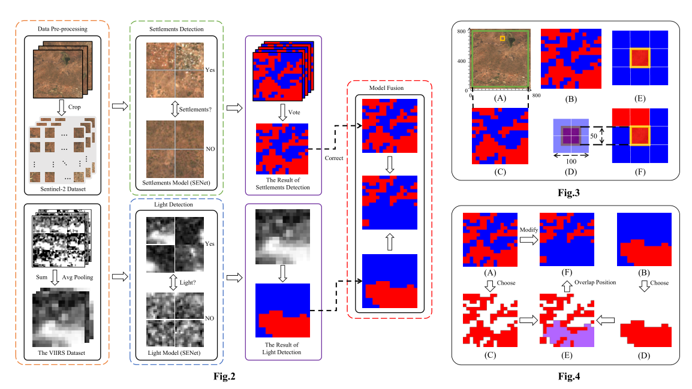

**定居点检测**

在预处理之后，得到了一个扩展的Sentinel-2数据集，其值为50∗50像素。通过设置不同的超参数，使用预处理后的训练集训练多个卷积神经网络SENet154(以下简称Settlements  Model)。在测试集上，使用验证集上表现最好的前5个分类模型的预测进行融合。有沉降记录为1，无沉降记录为0。融合规则是，对于同一区域，如果选1的票数比选0的票数多，则预测值设为1，否则为0。对于每个贴图，可以获得一个16∗16像素的二值图作为最终预测，以表示聚落检测的结果。

**定居点检测结果的修正**

在(A)的中心获得了一幅750∗750像素的图像，类似地，(C)是通过沉降检测从该图像中获得的一幅15∗15像素的二值图。地区50∗50像素(A)中随机选择,和该地区的橙色线作为一个例子,我们可以看到,该地区预计为1的位置(B),但在(C)预计为0,(D)所示,这意味着两种预测结果的冲突。此时，我们选择检查(B)中冲突区域周围的其他8个区域的像素值，如果像素值均为0，如(E)所示，则该区域的像素值1将被修正为0。否则，由于定居点分布的连续性，我们称之为区域连续性，如(F)所示，该区域没有得到修正。

## top2

为了检测无电住区，我们提出了一个融合卷积神经网络和随机森林算法的多模型融合框架。首先对多模态多时相遥感数据进行必要的数据预处理，去除噪声，保留有效数据，从而获得可观的可行数据集。在预处理数据集的基础上，建立了无电住区检测单任务模型和双任务模型。**在单任务模型中，所有数据直接输入到全局上下文卷积神经网络中，对无电住区进行分割。在双任务模型中，利用光学数据对建筑物进行神经网络检测，利用夜间数据对电力进行随机森林法检测。然后，利用模型融合原理和后处理方法得到输出结果。**

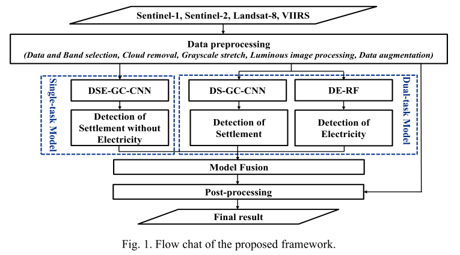

**数据预处理**

数据预处理包括四个部分：数据和波段选择、云去除、灰度拉伸和数据增强。

1. 由于Sentinel-1和Landsat-8噪声严重，因此只保留了Sentinel-2和VNP46A1产品；
2. 我们选择Sentinel-2图像的Red、Green、Blue、NIR、SWIR-1和SWIR-2六个波段进行下面的步骤；
3. 对于受云污染的光学图像，需要利用多时相数据采用中值滤波方法合成无云图像；
4. 对于VNP46A1产品数据，为了避免不同时间光照变化的影响，将多时间的夜间数据都进行积累，生成新的图像；
5. 此外，对多时段夜间数据的中值和最大值进行合成，以减小数据噪声的影响；
6. 对所有选定的波段进行2%线性灰度拉伸算法，消除极端噪声点，增强图像对比度；
7. 最后，运用旋转、翻转等数据增强方法生成更大的数据集。

**单一任务模型**

1. 为了检测无电环境下的住区，提出一种端到端的全局上下文卷积神经网络(DSE-GC-CNN)。如图2所示，网络接收800x800  Sentinel-2图像6个波段和夜间图像3个波段，输出16*16的分割图。

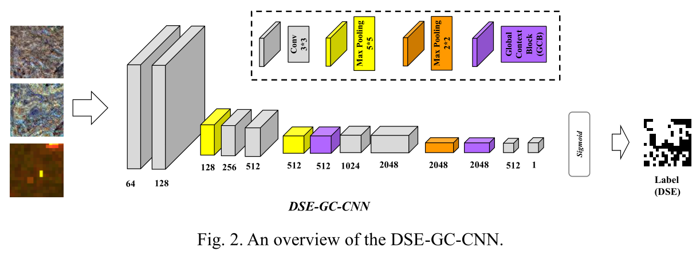

2. 为了提取图像中的全局上下文信息，捕获深度神经网络的长距离依赖关系，我们的检测网络中采用了全局上下文模块，如图3所示。

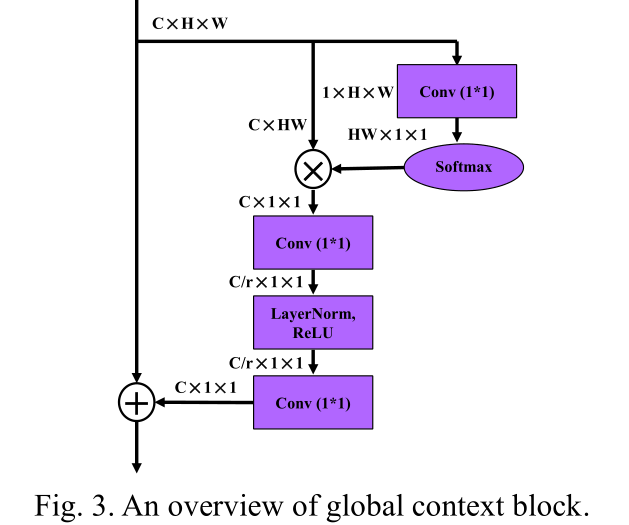

3. 鉴于数据集的类别不平衡，我们在网络训练中采用了焦点损失函数，其描述如下:
   $$
   FL(p,y)=-\alpha y(1-p)^\gamma log(p)-(1-\alpha)(1-y)p^\gamma log(1-p)
   $$

   > y：真值；
   >
   > p：预测值；
   >
   > $\alpha$：样本类别数的权重系数；
   >
   > $\gamma$：样本分类难度的权重参数

4. 在测试阶段，将一种投票策略应用于检测结果。在不同数据增强方法生成的8个图像结果中，如果有2个以上的预测结果显示存在无电住区，则将该像素标为“DSE”。

**双任务模型**

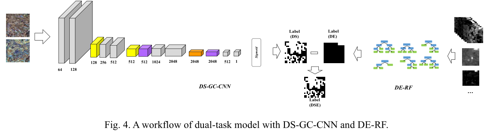

1. 使用与全局上下文块相同的卷积神经网络检测住区(DS-GC-CNN)；
2. 使用随机森林分类器检测有电区域(DE-RF)；
3. DS-GC-CNN的输入为光学图像，而DE-RF的输入为VNP46A1的9个相位乘积，以及中值、最小值、最大值、总和特征图像，这两种方法的输出都是二值图；
4. DS-GC-CNN采用了与DSE-GC-CNN相同的投票策略。

**模型融合**

单任务模型虽然可以简洁、方便地生成最终结果，但由于网络对夜间数据和光学数据的使用不均匀，导致集成不足。另一方面，双任务模型虽然充分利用了数据特性，但在多任务过程中存在误差积累。综上所述，与单任务模型相比，双任务模型更注重建筑物的检测，可以实现更高的建筑物检测精度，有利于后续结果的整合。

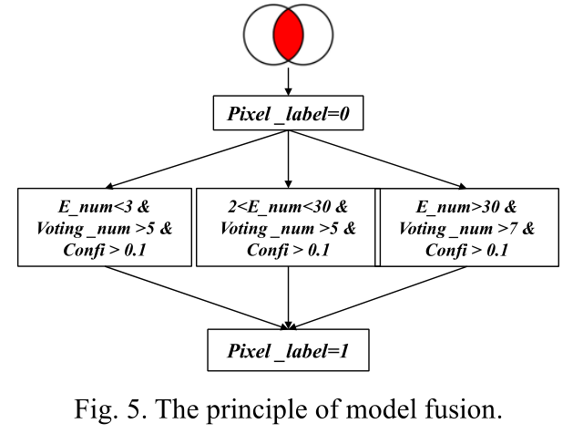

> E_num是每个tile中供电像素的数量，而Voting_num代表投票策略中正面结果的数量(DS-GC-CNN)。
>
> Confi为DSE-GC-CNN中每个像素的置信度值。

1. 模型融合的第一步是取两个模型结果的交点，产生高置信度的标签，但存在许多遗漏错误;
2. 在此基础上，利用阈值分割方法对网络的置信度图和DE-RF的结果进行进一步处理，从而在交叉口结果中加入一些高置信度的无电居住区。

**后处理**

经过以上步骤，无电住区的多模型融合结果仍然存在一些噪声点，可以通过阈值分割和形态学处理进一步细化噪声点。对于每个E_num大于30的tile，最大值在18到30之间的像素和sum值大于30的像素被认为是有电像素，这将被进一步排除。另外，我们假设当一块瓦片上无电的居住区数量小于3时，整块瓦片上没有居住区。

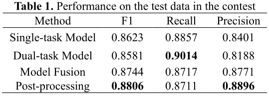

## top3

我们将问题转化为一个分类问题，其中，给定一个大小为(50,50,98)的输入图像，我们希望预测它在四个可用类别中的类别。因此，我们将每个800  × 800的图像分割成256个50 × 50的tile。我们获得15,360个标签样品，4,864个验证样品和4,864个测试样品。

**多分支多时段架构**

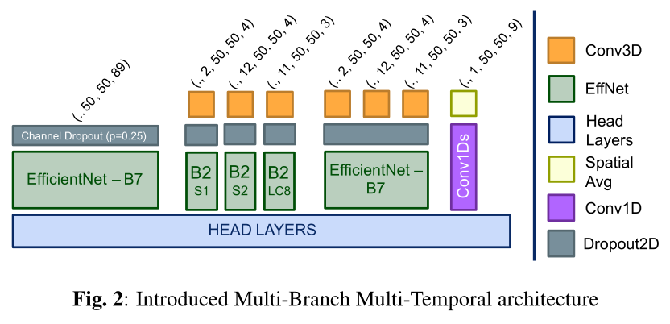

**多时段特征提取**

1. 为了处理数据集的多时间性，**我们使用了一个Conv3D层作为大多数分支计算的第一步**。它的设计是为了在模型计算的早期减少时间成分。我们不认为数据的时间维度是预测的关键，而是作为一种限制数据噪声的方法。
2. 因给定一个数据堆栈的形状(c、h、w 、t) c对应通道的数量的堆栈,h高度,w宽度和t时间维度,我们设计一个Conv3D层与内核的大小(t, 1,  1),和c过滤器,以便它可以减少时间维度。然后将缩减后的堆栈传递到Conv2D层进行空间特征提取。

**多模态特征提取**

我们的模型体系结构由四个特征提取分支组成：

1. **DNB-specific TempCNN Branch：**鉴于VIIRS传感器的低分辨率，等于标签分辨率，在我们对50 ×  50图像区域的波段值进行空间平均后，我们的模型仅使用一维卷积堆栈提取时间特征。
2. **Multi-modal Branch**：最左边以一批图像作为输入，该分支旨在提取跨越任何采集和任何传感器的特征。
3. **Multi-Unimodal Branch**：是一个多分支模型，它考虑了输入数据的多传感器和多时间方面。为此，我们训练了三个概念相同的分支，每个分支都有特定于单个传感器的数据。这种策略旨在分别从每个传感器获取尽可能多的信息。
4. **Temporal-Merged Branch**：该分支执行与Multi-Unimodal模型相同的时间缩减。然后将每个传感器数据的临时缩减堆栈串联起来，以通道方式，并馈送到一个EfficientNet  B7。**这种设计在提取跨越多个传感器的特征之前，消除了每个传感器数据中潜在的时间冗余。**

从模型的每个分支提取特征后，我们将它们展平并连接到一个公共特征向量，然后传递给完全连接层。

## top3

本文提出了两种用于居住点检测的语义分割模型**DO-UNet**和**DO-LinkNet**，并提出了一种基于阈值的有电检测模型。

1. 首先，对Sentinel-2和Landsat  8多光谱数据集进行不同波段的多通道融合，经过多次对比实验，我们选择Sentinel-2  RGB通道作为后续所有模型的输入数据，因为它的效果比其他数据集要好得多。

2. 在Suomi可见光红外成像辐射计套件(VIIRS)夜间数据集上进行基于阈值思想的带电区域检测模型。用这种方法，就能探测到有电的区域。

**DO-UNet**

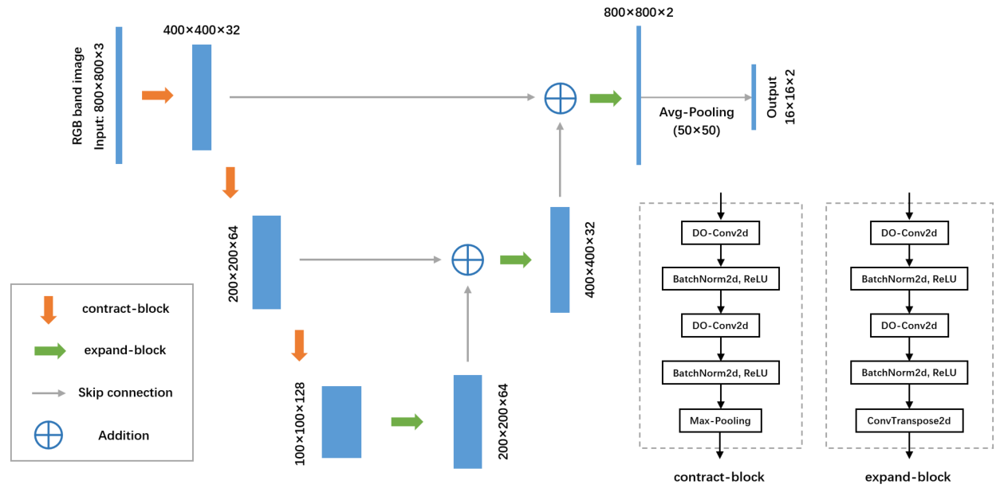

**DO-LinkNet**

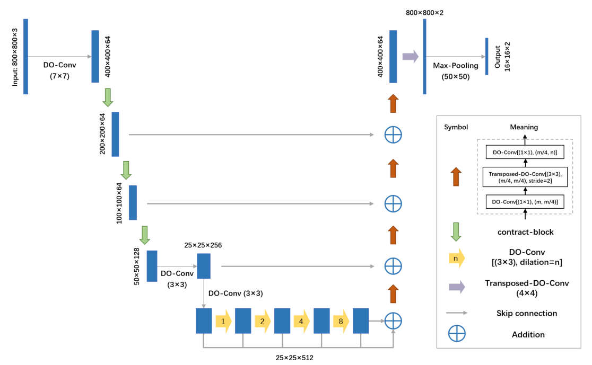

**在验证集和测试集上，我们对性能较好的多个模型的结果进行投票融合，并利用带电区域的检测模型对融合结果进行修正，得到最终的预测结果。**

# 总结

1. top1：使用S2数据集完成居住点检测，使用VNP46A1数据完成完成通电检测，最后结果取交集，实现检测居住点未通电区域。没有涉及两个数据集融合完成一个任务的地方。不过，这篇论文使用了一个校正方法，可以关注一下。（决策融合）
2. top2：该论文使用S2数据集和VNP46A1数据集完成了一个单一任务模型的居住点未通电区域检测，此外，双任务模型中将两个数据集分开使用再次完成居住点未通电区域检测。最后提出一个融合方法，将这两个思路得到的结果进行融合。（决策融合）
3. top3：该论文使用了官方给出的所有数据，每种数据经由模型的不同分支提取特征后，再将它们展平并连接到一个公共特征向量，然后传递给完全连接层。（特征融合）
4. top3：该论文分别使用了DO-UNet和DO-LinkNet两个模型进行居住点检测，根据对数据集的预处理方式不同得到多个模型，取最好的7个模型，在测试时利用它们进行投票得到最终居住点区域，利用阈值法进行通电区域检测，然后两个区域范围取交集。（决策融合）