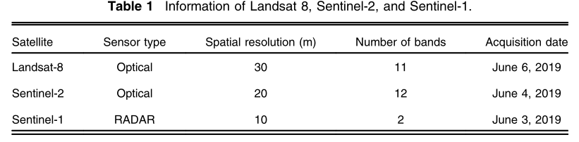
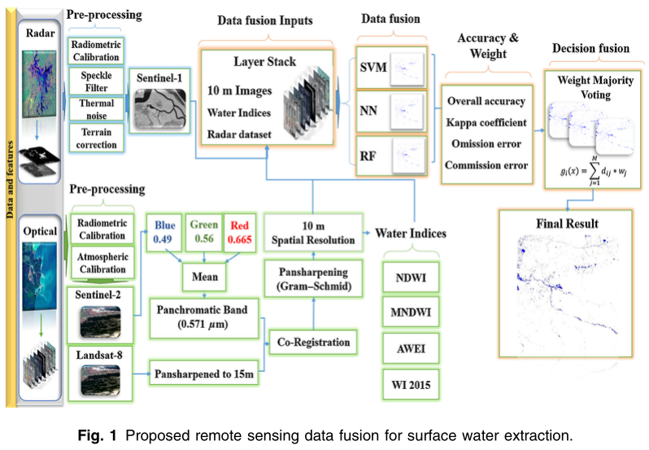
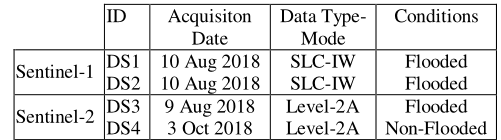
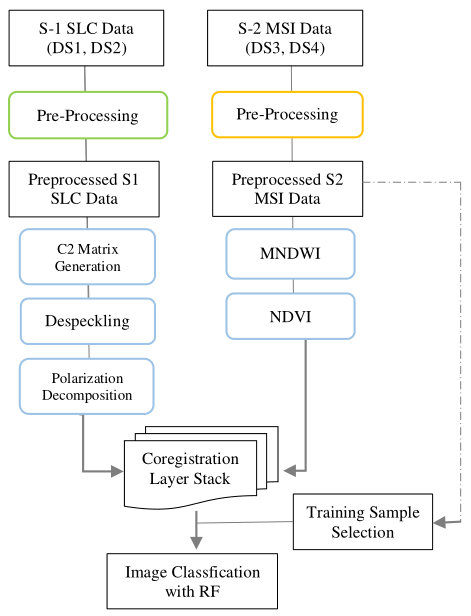
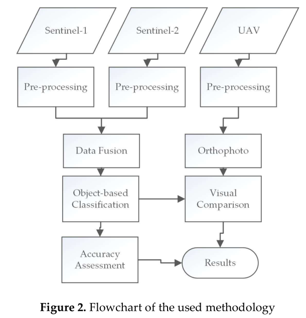
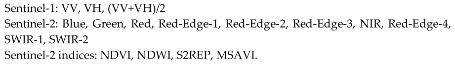
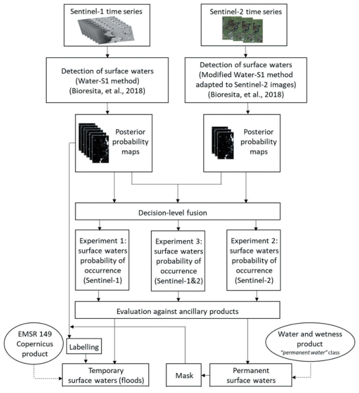
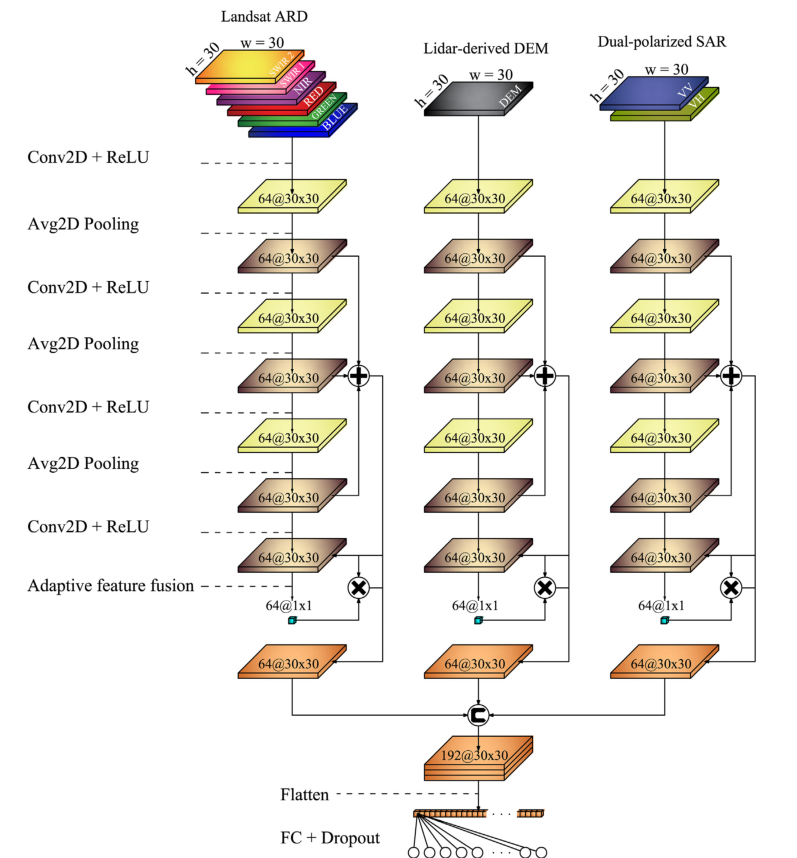
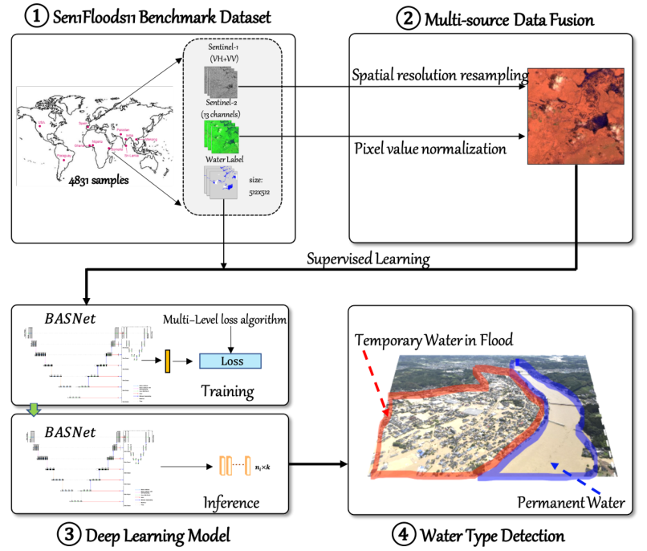

# 一、深度学习中的融合算法

多传感器数据融合主要有三种方法：

1. 直接数据融合：将多个独立的数据集融合成一个单一的特征向量，然后输入到机器学习分类器中。**由于多模态数据的直接融合往往无法充分利用多个模态数据间的互补性，且融合的原始数据通常包含大量的冗余信息。**因此，多模态数据直接融合方法常常与特征提取方法相结合以剔除冗余信息，如主成分分析、最大相关最小冗余算法、自动解码器等。

2. 特征融合：指将不同的模态数据先转化为高维特征表达，再于模型的中间层进行融合。以神经网络为例，中间融合首先利用神经网络将原始数据转化成高维特征表达，然后获取不同模态数据在高维空间上的共性。中间融合方法的一大优势是可以灵活的选择融合的位置。

3. 决策融合：将不同模态数据分别训练好的分类器输出打分(决策)进行融合。这样做的好处是，融合模型的错误来自不同的分类器，而来自不同分类器的错误往往互不相关、互不影响，不会造成错误的进一步累加。**常见的决策融合方式包括最大值融合、平均值融合、 贝叶斯规则融合以及集成学习等。**

但是目前比较成熟的方法仍然集中在直接数据融合，在特征融合和决策融合的层面。

同时需要注意的是，工作重点在于设计数据融合算法，但是好的传感器仍然是最重要的，传感器的性能直接决定着数据融合的效果，因此**数据融合的结果很有可能比最好的那个传感器得到的结果还要差。**

# 二、调研：深度学习水域多模态融合算法

1. Sentinel-1 and Sentinel-2 data fusion system for surface water extraction（数据融合、决策融合）
2. A fusion approach for flood mapping using sentinel-1 and sentinel-2 datasets（特征融合）
3. Sentinel-1 and Sentinel-2 Data Fusion for Mapping and Monitoring Wetlands（数据融合）
4. Fusion of Sentinel-1 and Sentinel-2 image time series for permanent and temporary surface water mapping（决策融合）
5. From Local to Regional Compound Flood Mapping with Deep Learning and Data Fusion Techniques（特征融合）
6. Enhancement of Detecting Permanent Water and Temporary Water in Flood Disasters by Fusing Sentinel-1 and Sentinel-2 Imagery Using Deep Learning Algorithms: Demonstration of Sen1Floods11 Benchmark Datasets（数据融合）

# 三、算法详细说明

## 3.1

数据集：

思路：

1. 采用**数据融合**的方法，将多光谱影像的空间分辨率从30  m提高到10  m，同时保留了Landsat-8和Sentinel-2的光谱信息；
2. 然后，将从高空间分辨率图像、水指数图和Sentinel-1数据集中提取的所有特征组合为一个堆叠的特征空间；
3. 通过支持向量机、神经网络和随机森林对新数据进行分类；
4. 最后，采用加权多数投票**决策融合**策略对所有分类器的输出进行集成。

下面是详细流程图：

> 数据融合由10  m空间分辨率图像、水体指数和雷达数据集组成。
>
> 利用GS算法的Landsat-8全色波段可以将空间分辨率从30米提高到15米。将空间分辨率提高到15  m后，由Sentinel-2卫星红、绿、蓝波长(0.571μm)的平均值获得全色波段，通过GS方法将空间分辨率提高到10 m。

Gram-Schmid算法详细介绍：[Gram-Schmidt图像融合 - Rser_ljw - 博客园 (cnblogs.com)](https://www.cnblogs.com/ljwgis/p/12774005.html)

## 3.2

数据集：本研究共使用Sentinel-1和Sentinel -2采集了4个数据集(DS)。这些数据集是在洪水期间和之后的三种不同天气条件下获得的(DS1、DS2、DS3)，并在调查中使用了一幅非洪水Sentinel-2图像(DS4)。

在表1中，DS1和DS2是洪水日期最新的Sentinel-1图像，是在洪水发生后两天拍摄的。本研究使用DS3中的Sentinel-2图像来选择训练区域，获得洪水区域的一些特征，使用DS4图像产生归一化植被指数(NDVI)和归一化水指数(MNDWI)信息。

**整体流程：**

> 这篇论文大部分都在介绍**Pre-processing**，而它所提到的特征融合中的特征并非通过深度学习模型提取出来的，而是利用一些软件工具对SAR图像进行处理得到的。之后将获得的特征按层堆叠在一起，训练区域的选择也是在DS3上加入云掩模。

## 3.3

数据集：Sentinel-1和Sentinel-2、UAV

整体流程：

> 我们的数据集已经是预处理之后的数据，这篇论文中的预处理部分就不太重要。
>
> 无人机数据用于现场拍摄进行可视化对比。
>
> **Data Fusion：S1和S2产生17个波段，将这些波段被堆叠成单个图像。**

## 3.4

数据集：sentinel-1和sentinel-2

整体流程：

> 该论文的得到水域概率图是利用另外一篇文章中提出的方法，该方法并非深度学习方法。
>
> 由于本文的数据包含同一区域的时间序列，因此在融合部分考虑了S1时间序列的融合，S2时间序列的融合和S1与S2的融合。
>
> 在融合方法上，对决策级融合的**模糊逻辑方法和贝叶斯方法**进行了验证。

**模糊逻辑方法**

使用模糊逻辑的图像融合(Wendl et al. 2018)对于合并不确定数据是非常强大的。

公式：
$$
A = [(x,P_A(x)|x\in L)] \\
P_{fusion}(x)=Min(P_A(x),P_B(x))
$$

> A 和 B代表两个模糊集合，L代表类别；
>
> $P_A(x)$代表A中的x属于L的概率。

**贝叶斯方法**
$$
P_{fusion}(x)=P_A(x)\times P_B(x)\\
P_{fusion}(x)=P_A(x) + P_B(x)\\
$$
可以选择乘积或相加。

## 3.5

> 通过逐点添加来集成低、中、高层抽象，从而合并产生的池层，从而从每个分支的多尺度属性中获益。
>
> 该模型由二维卷积(Conv)、ReLU和平均池化的三分支CNN组成。通过逐点加法(+)将Avg2D池化层合并为单一层，并对最优DF实现自适应特征融合模块。通过逐点乘积(X)将特征权重分配给Avg2D池化层，然后连接并展平。最终通过全连接(FC)层、dropout和softmax功能完成分类任务。

## 3.6

采用**空间分辨率重采样**和**像素值归一化**方法对sentinel-1和sentinel-2图像进行融合。

