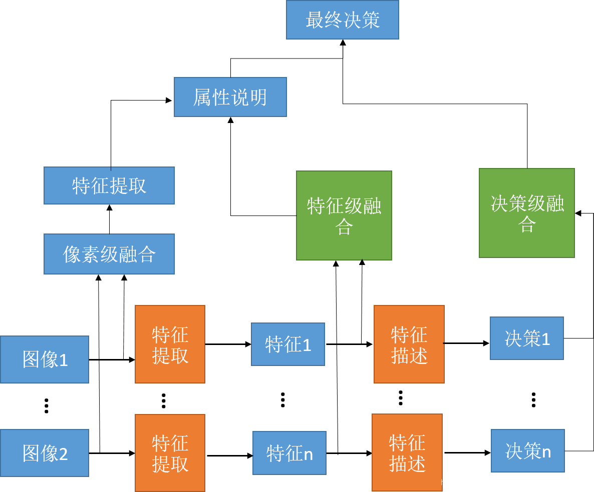

# 一、文献信息

Multimodal Machine Learning: A Survey and Taxonomy 

发表时间：2018

发表平台：IEEE

引用数：1174

Deep multimodal representation learning: A survey

发表时间：2019

发表平台：IEEE

引用数：101

Spectral–spatial feature extraction for hyperspectral image classification: A dimension reduction and deep learning approach

发表时间：2016

发表平台：IEEE

引用数：732

# 二、详细介绍

## 2.1

### 2.1.1 多模态学习

为了使人工智能进一步加强对我们周边事物的理解，它需要具备解释多模态信号的能力。一般多模态需要处理的任务主要有：

- 表示（Representation）。学习如何利用多模态的互补性和冗余性来表示和总结多模态数据。例如，语言通常是符号化的，而音频和视觉形式被表示为信号。找到某种对多模态信息的统一表示，分Coordinated representations（每个模态各自映射然后用用相关度距离来约束表示），Joint representations（多个模态一起映射）。
- 翻译（Translation）。如何将数据从一种模态转换到另一种模态。不仅数据是异质的，而且模式之间的关系往往是开放的或主观的。例如，有许多正确的方法来描述一个图像，而一个完美的翻译可能不存在。一个模态映射到另一个模态，分example-based（有候选集，如检索任务），generative（Decoder-Encoder）。
- 对齐（Alignment）。确定来自两个或更多不同模式的(子)要素之间的直接关系。例如，我们想要将菜谱中的步骤与显示菜肴制作过程的视频对齐。**为了应对这一挑战，我们需要衡量不同模式之间的相似性，并处理可能的长期依赖关系和歧义。**
- 融合（Fusion）。将来自两个或更多模式的信息连接起来进行预测。例如，在视听语音识别中，将嘴唇运动的视觉描述与语音信号融合在一起来预测口语单词。来自不同模态的信息可能具有不同的预测能力和噪声，至少在一种模态中可能丢失数据。
- 联合学习（Co-learning）。在模态、它们的表示和它们的预测模型之间转移知识。共同学习探索了如何从一个模态学习知识可以帮助在不同模态上训练的计算模型。

### 2.1.2 多模态表示

在Bengio等人的[19]之后，我们不断使用术语“特征”和“表示”，每一个都指一个实体的向量或张量表示，它可以是一个图像、音频样本、单个单词或一个句子。

多模态表示是使用来自多个实体的信息的数据表示。表示的多种形式带来了许多困难：

1. 如何组合来自异构源的数据；
2. 如何处理不同程度的噪音；
3. 如何处理丢失的数据。

以有意义的方式表示数据的能力对多模态问题至关重要，并构成任何模型的支柱。

在过去的十年里，已经出现了**从手工设计特定应用程序到数据驱动的转变**。例如，在21世纪初，最流行的一种表示图像的方法是通过手工设计特征表示，例如尺度不变特征变换(SIFT)。**目前大多数图像(或其部分)是使用描述来表示的，这些描述是使用卷积神经网络(CNN)等神经体系结构从数据中学习来的**[114]。同样，在音频领域，如Mel-frequency倒谱系数(MFCC)等声学特征已被语音识别中的数据驱动深度神经网络[82]和拟语言分析中的循环神经网络[216]所取代。在自然语言处理中，文本特征最初依赖于计算文档中的单词出现次数，但已经被利用单词上下文的数据驱动单词嵌入所取代[146]。尽管在单模态表示方面已经做了大量的工作，但直到最近，大多数多模态表示都涉及单模态表示[52]的简单串联，但这种情况正在迅速改变。

**为了帮助理解，我们提出了两种类型的多模态表示：联合的和协调的。**

联合表示将单模态信号组合到相同的表示空间中，而协调表示分别处理单模态信号，但对它们施加某种相似性约束，使它们进入我们所说的协调空间。

> 联合：f表示深度神经网络，受限玻尔兹曼机，或循环神经网络；
>
> 协调：每个模态都有一个相应的投影函数(f和g)，将其映射到一个协调的多模态空间。虽然到多模态空间的投影对于每个模态是独立的，但结果空间在它们之间是协调的，这种协调的例子包括最小化余弦距离[64]，最大化相关性[7]，以及在结果空间之间强制执行部分顺序[220]。

#### 2.1.2.1 联合表示

联合表示通常(但不是唯一)用于在训练和推理步骤中同时出现多模态数据的任务中。联合表示最简单的例子是单个形态特征的串联(也称为早期融合[52])。在本节中，我们将讨论创建联合表示的更高级方法，从神经网络开始，然后是图形模型和循环神经网络(代表性作品见表2)。

神经网络已经成为一种非常流行的单模态数据表示方法。它们被用来表示视觉、听觉和文本数据，并在多模态领域中越来越多地使用[157]，[163]，[225]。在本节中，我们将描述如何使用神经网络来构建联合多模态表示，如何训练它们，以及它们提供了什么优势。

一般来说，神经网络由内积的连续构建块和非线性激活函数组成。为了使用神经网络作为一种表示数据的方法，首先训练它执行特定的任务(例如，识别图像中的对象)。**由于深度神经网络的多层性质，假设每一层都以更抽象的方式[19]表示数据，因此通常使用最后或倒数第二层神经网络作为数据表示的一种形式。**

为了使用神经网络构建多模态表示，每个模态从几个单独的神经层开始，然后是一个隐藏层，该层将模态投射到联合空间[9]，[150]，[163]，[235]。然后将联合多模态表示通过多个隐藏层或直接用于预测。这样的模型可以经过端到端学习训练，既可以表示数据，又可以执行特定的任务。**这导致了在使用神经网络时，多模态表示学习和多模态融合之间的密切关系。**

基于神经网络的联合表示的主要优势在于，当有标记的数据不足以用于监督学习时，它们可以从无标记的数据进行预训练。缺点之一是模型不能自然地处理缺失的数据——尽管有一些方法可以缓解这个问题[157]，[225]。

#### 2.1.2.2 协调表示

不同于将模态一起投影到联合空间中，我们为每个模态学习了单独的表示，但通过一个约束进行协调。它会在结果空间上施加更多的结构。相似模型最小化了协调空间中模式之间的距离。例如，这样的模型鼓励单词dog和一只狗的图像之间的距离比单词dog和一辆汽车的图像之间的距离更小[64]。

> 这种表达最早的例子之一来自Weston等人[229]，[230]在WSABIE(图像嵌入的网络尺度注释)模型上的工作，其中为图像及其注释构建了一个协调的空间。WSABIE从图像和文本特征构造了一个简单的线性映射，这样对应的标注和图像表示与不对应的标注相比具有更高的内积(更小的余弦距离)。最近，由于神经网络具有学习表示的能力，它已经成为构建协调表示的一种流行方式。它们的优势在于能够以端到端方式共同学习协调的表示。
>
> Kiros等人[110]通过使用LSTM模型和一对排序损失来协调特征空间，将其扩展到句子和图像的协调表示。
>
> Socher等人[199]处理了相同的任务，但将语言模型扩展到依赖树RNN，以合并复合语义。
>
> Pan等人[166]也提出了类似的模型，但使用的是视频而不是图像。
>
> Xu等人[239]也使用主词、动词、宾语构成语言模型和深度视频模型构建了视频和句子之间的协调空间。然后将该表示用于跨模态检索和视频描述任务。

### 2.1.3 多模态融合

以往的研究强调早期、晚期和混合融合方法[52]，[255]。在技术术语中，多模态融合是将来自多种模式的信息进行整合的概念，目的是预测结果：通过分类得到一个类别，或者通过回归得到一个连续值。人们对多模态融合的兴趣源于它能提供的三个主要好处。

1. 首先，使用观察同一现象的多种模式可能会使预测更加准确。AVSR社区对此进行了特别的探索和利用[170]。
2. 其次，接触多种模式可能会让我们获得互补的信息——这在单独的模式中是不可见的。
3. 第三，当其中一种模式缺失时，多模态系统仍然可以运行，例如，当一个人不说话时，从视觉信号中识别情绪。

多模态融合具有非常广泛的应用，包括视听语音识别[170]、多模态情感识别[200]、医学图像分析[93]、多媒体事件检测[122]。

虽然之前的一些工作使用术语多模态融合来描述所有的多模态算法。**最近，对于表示学习与分类或回归的深度神经网络等模型，多模态表示和融合之间的界限已经模糊**。我们将多模态融合分为两大类：不直接依赖于特定模型方法和基于模型的方法。

#### 2.1.3.1 模型无关方法

历史上，绝大多数的多模态融合都是使用模型无关的方法[52]完成的。这些方法可以分为早期(即基于特征的)、后期(即基于决策的)和混合融合[11]。早期融合在特征被提取后立即集成(通常通过简单地连接它们的表示)。另一方面，晚期融合在每种模式做出决定(如分类或回归)后进行整合。最后，混合融合结合早期融合和单个单模态预测的结果。模型无关方法的一个优点是，它们可以使用几乎任何单模态分类器或回归器来实现。

早期的融合可以被看作是多模态研究人员进行多模态表示学习的早期尝试——因为它可以学习利用每个模态的低水平特征之间的相关性和相互作用。它也只需要对单个模型进行训练，相比后期的混合融合，使训练路径更容易。

相比之下，后期融合使用单模态决策值，并使用平均化[188]、投票方案[149]、基于信道噪声[170]和信号方差[55]或学习模型[71]、[175]等融合机制对其进行融合。它允许为每个模态使用不同的模型，因为不同的预测器可以更好地为每个模态建模，从而具有更多的灵活性。此外，当一个或多个模式缺失时，它可以更容易地进行预测，甚至可以在没有并行数据可用时进行训练。然而，晚期融合忽略了模式之间低水平的相互作用。

## 2.2

由于来自不同形态的特征向量最初位于不相等的子空间中，因此具有相似语义的向量表示将是完全不同的。在这里，这种现象被称为异质性差距，它会阻碍后续的机器学习模块[4]对多模态数据的综合利用。解决这一问题的一种流行方法是将异构特征投影到公共子空间中，其中具有相似语义的多模态数据将由相似的向量[5]表示。因此，**多模态表示学习的主要目标是缩小联合语义子空间中的分布差距，同时保持模态特定语义的完整性。**

为了缩小这一异质性差距，例如，利用融合的多模态特征，可以提高跨媒体分析任务的性能，如视频分类[6]、事件检测[7]、[8]和情感分析[9]、[10]。此外，通过利用跨模态相似性，我们可以使用句子作为输入或相反的输入来检索图像，这一任务称为跨模态检索[11]。最近，一种新型的多模态应用程序——跨模态翻译[12]在计算机视觉社区中引起了极大的关注。顾名思义，它努力将一种形态翻译成另一种形态。这类示例应用包括图像标题[13]、视频描述[14]和文本到图像的合成[15]。

**深度学习的关键优势是，可以使用通用学习过程直接学习层次表示，而不需要设计或选择手工制作的特征过程。**通常，基于多模态数据的机器学习任务包括三个必要步骤：模态特征提取、多模态表示学习(旨在将不同模态的特征整合到一个公共子空间中)和推理步骤。

在不同的多模态应用场景下，如何在保持模态语义不变的前提下缩小异构差异是本文研究的重点。为了便于讨论，根据不同模式集成的底层结构，我们将这些方法分为三类框架:联合表示框架、协调表示框架和编码器-解码器框架。每个框架都有其独特的体系结构和集成多模式特性的方法。

# 三、图像融合技术

**图像融合(Image Fusion)是用特定的算法将两幅或多幅图像综合成一幅新的图像。融合结果由于能利用两幅(或多幅) 图像在时空上的相关性及信息上的互补性，并使得融合后得到的图像对场景有更全面、清晰的描述，从而更有利于人眼的识别和机器的自动探测。**

**一般情况下，图像融合从层次角度由低到高分为：数据级融合、特征级融合、决策级融合。**

**像素级：**
像素级图像融合是三个层次中最基本的融合，**经过像素级图像融合以后得到的图像具有更多的细节信息**，如边缘、纹理的提取，有利于图像的进一步分析、处理与理解，还能够把潜在的目标暴露出来，利于判断识别潜在的目标像素点的操作，这种方法才可以尽可能多的保存源图像中的信息，使得融合后的图片不论是内容还是细节都有所增加，这个优点是独一无二的，仅存在于像素级融合中。**但像素级图像融合的局限性也是不能忽视的，由于它是对像素点进行操作，所以计算机就要对大量的数据进行处理，处理时所消耗的时间会比较长**，无法实现实时处理；另外在进行数据通信时，信息量较大，**容易受到噪声的影响**；还有如果没有将图片进行严格的配准就直接参加图像融合，会导致融合后的图像模糊，目标和细节不清楚、不精确。

**特征级：**
特征级图像融合是从源图像中将特征信息提取出来，这些特征信息是观察者对源图像中目标或感兴趣的区域，如边缘、人物、建筑或车辆等信息，然后对这些特征信息进行分析、处理与整合从而得到融合后的图像特征。对融合后的特征进行目标识别的精确度明显的高于原始图像的精确度**。特征级融合对图像信息进行了压缩**，再用计算机分析与处理，所消耗的内存与时间与像素级相比都会减少，所需图像的实时性就会有所提高。特征级图像融合对图像匹配的精确度的要求没有第一层那么高，计算速度也比第一层快，可是它**提取图像特征作为融合信息，所以会丢掉很多的细节性特征**。

**决策级：**
决策级图像融合是以认知为基础的方法，它不仅是最高层次的图像融合方法，抽象等级也是最高的。决策级图像融合是有针对性的，根据所提问题的具体要求，将来自特征级图像所得到的特征信息加以利用，然后**根据一定的准则以及每个决策的可信度（目标存在的概率）直接作出最优决策。**三个融合层级中，决策级图像融合的计算量是最小的，可是**这种方法对前一个层级有很强的依赖性，得到的图像与前两种融合方法相比不是很清晰。**将决策级图像融合实现起来比较困难，但图像传输时噪声对它的影响最小。

研究和应用最多的是像素级图像融合，目前提出的绝大多数的图像融合算法均属于该层次上的融合。图像融合狭义上指的就是像素级图像融合。
红外和可见的融合很多文献都是从像素级入手，基于已有的融合算法，根据实际情况，来设立融合规则，得到适合实际应用场景的融合图像。

**图像融合从方法角度分类：**

图像融合算法可分为两类：空间域算法和变换域算法。

- 空间域算法将输入图像划分成小块或区域，测量小块的显著性，最终将最显著的区域融合成新的图像。该类算法适用于相同模态的图像（如多聚焦图像）。存在问题：各区域拼接位置周围会存在区域伪影。
- 变换域方法将图像变换到特征域，然后在特征域上进行加权融合，最后将融合特征反向生成融合图像。即使图像的模态不同，但它们在特征域上可能会共享相似的属性，所以该算法可以适用于多模态的图像之间的融合，如红外-可见光融合，CT-MR融合。

# 四、会议总结

1. 寻找融合的根本原理（把不同模态的数据转到一个相同的物理场景下，使它们都给相互补充），为什么需要融合，融合为什么可以提高性能？
2. **2.1.1** 小节提到5中方式，分别用在什么场景下（整个任务流程的哪一步？）
3. 详细阅读综述。
