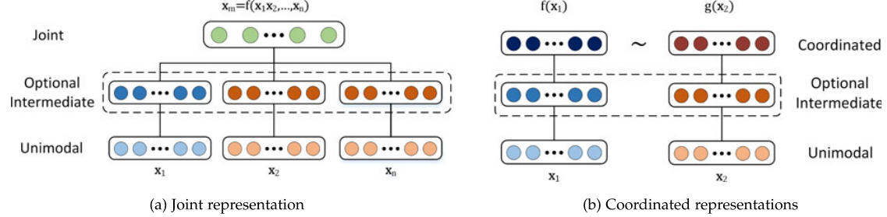
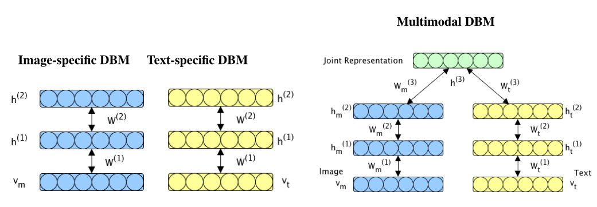
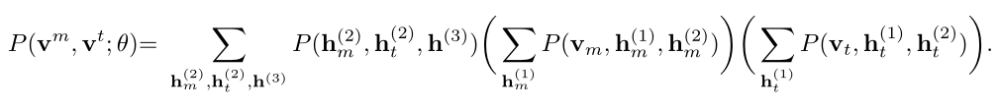
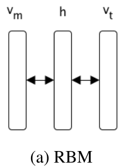
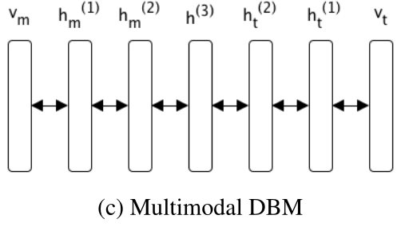
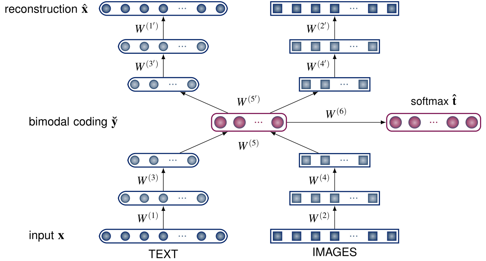
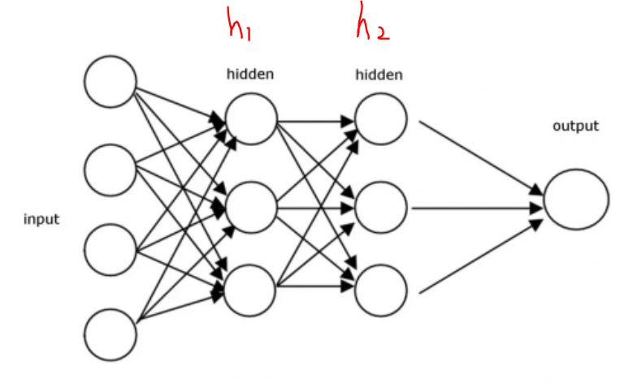
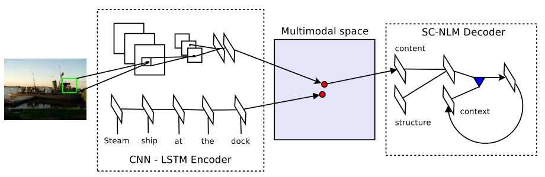

题目：Multimodal Machine Learning: A Survey and Taxonomy

# 一、Introduction

​		我们周围的世界涉及多种形式——我们看到物体、听到声音、感觉纹理、闻到气味等等。一般来说，一种形式指的是某件事发生或经历的方式。大多数人将“形式”一词和感官形式联系到一起，感官代表我们的主要沟通和感觉渠道。因此，当一个研究问题或数据集包含多个这样的形式时，它就被描述为多模态（或多模式）。在本文中，我们主要关注三种模式：既可以书写也可以口语的**自然语言**；通常用图像或视频表示的**视觉信号**；以及对声音和准语言信息（如韵律和声音表达）进行编码的**声音信号**。

**多模态机器学习旨在建立能够处理和关联多种模式信息的模型。**

​		从多模态数据中学习提供了模态之间的对应关系并获得对自然现象的深入理解的可能性。在本文中，我们确定并探索了围绕多模态机器学习的五个核心技术挑战。它们是多式联运环境的核心，需要加以解决，以便在领域取得进展。我们的分类超越了典型的早期和晚期融合这种分类，包括以下五个挑战：

①  表示：**第一个基本挑战是学习如何利用多种模式的互补性和冗余性来表示和总结多模式数据。**多模态数据的异质性使得构建这种表示具有挑战性。

② 转化：**第二个挑战涉及如何将数据从一种模式转换（映射）到另一种模式。**不仅数据是异质的，而且模式之间的关系往往是开放的或主观的。例如，有许多正确的方法来描述一个图像，而一个完美的翻译可能并不存在。 

③ 对齐：**第三个挑战是确定两种或两种以上不同模式的（子）要素之间的直接关系。**例如，我们可能希望将菜谱中的步骤与显示制作菜肴的视频对齐。为了应对这一挑战，我们需要衡量不同模式之间的相似性，并处理可能的长期依赖性和模糊性。 

④ 融合：**第四个挑战是将来自两种或两种以上模式的信息结合起来进行预测。**例如，对于视听语音识别，嘴唇运动的视觉描述与语音信号融合，以预测口语。来自不同模式的信息可能具有不同的预测能力和噪声拓扑，其中至少一种模式中可能缺少数据。

⑤ 共同学习：**第五个挑战是在模式、它们的表示和它们的预测模型之间转移知识。**协同训练、概念基础和零射击学习的算法就是一个例子。合作学习探索从一种模式学习的知识如何帮助在不同模式上训练的计算模型。当其中一种模式的资源有限（例如注解数据）时，这一挑战尤其重要。 

# 三、多模态表示

**单模态表示学习**负责将信息表示为计算机可以处理的数值向量或者进一步抽象为更高层的特征向量。

**多模态表示学习**是指通过利用多模态之间的互补性，剔除模态间的冗余性，从而学习到更好的特征表示。主要包括两大研究方向：**联合表示（Joint Representations）**和**协同表示（Coordinated Representations）**。

## 3.1 联合学习示例

### 3.1.1 概率图模型

文献：Multimodal Learning with Deep Boltzmann Machines

**深层玻尔兹曼机模型可用于提取融合模式的统一表示。**

#### 3.1.1.1 联合表示的要求

**联合表示必须确保表示空间中的相似性是对应“概念”的相似性。**即使在缺少某些模态的情况下，也应易于获得联合表示。基于观察到的模式，能够填充缺失的模式。此外，提取的表示对最终任务是有用。 

我们提出的多模态深度玻尔兹曼机（DBM）模型满足上述要求。DBM是无向图模型，在相邻的隐藏单元层之间有两部分连接。**其关键思想是学习多模态输入空间上的联合密度模型。**然后，通过从给定观测值的条件分布中取样，可以填充缺失的模态。 

例如：我们使用标记好的图像来学习一个图像和文本之间的联合分布$P(V_{img},V_{txt}|\theta)$，通过从$P(V_{txt}|V_{img},θ）$和$P(V_{img}|V_{txt},θ）$提取样本，我们可以填充缺失的数据，从而分别进行图像注释和图像检索。 

#### 3.1.1.2 受限玻尔兹曼机

受限玻尔兹曼机器是一个具有随机可见单元$v\in\{0,1\}^D$和随机隐藏单元$h\in\{0,1\}^F$的无向图模型，将每个可见单元连接到每个隐藏单元。该模型定义了能量函数$E:\{0,1\}^{D+F}->R$
$$
E(v,h;\theta)=-\sum_{i=1}^D\sum_{j=1}^Fv_iW_{ij}h_i-\sum_{i=1}^Db_iv_i-\sum_{j=1}^Fa_jh_j
$$

> 其中θ={a，b，W}是模型参数。 

可见和隐藏单元上的联合分布由以下定义： 
$$
P(v,h;\theta)=\frac{1}{Z(\theta)}exp(-E(v,h;\theta))
$$

#### 3.1.1.3  高斯受限玻尔兹曼机

考虑模型可见实值单位$v\in R^D$，使$h\in\{0,1\}^F$是随机隐藏单元。高斯RBM状态{v，h}的能量定义如下：
$$
E(v,h;\theta)=-\sum_{i=1}^D\frac{(v_i-b_i)^2}{2\sigma_i^2}-\sum_{i=1}^D\sum_{j=1}^F\frac{v_i}{\sigma}W_{ij}h_i-\sum_{i=1}^Db_iv_i-\sum_{j=1}^Fa_jh_j
$$

> 高斯RBM可以用于图像类型，用于文本的也有其他类型。

#### 3.1.1.4 多模态深度玻尔兹曼机

DBM是一个对称耦合的随机二元单元网络。它包含一组可见单元$v\in\{0,1\}^D$和一系列隐藏单元$h\in\{0,1\}^F$。只有相邻层中的隐藏单元之间才有连接。首先让我们考虑一个具有两个隐藏层的DBM。联合结构{v，h}的能量定义为（忽略偏置项）： 
$$
E(v,h;\theta)=-v^TW^{(1)}h^{(1)}-h^{(1)}W^{(2)}h^{(2)}
$$
表示可见到隐藏和隐藏到隐藏的对称交互项。与RBMs类似，这种二元DBM可以很容易地扩展到密集实值或稀疏计数数据的建模。

生成联合表示：该模型可生成融合表示，该表示法包含多种数据模式。

通过观察到的模式，并交替进行吉布斯采样，从$P(h^3|v_m,v_t)$（如果两种模式都存在）或$P（h^3|v_m）$（如果文本缺失）进行采样，可以推断出这种融合表示。 

当我们输入v的时候，通过p(h|v) 可以得到隐藏层h，而得到隐藏层h之后，通过p(v|h)又能得到可视层，通过调整参数，我们就是要**使得从隐藏层得到的可视层v1与原来的可视层v一样，那么得到的隐藏层可以视作与可视层等价，也就是说隐藏层可以作为可视层输入数据的特征**

隐单元h(3)的激活概率构成了输入的联合表示。 

> 思想理解：
>
> 1. 多模态DBM是多个无向单模态路径的组合。可以使用任意数量的路径，每个路径具有任意数量的层。每个路径中较低水平的RBM的类型可能不同，说明了不同的输入分布，只要每个通路末端的最终隐藏表示是相同的类型。
> 2. 每个数据模式都有非常不同的统计特性，这使得单个隐藏层模型很难直接找到模式之间的相关性。 
> 3. 在我们的模型中，通过在模式之间放置隐藏单元层来弥合这种差异。与简单RBM 图a相比，隐藏层h直接模拟vt和vm上的分布，DBM中第一层隐藏单元$h_m^{(1)}$更容易执行——即模拟vm和$h_m^{(2)}$上的分布。DBM中的每一层隐藏单元对vm和vt上的分布建模的总体任务贡献了一小部分。**在此过程中，每一层依次学习更高级别的表示，并移除特定于模态的相关性。**因此，网络中的中间层可以被视为输入的（相对）“无模态”表示。

### 3.1.2 神经网络模型

 文献：Learning Grounded Meaning Representations with Autoencoders

**该文章认为，多模态是对同一个实体的不同属性方面的描述，比如，一个单词实体，图像可以描述这个单词的形状，文本向量可以描述单词的出现频率等。**

在这项工作中，我们引入了一个模型，该模型通过将单词和图像映射到一个公共嵌入空间来学习本质意义表示。 我们的模型使用堆叠式自动编码器引导整合视觉和文本信息的语义表示。 

我们的模型在概念上与之前的研究（尤其是那些应用堆叠自动编码器的研究）相似，但至少在两个方面与它们有很大不同。

 首先，这些方法大多旨在学习模态之间的共享表示，以便从其他模态中推断出一些缺失的模态（例如，从图像中推断文本，反之亦然）；相比之下，我们的目标是学习每个模态的最佳表示及其最佳组合。

其次，我们的问题设置不同于以往的研究，前者通常处理分类任务，并使用带有明确类标签的训练数据对深层神经网络进行微调；相比之下，我们使用半监督标准对自动编码器进行微调。

#### 3.1.2.1 自动编码器

自动编码器是一种无监督的神经网络，经过训练，可以从潜在的表示中重建给定的输入。

它由一个编码器$f_\theta$组成，用来将一个输入向量$x^i$映射到潜在的表示$y^i=f_\theta(x^i)+b=s(Wx^i+b)$,s是一个非线性激活函数。

一个解码器$g_\theta$用来从$y^i$重建$x^i$。

**自动编码器是一种通过在编码阶段保留有用的特征来学习某些输入表示的方法，这些特征有助于重建输入，同时丢弃无用或有噪声的输入。**

**去噪自动编码器 **

使用去噪自动编码器的训练标准是，给定损坏的版本$\hat{x}^i$，重建干净的输入$x^i$。其基本思想是，如果自动编码器能够从其损坏中重建实际输入，那么学习到的潜在表示是好的。
$$
L(x^i,g_\theta(f_\theta(\hat{x}^i))
$$

#### 3.1.2.2 语义表示

为了从文本和视觉输入中学习单个单词的意义表示，我们使用了叠加（去噪）自动编码器（SAE）。 

> 利用编码器和解码器进行无监督训练，优化表示的提取。
>
> 中间的红色向量是融合后的表示。

#### 3.1.2.3 神经网络的概率理解

我们想训练一个识别猫的神经网络，输入猫的图像能够输出是猫的概率，该网络结构如下：

神经网络的每一层其实是对上一层数据分布进行的模拟（近似），神经网络整体就是对一个理想猫模型进行的逼近。

给出一个猫的图像，判断是猫的概率，本质是根据图像中我们提取出来的一些特征来判断的，这写特征就是分布函数中的自变量。假设我们的模型只会提取猫的胡须，h1提取胡须长度，那么就有一个理想的分布，x轴代表胡须长度，y轴代表是猫的概率。

## 3.2 协同学习示例

文献：Unifying Visual-Semantic Embeddings with Multimodal Neural Language Models

利用协同学习到的特征向量之间满足加减算数运算这一特性，可以搜索出与给定图片满足“指定的转换语义”的图片。

例如：狗的图片特征向量 - 狗的文本特征向量 + 猫的文本特征向量 = 猫的图片特征向量 -> 在特征向量空间，根据最近邻距离，检索得到猫的图片

编码器：用于学习联合图像句子嵌入的深卷积网络（CNN）和长短时记忆递归网络（LSTM）。

解码器：一种新的神经语言模型，它结合了结构和内容向量，按顺序一次生成一个单词。 

# 表示的理解

1. 表示可以认为是一种近似，例如我们求圆的面积，可以使用尽可能多的三角形来近似；
2. 参数方程中我们用另外一组参数来表示原来的问题；
3. 我们希望得到好的**表示**，比如，一个人戴上了口罩我们依然可以识别出来，说明遮盖的部分不影响人脸识别，我们可以简化数据量。