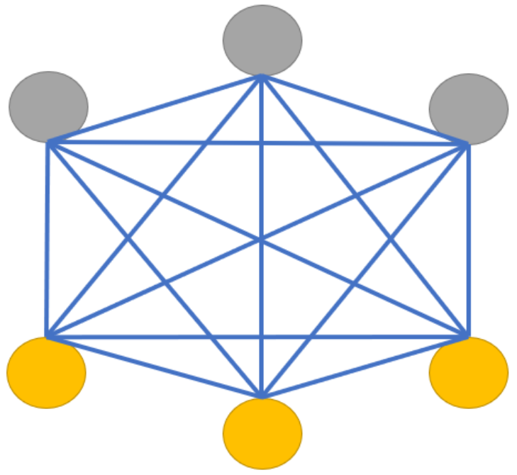
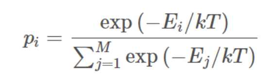
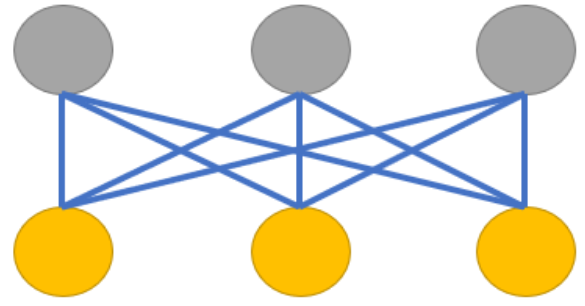
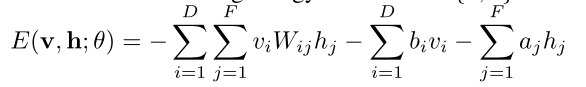

# 一、针对玻尔兹曼机的学习

## 1.1 玻尔兹曼机

 **Boltzmann**机是受**统计力学**启发的多层学习机，它是一类典型的随机神经网络属于反馈神经网络类型 。其命名来源于**Boltzmann**在统计热力学中的早期工作和网络本身的动态分布行为 。

它在神经元状态变化中引入了统计概率，网络的平衡状态服从**Boltzmann**分布，网络运行机制基于模拟退火算法（寻优的贪心算法）。

玻尔兹曼机(Boltzman Machine)是一个随机动力系统，每个变量的状态都以一定的概率受到其他变量的影响。
玻尔兹曼机可以用**概率无向图模型**来描述，一个具有K个节点的玻尔兹曼机满足以下三个性质：

1. 二值化。每个节点的状态值只有0和1。
2. 一个玻尔兹曼机包括两类节点，一类是可观察的节点有N个，一类是不可观察的节点，即隐藏节点，有(K-N)个。
3. 节点之间是全连接的。每个节点都和其他节点连接。
4. 每两个变量之间的互相影响是对称的。这里的对称和上面无向其实是一个概念，就是已知A点的状态值，那么求B的状态值和已知B的状态值，求A的状态值的影响是相等的。可以理解为 P(B|A) = P(A|B)。



> 上图就是一个有六个节点的玻尔兹曼机。其中有三个可观察的节点，标了黄色，还有三个不可观测的节点，即隐藏节点，标了灰色。

## 1.2 波尔兹曼分布推导过程

玻尔兹曼机中，随机向量X的联合概率，也就是节点的状态值，是满足玻尔兹曼分布的。

玻尔兹曼分布是描述粒子处于特定状态下的概率，是关于状态能量E(x)与系统温度T的函数。（借鉴热力学中的概念）

**一个粒子处于状态α的概率P(α)是关于状态能量E(x)与系统温度T的函数。**

> 特定状态，节点的状态值为1，还是0。x=α
> 特定状态概率，节点状态值为1或者0时的概率。P(x=α)
> 状态能量，粒子本身具有的能量。



> 玻尔兹曼机可以解决两类问题，一类是搜索问题：当给定变量之间的连接权重时，需要找到一组二值向量，使得整个网络的能量最低。另一类是学习问题，当给定变量的多组观测值时，学习网络的最优权重。

## 1.3 受限玻尔兹曼机(RBM)

由于全连接的玻尔兹曼机的复杂性，目前为止并没有广泛运用。实际应用中，用得更多的是基于玻尔兹曼机改造的一个版本——受限玻尔兹曼机(RBM)，其网络架构如下：



受限玻尔兹曼机有层的概念。它有两层，一层称为显层，用于观测和输入，一层为隐藏层，用于提取特征。
受限玻尔兹曼机相比玻尔兹曼机，层间的节点还是采用了对称的全连接的方式连接，但是层内的节点相互独立，相互不受影响。

显层——>隐层：编码

隐层——>显层：解码

## 1.4 能量函数

玻尔兹曼机是一个无向图，因此每一条边都是双向的。

受限玻尔兹曼机的能量函数可以分成三部分，

1. 显层节点偏置乘以显层随机可观测变量部分；
2. 连接权重与显层随机可观测变量和隐层随机可观测变量相乘部分；
3. 隐层节点偏置乘以隐层随机可观测变量偏置部分。



## 1.5 受限玻尔兹曼机运行流程

受限玻尔兹曼机有两个偏置项，隐藏层的偏置项有助于RBM在前向传递中获得非零激活值，而可见层的偏置项有助于受限玻尔兹曼机学习后向传递中的重建。

1. 在正向传递中，每个输入数据乘以一个独立的权重，然后相加后再加上一个偏置项，最后将结果传递到激活函数来产生输出。
2. 用对比散度计算正反向梯度，然后更新偏置和权重。
3. 因为最开始受限玻尔兹曼机权重是随机初始化的，所以重建结果和原始输入差距通常会比较大，这个差距可看作是重建误差，训练受限玻尔兹曼机是通过在可见层和隐藏层之间迭代学习不断正向反向传播，直至达到某个误差的最小值。

```python
def encode(self, v):
    # 编码，即基于v计算h的条件概率：p(h=1|v)
    return sigmoid(self.bias_b + v @ self.weights)

def decode(self, h):
    # 解码(重构)：即基于h计算v的条件概率：p(v=1|h)
    return sigmoid(self.bias_a + h @ self.weights.T)

def gibbs_sample(self, v0, max_cd):
    # gibbs采样, 返回max_cd采样后的v以及h值
    v = v0
    for _ in range(max_cd):
        # 首先根据输入样本对每个隐藏层神经元采样。二项分布采样，决定神经元是否激活
        ph = self.encode(v)
        h = np.random.binomial(1, ph, (self.n_sample, self.n_hidden))
        # 根据采样后隐藏层神经元取值对每个可视层神经元采样
        pv = self.decode(h)
        v = np.random.binomial(1, pv, (self.n_sample, self.n_visible))
        return v
```

