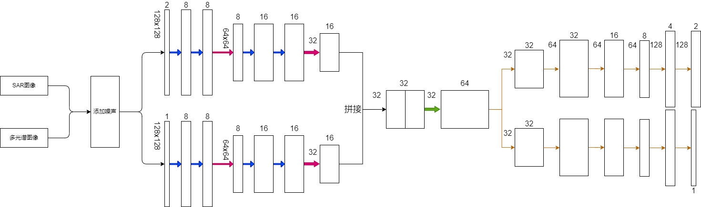
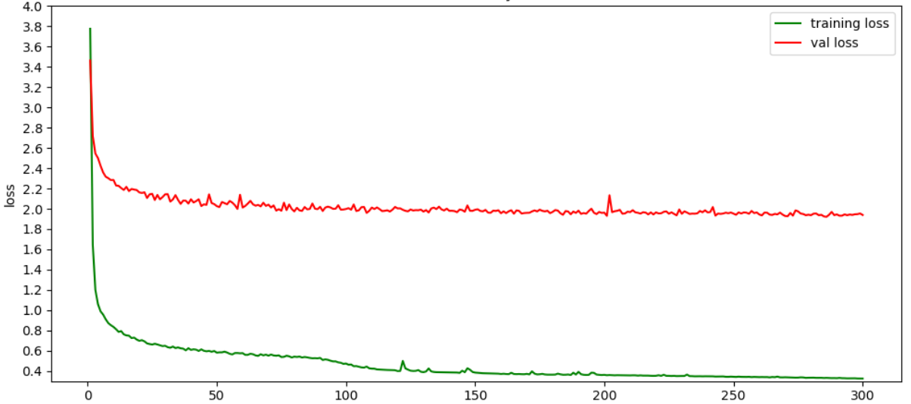
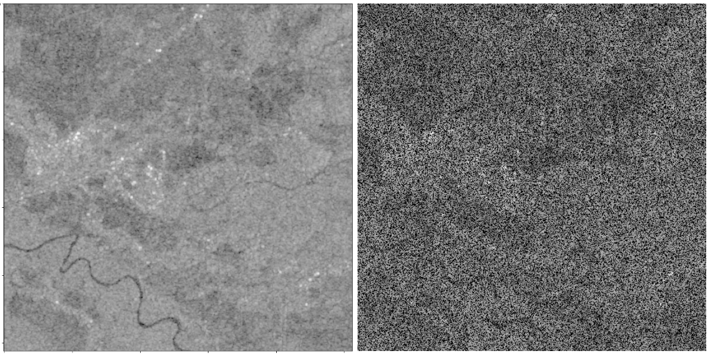
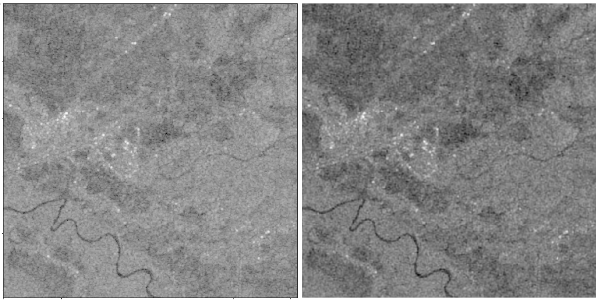
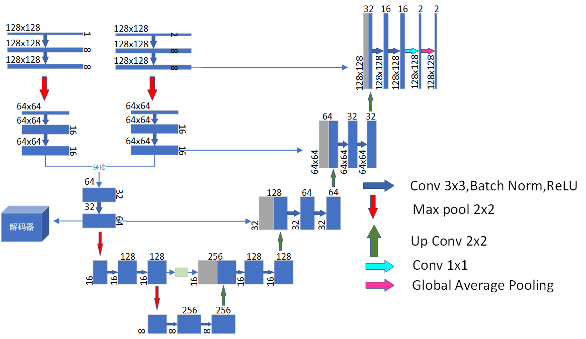

# 一、本周任务

1. 复现基于自编码器的表示融合网络。
2. 将融合网络与现有的unet图像分割网络结合。

# 二、实现

## 1. 去噪自编码器

**① 网络图**

**② 噪声**

先对图像进行归一化，是所有像素值在0-1之间。

之后通过随机选择像素位置，将选中的位置像素值设为0。

添加40%的噪声。

**③ 损失函数**

利用均方误差(MSE)来计算原图与输出之间的损失值。

**④ 训练效果**

轮数：300轮

学习率：0.0001

损失值曲线：

去噪效果：

**左边原图，右边添加噪声**

**左边是原图，右边是去噪后**

## 2. 将表示融合网络与unet分割网络结合

① 网络图

② 连接路径

因为UNet包含连接路径，通过表示融合后的融合块的尺寸小于原图尺寸。因此unet中编码端存在没有与解码端相连接的部分。

融合网络的前半部分也是编码器，可以用其每一阶段的输出来弥补unet的部分编码器。

将SAR图像和多光谱图像的每一阶段输出拼接在一起，然后再与unet的解码器相连接。

结果：(0.9705270472732171, 0.8839117066910458, 0.9104015984890395, 0.8969611141727987)

# 三、要做的实验

1. 验证重建网络和UNet一起训练时，解码器是否有用？（去掉解码器训练）
2. 使用多光谱的11个通道一起训练。
3. 输入图像不加噪声，在计算loss时设定一个阈值或使用正则化，看看能否去掉图像原本存在的噪声。