# 目标检测

两部分：提取特征的主干网络和检测器（Classification和Location）

优化方向1：更深的网络——>提高精度（时间增加，训练困难）。

优化方向2：更少的参数——>充分考虑移动应用场景。

单极训练：Classification和Location同时进行。

两级训练：Classification和Location单独进行。

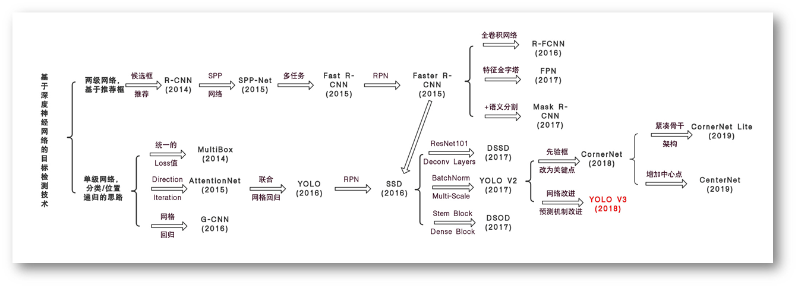

anchor box是各种大小和纵横比的框，用作检测候选。锚箱广泛用于一级探测器，它可以实现与两级探测器高度竞争的结果，同时效率更高。一级探测器将anchor box密集地放置在图像上，并通过对anchor box打分和回归优化其坐标来生成最终的框预测。 

anchor的缺点：

1. one-stage detectors在每张图片上放置大量的anchor boxes。如此密集的boxes是为了确保大多数的ground truth有足够的anchors box与他们匹配，即与他们有足够的IoU值。但是，最终只有少部分的anchor boxes达到的匹配要求，绝大部分anchor boxes为负样本，使得样本出现了class imbalance，正负样本比例不平衡，验证影响训练结果与速度。正是这种imbalance导致了训练低效，且性能无法提高，于是出现了focal loss等方法来解决这个class imbalance问题。
2. anchor box 会引入很多的超参数以及设计选项，如boxes数量、尺寸、比例等，这些参数在多尺度的网络中显得更加复杂，需要为不同分辨率的特征层设置不同anchor boxes参数。

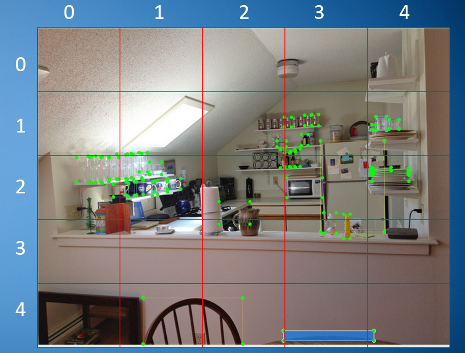

# CornerNet的创新

1. 我们使用单个卷积神经网络将一个对象边界框检测为一对关键点，**即左上角和右下角**。通过将对象检测为成对的关键点，我们**消除了设计一组anchor box的需要**。

> 卷积网络预测了两个heatmap来表示同类物体的corners信息。一个heatmap描绘属于同一类的所有instance的左上角corners信息，另一个heatmap描述属于该类的所有instance的右下角的信息。此外，卷积网络还为每一个corner预测一个嵌入向量（embedding vector），embedding vector作用就是将一个物体的左上角和右下角两个corner做匹配，匹配原则为同一个物体的两个corner会有相似的vector。如此，就极大的简化了网络，不再需要设计anchor boxes了。

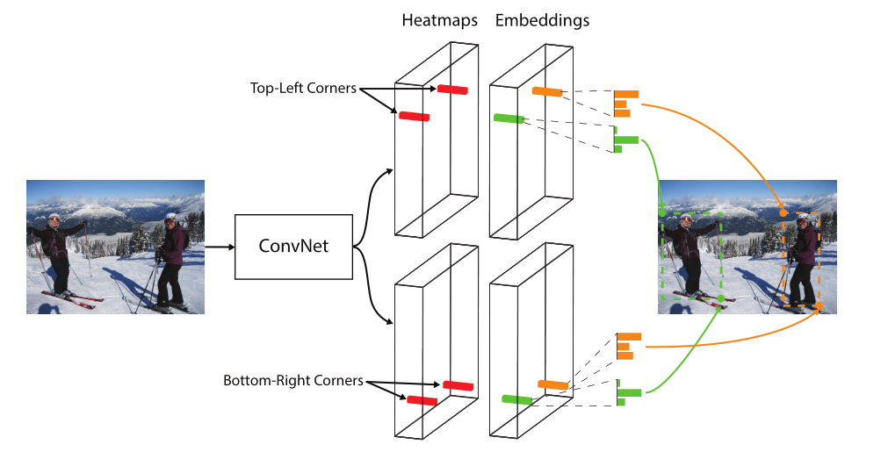

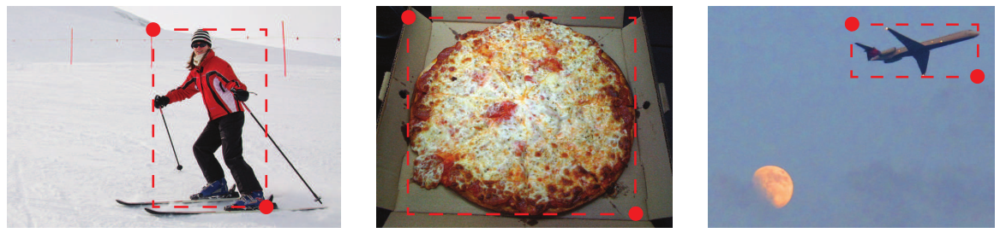

2. 我们还引入了**corner pooling**，这是一种新型的池化层，可以帮助网络更好地定位角点。 

   bounding box的每一个corner一般在目标的外面。我们无法仅根据这一个像素来判断该像素是否是某一个目标的corner。这个时候，我们需要水平向右查看对象最上面的边界，垂直向下查看最左边的边界，通过这两个边界来判断该像素的激活值。第一个max-pooling是计算该像素右侧所有像素的最大值，第二个max-pooling是计算该像素下方所有像素的最大值，然后将这两个值相加，就代表该像素的激活值。

   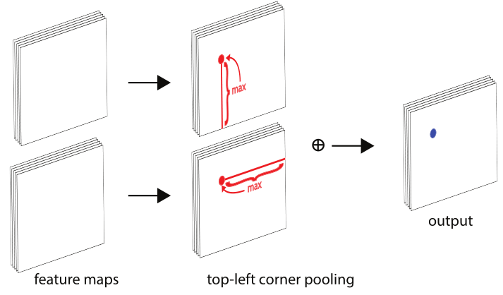

# corner 相比anchor优点

1. 边框中心来预测的方式需要依赖物体4个方位的信息，而使用corner的方式，预测物体每个corner只需要两个方位信息，加上有corner pooling，就使得corner更加容易定位物体。

2.  使用corner能更高效地计算boxes的离散空间位置：使用corner只要O(wh)计算复杂度就能得到所有的可能anchor boxes，但是使用anchor boxes需要$O(w^2h^2)$的复杂度。

# CornerNet

## Overview

CornerNet通过一对corner来检测物体。通过一个卷积网络预测两个heatmaps来呈现不同物体种类的corner分布，一个heatmap用与左上角corner，一个右下角corner。网络随后预测两个嵌入向量来标识那些左上角和右下角corner是属于同一个物体的，即要使同一物体的两个corner的嵌入向量相似。为了产生更贴合的bounding box，网络还预测了每个corner偏移（offsets）来调整corners，最后通过一个简单的处理得到最终bounding box。

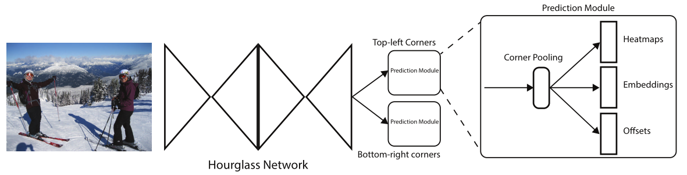

## Detecting Corners

每个heatmaps有C个channel，对应C个种类，这里不考虑background，尺寸为H×W。每个channel都是一个binary mask，表明一个类的位置所在处。

**每个corner会有一个ground-truth positive 位置，其它的位置都是negative。**在这个ground-truth positive位置的一个半径（radius） 内的负样本得到的惩罚要比不在该范围内的小些。因为即使没有在标准点，如果两个corner都靠近各自标准点那也能与ground truth有足够的重叠。这里上述半径的值设置为能使处于这个半径范围内的一对corner能够与GT有足够的IoU，文中阈值为0.3。

给定半径，惩罚减少量由非标准化的二维高斯分布给出：
$$
exp(-\frac{x^2+y^2}{2\sigma^2})
$$
其σ是半径的1/3。

使$p_{cij}$是heatmaps中(i,j)位置c类的分数，$y_{cij}$代表利用非标准型高斯分布增强的ground-truth heatmap.

**focal loss**

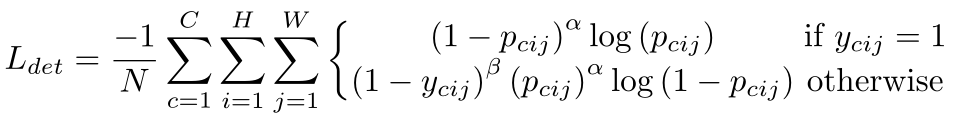

> 使用高斯分布编码了$y_{cij}$，$(1-y_{cij})$就减少了对ground truth周围点的惩罚。

许多网络涉及下采样层，以收集全局信息并减少内存使用。当它们完全卷积地应用于图像时，输出的大小通常小于图像。当它们完全卷积地应用于图像时，输出的大小通常小于图像。 因此，图像中的位置（x，y）被映射到heatmap位置$(\lfloor\frac{x}{n},\frac{y}{n}\rfloor)$，n是下采样因子。当我们重新从heatmap 映射到输入图像的位置时，可能会丢失一些精度。**为了解决这个问题，我们预测位置偏移，在将corner位置重新映射到输入分辨率之前稍微调整corner位置。**

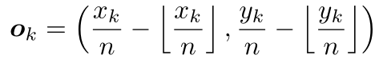

我们预测了所有类别的左上角共享的一组偏移量，以及右下角共享的另一组偏移量。

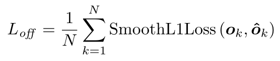

> $o_k$：真实值，$\hat{o}_k$：预测值。

## Grouping Corners

图像中可能会出现多个对象，因此可能会检测到多个左上角和右下角。我们需要确定一对左上角和右下角是否来自同一个边界框。

网络为每个检测到的corner预测一个embedding vector，这样，如果左上角和右下角属于同一个边界框，则它们之间的embedding距离应该很小。

我们遵循Newell等人[27]的观点，使用一维嵌入。

令$e_{t_k}$是目标k的左上角corner，$e_{b_k}$是目标k的右下角corner。pull loss用来缩小属于同一个目标（第k个目标）的两个corner的embedding vector距离。push loss用来扩大不属于同一个目标的两个corner的embedding vector距离。

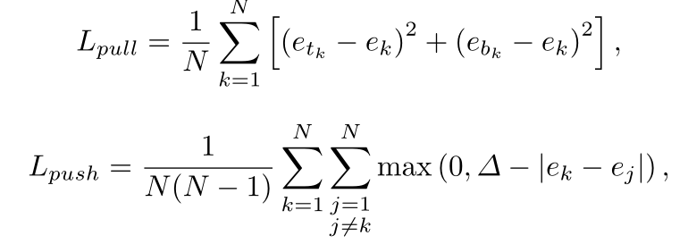

> $e_k$是$e_{t_k}$和$e_{b_k}$的平均值。
>
> $\Delta$=1
>
> 与offset loss类似，该损失只用于ground-truth corner。

## Corner Pooling

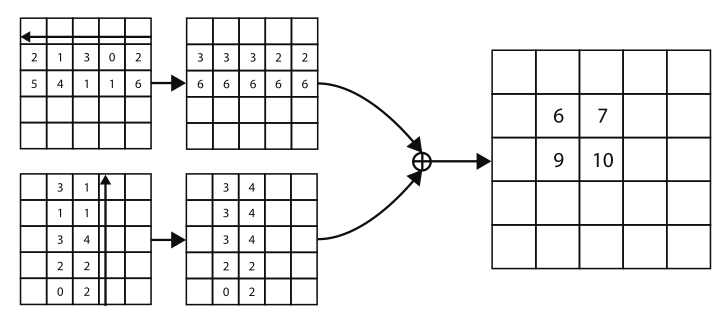

类似地还有左下角池化层，方向相反。

## prediction module

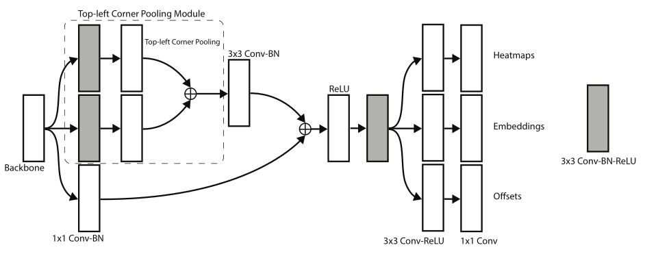

## Hourglass Network

CornerNet采用 Hourglass Network做骨干网，Hourglass Network是一个全卷积网络，由一个或多个hourglass module组成。每个hourglass module首先通过卷积层和max pooling 层下采样输入特征层，然后通过一系列的上采样操作和卷积层上采样回原分辨率。但是max pooling layer会丢失很多细节，于是增加了skip layer来补上细节。这样Hourglass Network就能同时捕获全局和局部特征。

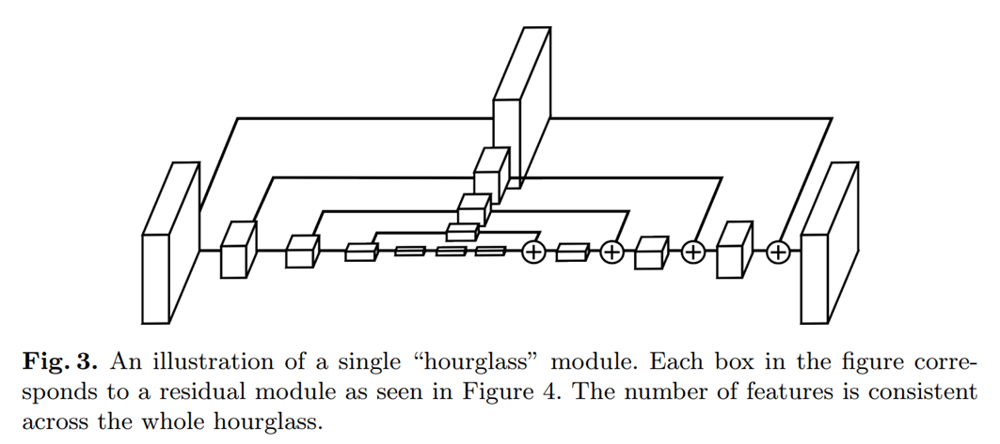

## Train Loss

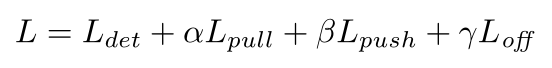