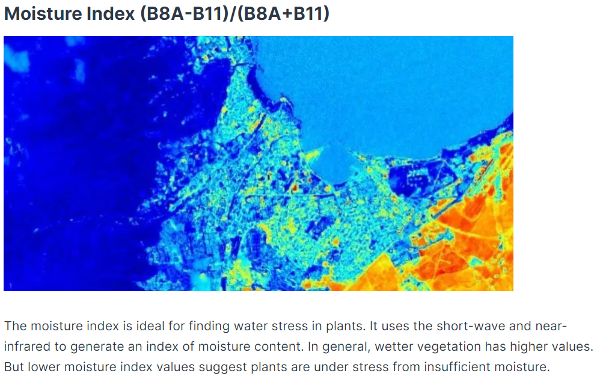

## **实验**

1. 验证重建网络和UNet一起训练时，解码器是否有用？（去掉解码器训练）
2. 使用多光谱的13个通道一起训练。
3. 输入图像不加噪声，在计算loss时设定一个阈值或使用正则化，看看能否去掉图像原本存在的噪声。

| 模型      | model1              | model2             | model3             | model4   |
| --------- | ------------------- | ------------------ | ------------------ | -------- |
| accuracy  | 0.970527   0.973673 | 0.975878 0.976947  | 0.974895  0.974544 | 0.975906 |
| precision | 0.883911  0.898743  | 0.916222  0.915958 | 0.903164  0.914515 | 0.918381 |
| recall    | 0.910401  0.911540  | 0.907861  0.916723 | 0.920531  0.903832 | 0.905531 |
| F1        | 0.896961  0.905096  | 0.912022  0.916341 | 0.911765  0.909142 | 0.911911 |

> model1：（SAR图像和多光谱图像）输入添加噪声的图像，自动编码器部分需要解码器（重建网络）。
>
> model2：（SAR图像和多光谱图像）输入未添加噪声的图像，自动编码器部分去除解码器（非重建网络）。
>
> model3：（多光谱图像）普通UNet模型。
>
> model4：（SAR图像和多光谱图像）输入未添加噪声的图像，自动编码器部分需要解码器，且使用正则化方法防止过拟合（尝试去除原有的噪声）。
>

| 模型      | model5   | model6   |
| --------- | -------- | -------- |
| accuracy  | 0.955092 | 0.952343 |
| precision | 0.847078 | 0.854893 |
| recall    | 0.822391 | 0.787654 |
| F1        | 0.834552 | 0.819897 |

> model5：（SAR图像和多光谱图像全部通道）输入未添加噪声的图像，自动编码器部分去除解码器（非重建网络）。
>
> model6：（SAR图像和多光谱图像全部通道）输入添加噪声的图像，自动编码器部分需要解码器（重建网络）。

## **多光谱图像有利于水体检测的通道**

> https://gisgeography.com/sentinel-2-bands-combinations/#Sentinel_2_Bands

| 水体指数                             | 计算公式                                     | 描述                                                         |
| ------------------------------------ | -------------------------------------------- | ------------------------------------------------------------ |
| 水分指数                             | $\frac{(B8A-B11)}{(B8A+B11)}$                | 寻找植物水分的理想选择。一般来说，较潮湿的植被具有较高的值。但较低的水分指数值表明植物水分不足。 |
| 植被指数                             | $\frac{(B8-B4)}{(B8+B4)}$                    | 高值表示茂密的树冠，低值或负值表示城市和水体。               |
| 归一化差异水体指数(NDWI)             | $\frac{(B3-B8)}{(B3+B8)}$                    | 能够抑制植被信息，突出水体； 对建筑物和土壤的分离有一定影响； 受冰雪、薄云和山体阴影影响较大，适用于地势平坦地区 |
| 修正的归一化差异水体指数(MNDWI)      | $\frac{(B3-B11)}{(B3+B11)}$                  | 能够较好地去除居民地和土壤等影响，突出水体； 受阴影影响较大  |
| 自动水体提取指数(AWEInsh) | $\frac{4(Green-SWIR1)}{(0.25NIR+2.75SWIR2)}$ | 能够抑制地形阴影和暗表面；受冰雪等高反射表面影响较大         |
| AWEIsh                    | Blue+2.5Green-1.5(NIR+SWIR1)-0.25SWIR2       | 能够抑制地形阴影和暗表面；受冰雪等高反射表面影响较大         |
| 基于线性判别分析的水体指数(WI)       | 1.7204+171Green+3Red-70NIR-45SWIR1-71SWIR2   |                                                              |
|                                      |                                              |                                                              |

