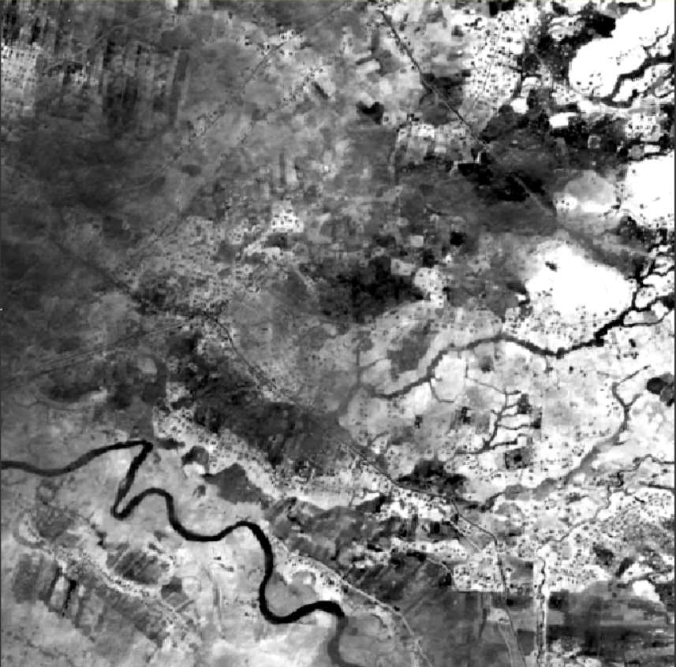
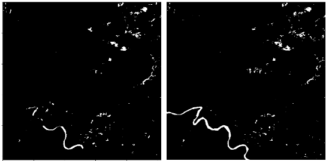

**一、对Sentinel2每一个通道进行分析**

1. 这些通道的尺寸均为512x512；
2. 不同通道存在空间分辨率不一样，比如通道1分辨率为60m，通道2分辨率为10m；
3. 通道1的每一个像素会重复6次，这样保证和通道2尺寸一致。

|  |  |
| ------------------------------------------------------------ | ------------------------------------------------------------ |

**二、Sentinel2突显水体的指数**

1. **水分指数 (B8A-B11)/(B8A+B11)**：水分指数是寻找植物水分胁迫的理想选择。它使用短波和近红外来生成水分含量指数。一般来说，较潮湿的植被具有较高的值。但较低的水分指数值表明植物因水分不足而受到压力。
2. **植被指数 (B8-B4)/(B8+B4)**：因为近红外（植被强烈反射）和红光（植被吸收），植被指数有利于量化植被的数量。归一化植被指数的公式为（B8-B4）/（B8+B4）。高值表示茂密的树冠，低值或负值表示城市和水景。
3. **归一化差异水体指数(NDWI)**：(Green-NIR)/(Green+NIR)=(B3-B8)/(B3+B8)
4. **改进的归一化差异水体指数(MNDWI)**：(Green-SWIR)/(GREEN+SWIR)=(B3-B11)/(B3+B11)
5. **自动水体提取指数(AWEI)**：AWEI_nsh = 4(Green-SWIR1)/(0.25NIR+2.75SWIR2), 
5. AWEI_sh = Blue+2.5Green-1.5(NIR+SWIR1)-0.25SWIR2
6. **基于线性判别分析的水体指数(WI)**：1.7204+171Green+3Red-70NIR-45SWIR1-71SWIR2

**三、水体指数对比实验**

| 模型      | model1  | model2  | model3  | model4  | model5  | model6  |
| --------- | ------- | ------- | ------- | ------- | ------- | ------- |
| accuracy  | 0.98216 | 0.98341 | 0.98418 | 0.94741 | 0.94263 | 0.97065 |
| precision | 0.94984 | 0.94706 | 0.95134 | 0.72252 | 0.81745 | 0.91966 |
| recall    | 0.92212 | 0.93454 | 0.93564 | 0.87943 | 0.76338 | 0.86752 |
| F1        | 0.93577 | 0.94076 | 0.94343 | 0.79329 | 0.78949 | 0.89283 |

> model1：S2水指数；
>
> model2：S2水指数、S1；
>
> model3：S2水指数、S1 进行通道加权连接。
>
> model4：植被水指数
>
> model5：MoistureIndex
>
> model6：NDWI

| 模型      | model7   | model8   | model9   | model10  |
| --------- | -------- | -------- | -------- | -------- |
| accuracy  | 0.976308 | 0.964883 | 0.972028 | 0.952228 |
| precision | 0.910763 | 0.913030 | 0.894274 | 0.830105 |
| recall    | 0.922222 | 0.829824 | 0.908947 | 0.831061 |
| F1        | 0.916457 | 0.869441 | 0.901551 | 0.830582 |

> model7：MNDWI
>
> model8：AWEI_nsh
>
> model9：AWEI_sh
>
> model10：基于线性判别分析的水体指数

**四、实验分析**

**输入水指标：**

|  |  |  |
| ------------------------------------------------------------ | ------------------------------------------------------------ | ------------------------------------------------------------ |

|  |  |  |
| ------------------------------------------------------------ | ------------------------------------------------------------ | ------------------------------------------------------------ |

**预测结果：**

这张图左边是预测结果，右边是真实标签。

左下角的河流没有连续识别出来，通过显示上一层的部分输出：

|  |  |
| ------------------------------------------------------------ | ------------------------------------------------------------ |

在目前的水域分割任务中，这个深度学习模型就像是一个大型的阈值过滤器，还是仅仅通过像素值的大小来分类，并没有学习到形状相关的信息。

输入数据中水指标，人眼可以很容易地区分出蜿蜒的河流，模型给我的最直观的感觉还是通过图像的亮度来分割的。

如果我们的模型只能根据像素的亮度分割区域（阈值法），确实无法很好的分割左下角的河流。

在S1图像中河流可以很好的分割出来。而目前的融合方法，并不能很好地融合S1和S2，使两者取长补短。

> 目前有一个想法：利用S1图像经过网络生成权重图，使用S2图像乘以权重，以此加强S1中明显是水的区域，而对于S1中不明显的区域，希望S1不影响S2原有的判断。

**五、下周任务**

1. 去掉两个比较差的水指数，再跑一个模型。
2. 学习显著性检测和决策融合。