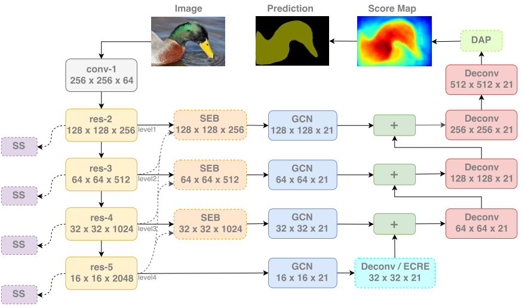
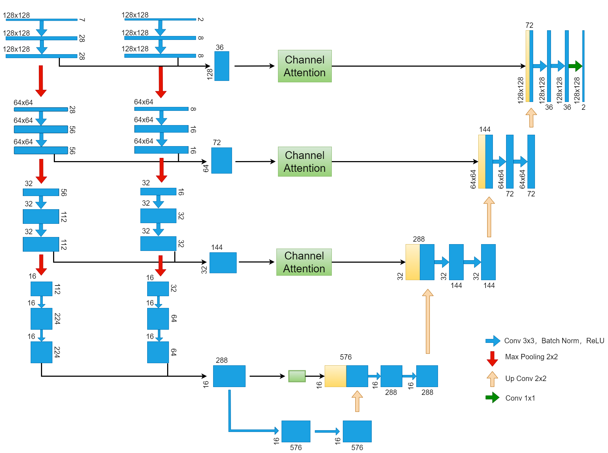

**实验**

| 模型      | model1   | model2   | model3   | model4  | model5   |
| --------- | -------- | -------- | -------- | ------- | -------- |
| accuracy  | 0.982386 | 0.983235 | 0.982357 | 0.98324 | 0.983198 |
| precision | 0.937227 | 0.933961 | 0.941846 | 0.94235 | 0.938147 |
| recall    | 0.937808 | 0.948059 | 0.932364 | 0.93853 | 0.942932 |
| F1        | 0.937518 | 0.940957 | 0.937081 | 0.94044 | 0.940533 |

| 模型      | model6           | model7 | model8  | model9  |
| --------- | ---------------- | ------ | ------- | ------- |
| accuracy  | 0.98216  0.98180 |        | 0.98265 | 0.98213 |
| precision | 0.94984  0.93777 |        | 0.94930 | 0.93167 |
| recall    | 0.92212  0.93276 |        | 0.92638 | 0.94228 |
| F1        | 0.93577  0.93526 |        | 0.93770 | 0.93695 |

> model1：水指数+通道注意
>
> model2：S1和水指数+SEB+DAP
>
> model3：S1和水指数+SEB+GCM+BR
>
> model4：S1和水指数+SEB+GCM+BR+DAP
>
> model5：S1和水指数+DAP
>
> model6：水指数
>
> model7：水指数+DAP（未做）
>
> model8：水指数7通道输入
>
> model9：水指数7通道输入+通道注意

