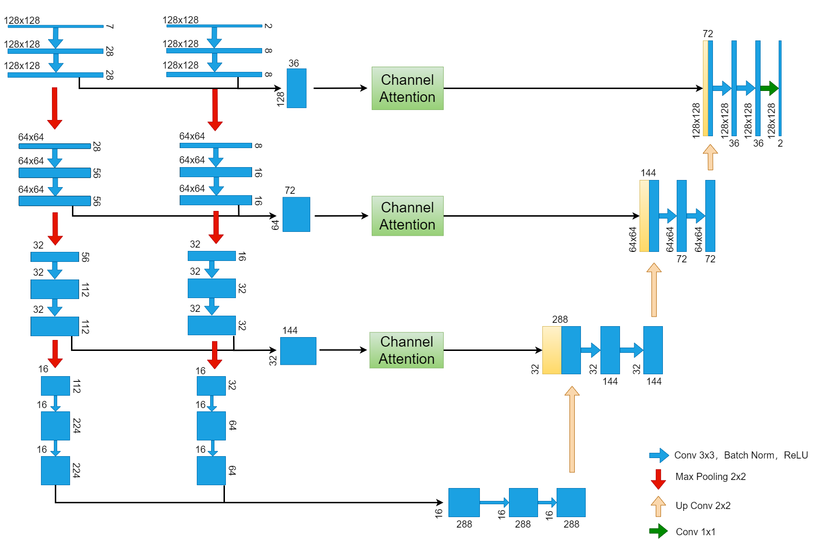
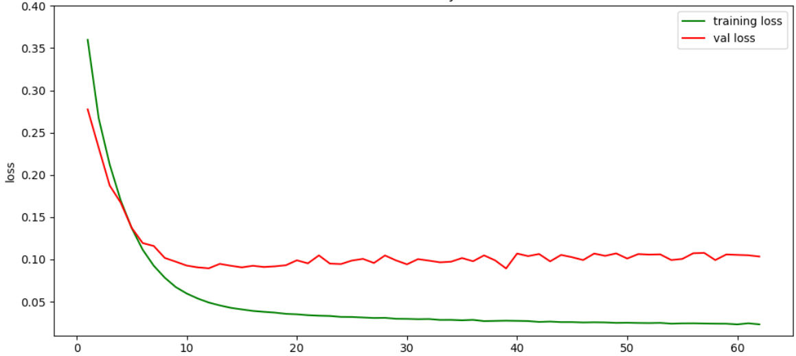

## **实验**

1. **第四层经过两个卷积操作**

​	这种情况下，第四层经过两次卷积操作。（第四层没有特征）

​	F1=93.64%

2. **去掉第三层的通道注意，直接通过卷积后，再进行反卷积。每一层均有特征。**（三层网络）

​	F1=93.309%

3. **同2，将编码器的每一个卷积操作的输出通道增大。**每一层均有特征

​	F1=93.749%

4. **同3，去掉通道注意模块**，第三层没有特征。

   F1=93.813%

5. **7个水指数和sar图像经过8条branch，去除第五层**

   F1=93.96%

6. **最高的分数无法复现，又跑了一次之前的模型**

   F1=93.96%，F1=94.17%（经过水平、垂直翻转扩充数据集）
   
   F1=94.215%

**验证：编码器每一组block修改为一个卷积操作，验证是否还出现feature map为常数的层。**

1. **SAR：**3x3，OneConv，5组block，无feature map全为常数的组 F1=85.902%
2. **SAR：**3x3，OneConv，4组block，无feature map全为常数的组 F1=85.055%
3. **SAR：**3x3，OneConv，3组block，无feature map全为常数的组 F1=
4. **SAR：**5x5，OneConv，5组block，无feature map全为常数的组 F1=85.570%
5. **SAR：**5x5，OneConv，4组block，无feature map全为常数的组 F1=86.147%
6. **SAR：**5x5，OneConv，3组block，无feature map全为常数的组 F1=84.559%
7. **Fusion model：**3x3,OneConv,5组block,无feature map全为常数的组,8个branch（对比TwoConv从第四组开始出现feature为常数）F1=94.129%
5. **Fusion model：**5x5,OneConv,5组block,无feature map全为常数的组,8个branch F1=93.918%

上面的模型变小了，并且没有featuer map为常数的组，测试的结果基本保持不变，没有下降。Fusion model loss曲线如下：

