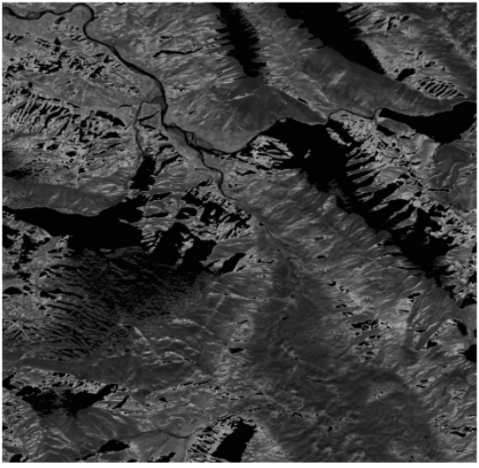
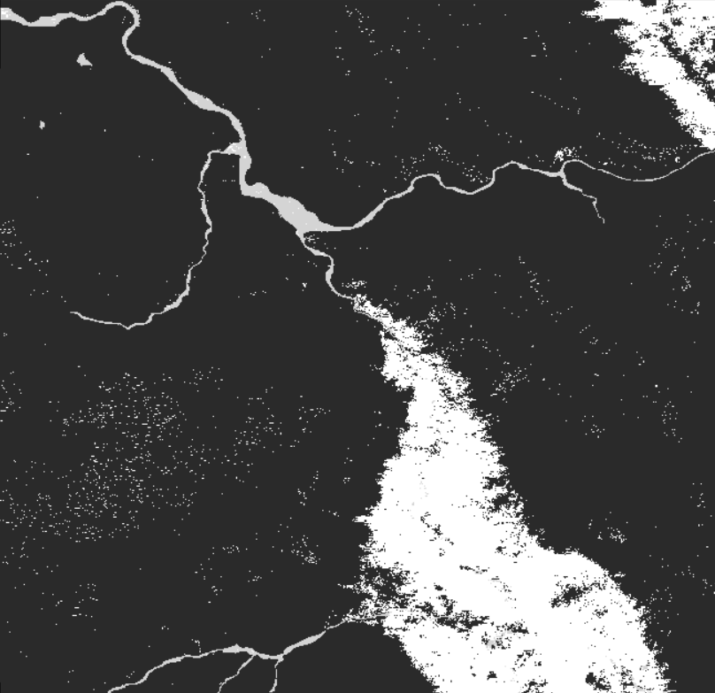
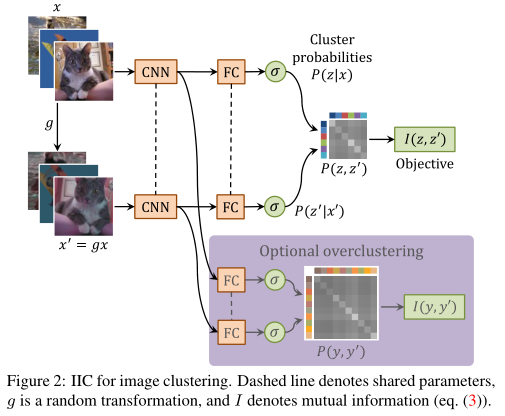
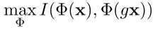
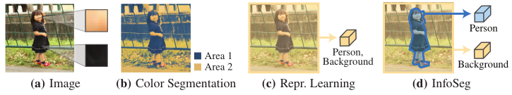
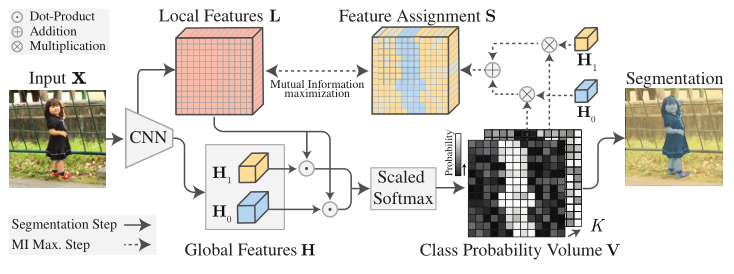

# 一、水域分割的新数据集

数据集：https://tinyurl.com/worldfloods

这是Sentinel-2卫星的数据，数据量很大，总数据大小251GB左右。数据尺寸不一致，长宽比也不一致。有些图形大小可以达到2GB，也有些只有几MB。

目前是将该数据切分为512x512的新图像。

原图：

**Label示例：**（2693x2610）

# 二、深度学习方面的聚类算法

1. Invariant Information Clustering for Unsupervised Image Classification and Segmentation
2. InfoSeg: Unsupervised Semantic Image Segmentation with Mutual Information Maximization

## 2.1 Invariant Information Clustering for Unsupervised Image Classification and Segmentation

​		许多作者试图将成熟的聚类算法与深度学习结合起来，例如通过将网络训练与k-means风格的目标结合起来。然而，将聚类和表示学习方法简单地结合起来往往会导致退化。

​		在本文中，我们介绍了不变信息聚类（IIC），一种更具原则性的方法来解决这个问题。IIC是一种通用的聚类算法，它直接将随机初始化的神经网络训练成端到端的分类函数，并且没有任何标签。它涉及一个简单的目标函数，即成对数据样本的函数分类之间的互信息。输入数据可以是任何模态，并且由于聚类空间是离散的，因此可以精确地计算互信息。

**Method**

设$X,\hat{X} \in \chi$是包含相同对象的不同图像。IIC的目标就是学习$\Phi:\chi->\Upsilon $，保留X和$\hat{X}$之间的共同点，同时丢弃特定于实例的细节。前者可以通过最大化编码变量之间的互信息来实现：
$$
max\ I(\Phi(X),\Phi(\hat{X}))
$$
**用于图像聚类（分类问题）**

图像x和变换g都是随机变量。g可以包括缩放、倾斜、旋转或翻转（几何）、改变对比度和颜色饱和度（光度），或任何可能使图像内容保持完整的其他扰动。

**用于图像分割**

IIC可以像图像聚类一样应用于图像分割，除了两个修改。

- 首先，由于对每个像素进行了密集的预测，因此聚类应用于图像块，而不是整个图像。
- 第二，与整体图像不同，我们可以获得patch之间的空间关系。
- 因此，我们可以将局部空间不变性添加到几何不变性和光度不变性列表中，这意味着我们不仅通过合成扰动，而且通过提取图像中的相邻patch对来形成patch对。

## 2.1 InfoSeg: Unsupervised Semantic Image Segmentation with Mutual Information Maximization

>  语义图像分割的主要挑战是识别图像中的高层结构。最先进的方法通过从标记数据中学习来实现这一点。**虽然在无标记数据的分割方面存在大量研究，但主要集中在使用颜色或边缘等低级特征的非学习方法**。一般来说，底层特征不足以进行语义分割。它们在高层结构中并不同质。图（a-b）说明了这个问题。根据颜色对描绘人物的图像进行分割。图像区域的颜色变化很大，即使它们在语义上是相关的。因此，结果分割不会捕获任何高层结构。相反，图（d）说明了InfoSeg如何将未标记的图像映射到捕获高级结构的分割。这些分割通常直接捕获标记数据集的语义类。  

​		最近，自我监督表征学习方法展示了如何在没有任何带注释的训练数据的情况下从图像中提取高级特征。然而，他们计算特征可以捕获图像的全部内容。因此，它们不适合分割。

​		**为了实现分割，我们使用多个高级功能，每个特征捕获语义相似的图像区域。这使我们能够根据每个特征的属性为类分配像素。图（c-d）说明了我们的方法与图像级表征学习的区别。**

1. 这是一个需要分割成两个类别的图片示例，首先原图输入 CNN 网络有两个输出端，一个是和原图成比例缩小的局部特征图 L，一个是和类别数一样的全局特征 H。H 大小为 1，通道数和 L 一致。
2. 之后每个 H 与特征图做点积得到预测的初步分割图，对几张 H 进行 Scaled Softmax 操作以确定每个像素点属于哪个类别的概率。

3. 最后，我们的目标就是使正例的局部特征与该合成特征互信息最大。
