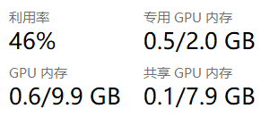
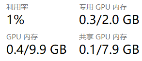
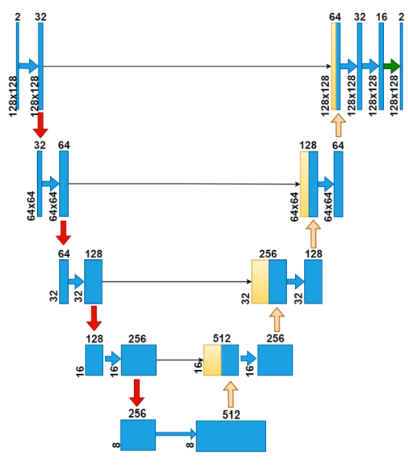
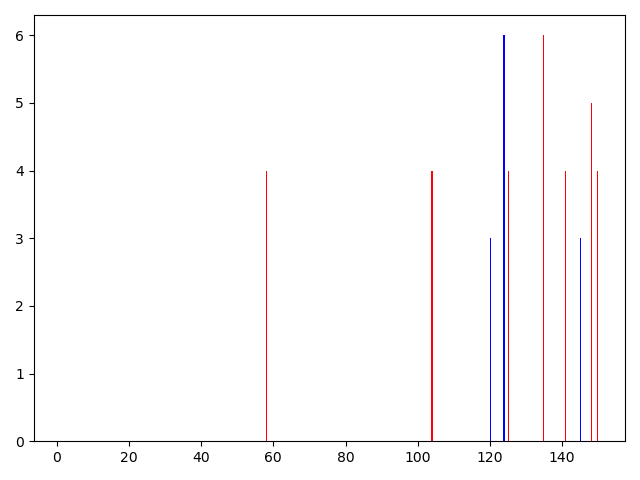
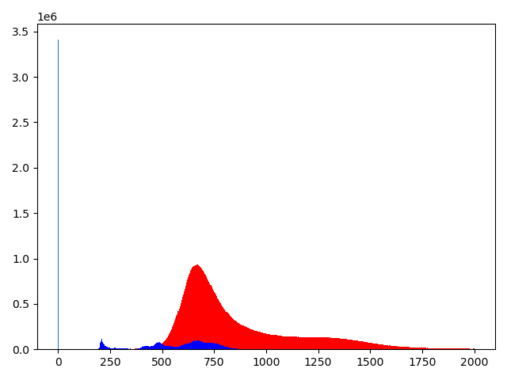
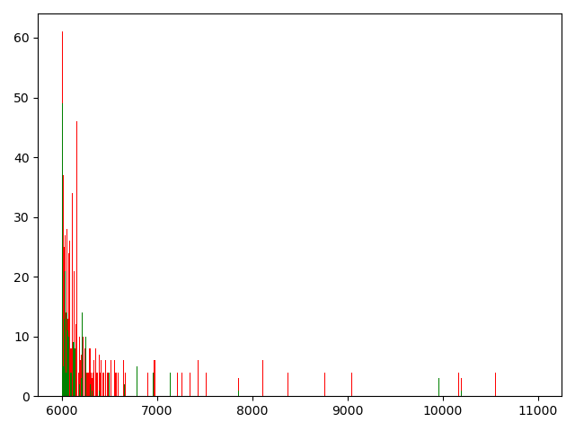
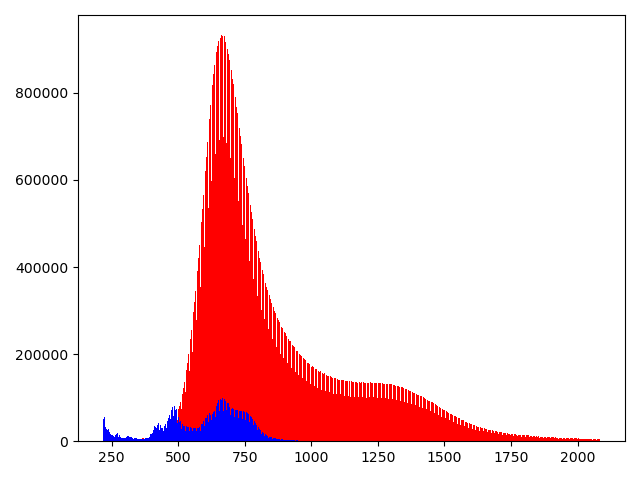
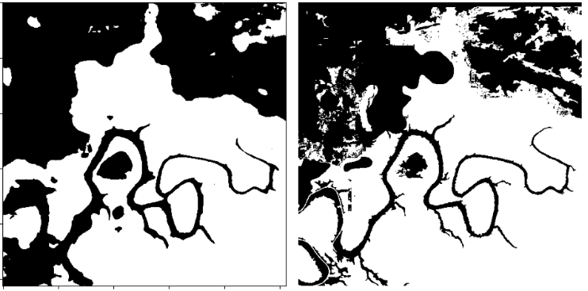
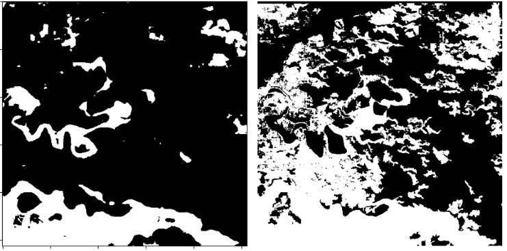
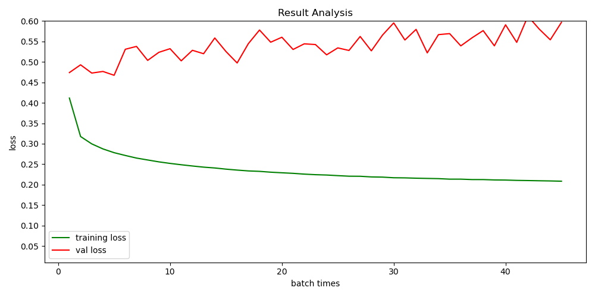

# 一、TensorRT加速模型

目前还没有学会利用TensorRT推理多batch数据，下面的推理过程均是batch=1

|                   | 普通GPU推理(时间/s)                                          | TensorRT加速(时间/s)                                         |
| ----------------- | ------------------------------------------------------------ | ------------------------------------------------------------ |
| Unet(46张sar图像) | 10.09                                                        | 6.25                                                         |
|                   |  |  |

# 二、新数据集

1. 该数据是13个波段信息的多光谱图像，标签包括：无效区域（0）、陆地（1）、水（2）、云（3）。

2. 对数据集进行过滤，去除长或宽小于512的图像。

3. 该数据的无效值是0，为避免无效值和正常值（归一化后最小值为0）混淆，将无效值设置为255。通过设置[0.5%，99.5%]进行截断处理，截断不考虑无效值。

   |  |  |  |
   | ------------------------------------------------------------ | ------------------------------------------------------------ | ------------------------------------------------------------ |

   截断后直方图（217，2085）

   

4. 计算每一个图像的水体指数，保存水体指数(13->7)。

4. 通过512x512尺寸进行分块（去除无效值区域大于0.5的，水域小于0.2的），得到1636张图像块。

6. 对每一个图像块进行归一化和标准化处理。

# 三、训练

训练时采用多分类方式，测试时将水归为一类，非水归为一类。

**结果：**

|               | F1      | accuracy | recall  | precision |
| ------------- | ------- | -------- | ------- | --------- |
| 验证集（161） | 80.795% | 85.037%  | 77.594% | 84.271%   |
| 测试集（127） | 78.060% | 72.999%  | 72.620% | 84.380%   |

