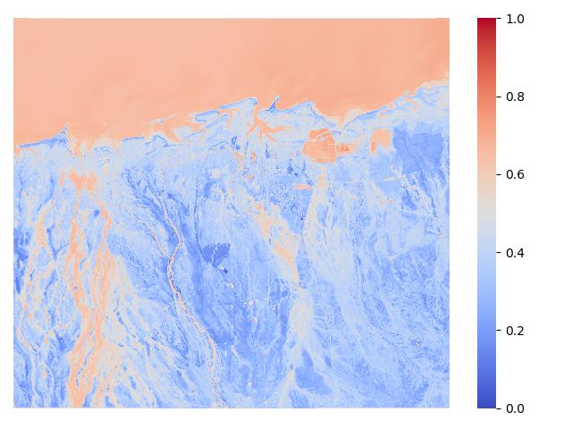

## 一、验证计算水体指数之前是否需要归一化

1. 案例图的四种类别占比

   | 无效值 | 0.049% |
   | ------ | ------ |
   | 陆地   | 66.94% |
   | 水域   | 32.31% |
   | 云层   | 0.687% |

   

2. 原图2,3,4,8,9,12,13波段的直方图（这几个波段是所有参与水体指数计算的）

   类别区域图：红色代表陆地、绿色代表水域、蓝色代表云层、黑色代表无效值

   

   | 波段 | 原图                                                         | 直方图                                                       | 陆地直方图                                                   | 水域直方图                                                   |
   | ---- | ------------------------------------------------------------ | ------------------------------------------------------------ | ------------------------------------------------------------ | ------------------------------------------------------------ |
   | 2    |  |  |  |  |
   | 3    |  |  |  |  |
   | 4    |  |  |  |  |
   | 8    |  |  |  |  |
   | 9    |  |  |  |  |
   | 12   |  |  |  |  |
   | 13   |  |  |  |  |

3. 水体指数前经过归一化和原始数据上直接计算水体指数

   | 直接计算水体指数再归一化                                     | 归一化后计算水体指数                                         | 归一化后计算水体指数再归一化                                 |
   | ------------------------------------------------------------ | ------------------------------------------------------------ | ------------------------------------------------------------ |
   |  |  |  |
   |  |  |  |
   |  |  |  |
   |  |  |  |
   |  |  |  |
   |  |  |  |
   |  |  |  |

4. 水体指数归一化后的直方图

   | 总体                                                         | 陆地                                                         | 水域                                                         |
   | ------------------------------------------------------------ | ------------------------------------------------------------ | ------------------------------------------------------------ |
   |  |  |  |
   |  |  |  |
   |  |  |  |
   |  |  |  |
   |  |  |  |
   |  |  |  |
   |  |  |  |

- 通过上面的对比可以看出，不截断处理的情况下，计算水体指数之前是否进行归一化处理，不会对输入模型的数据产生很大影响。

- 一个想法：从上面的直方图可以看出，两种不同的地物有重叠部分。同一个特征值可能是水域，也可能是陆地。因此只根据特征值的大小进行分类，本质就是阈值法。根据水体指数生成一个新的数据，该数据描述的是（i，j）位置周围k内像素的直方图信息（可以包括最大值、最小值、众数等）。这个包含局部直方图分布信息的数据，也进行输入到模型中进行训练。

- 全局归一化（参考自然图像直接使用0和255作为最小值和最大值）
- 步骤：原始数据->计算水体指数->全局归一化(通道级)->全局标准化

## 二、实验

1. 利用旧数据进行验证：水体指数之前不进行归一化、**水体指数归一化是采用全局最大值和最小值**。

   使用之前的443张数据进行实验，结果提升明显：F1=94.149%->99.976%

2. 将UNet网络中的下采样替换成步长为2的卷积操作。

