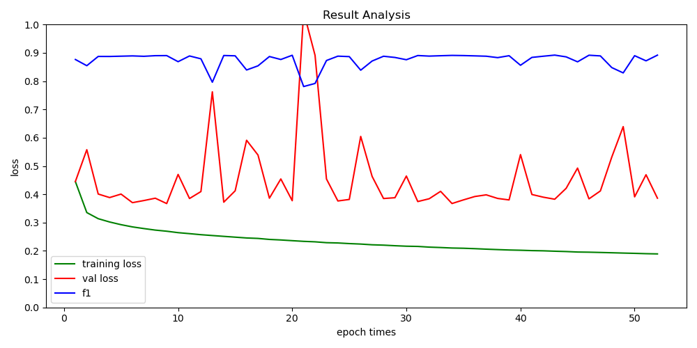
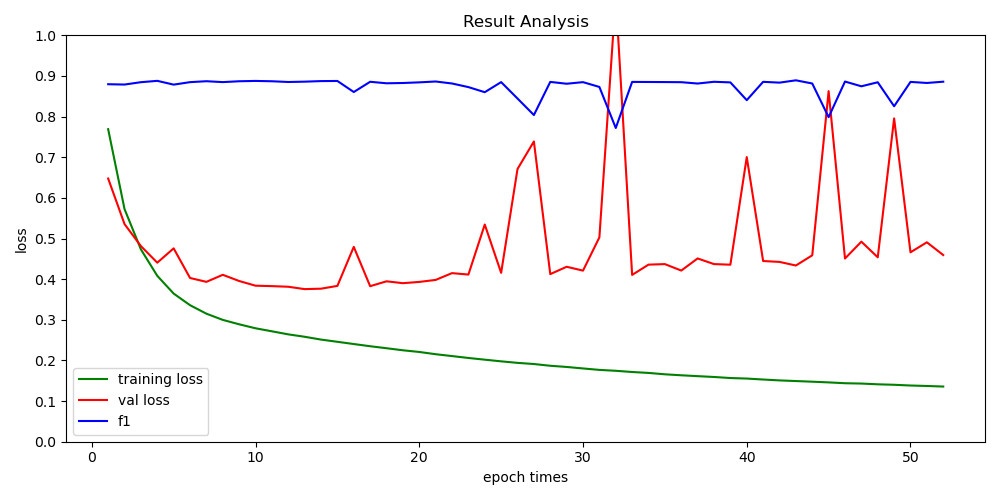

# 一、WorldFloods数据集

1. 该数据共有444张，图像尺寸不统一，是13个波段信息的多光谱图像，标签包括：无效区域（0）、陆地（1）、水（2）、云（3）。
2. 对数据集进行过滤，去除长或宽小于512的图像。
3. 将图像分割为512x512的图像块。
4. 按照通道计算所有图像相同通道整体的最小值、最大值、均值和方差。

# 二、训练与评估

现在的方法修改了之前的数据预处理步骤。

训练时把任务作为四分类；计算指标时利用下面代码只考虑水域这一个分类，其他分类作为背景（分类对错不计）。这种情况存在的问题时，训练时的loss降低，是四个类别的总loss降低，但水域这一个类的loss不一定降低。如果只针对水域，可以修改label将无效区域（0）、陆地（1）、云（3）全部改为0，水（2）改为1。整个任务改为二分类问题。

```python
label[label != 2] = 0
label[label == 2]=1
pic=all_output[:,2,:,:]
pic[pic >= 0.5] = 1
pic[pic < 0.5] = 0
```

**之前步骤：原始数据->图像级归一化->全局标准化->计算水体指数->图像级归一化->全局标准化**

结果：

|               | F1      | accuracy | recall  | precision |
| ------------- | ------- | -------- | ------- | --------- |
| 验证集（161） | 80.795% | 85.037%  | 77.594% | 84.271%   |
| 测试集（127） | 78.060% | 72.999%  | 72.620% | 84.380%   |

**现在步骤：原始数据->计算水体指数->全局归一化(通道级)->全局标准化**

```python
minvs = [0.0, 0.0, 0.0, 0.0, 0.0, -30329.5, -193222.28]
maxvs = [203.16823, 2519.6924, 80.35951, 21845.0, 21832.0, 27100.25, 90159.72]
```

结果：

|               | F1      | accuracy | recall  | precision |
| ------------- | ------- | -------- | ------- | --------- |
| 验证集（180） | 88.351% | 89.648%  | 89.073% | 87.641%   |
| 测试集（180） | 81.041% | 86.923%  | 81.060% | 81.021%   |

# 三、一些修改

**将UNet网络中的下采样替换成步长为2的卷积操作**

'80.614%', '86.736%', '79.988%', '81.251%'

|               | F1      | accuracy | recall  | precision |
| ------------- | ------- | -------- | ------- | --------- |
| 验证集（180） | 87.950% | 89.354%  | 88.146% | 87.755%   |
| 测试集（180） | 80.614% | 86.736%  | 79.988% | 81.251%   |

**增大batch_size(32->64)，减小学习率（$1e^{-4}->1e^{-5}$）**

在经过前面一系列修改后，新数据上的Loss、F1曲线如下：



增大batchsize和减小learningrate



任务：重新分配训练集、测试集和验证集，先将数据按照7:3分为训练集和测试集，之后再将训练集按照8:2分为训练集和验证集。

在旧数据集上做测试，看看不同数据集下模型的泛化能力。
