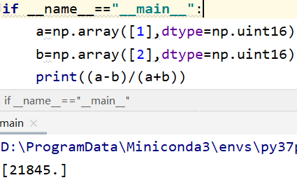
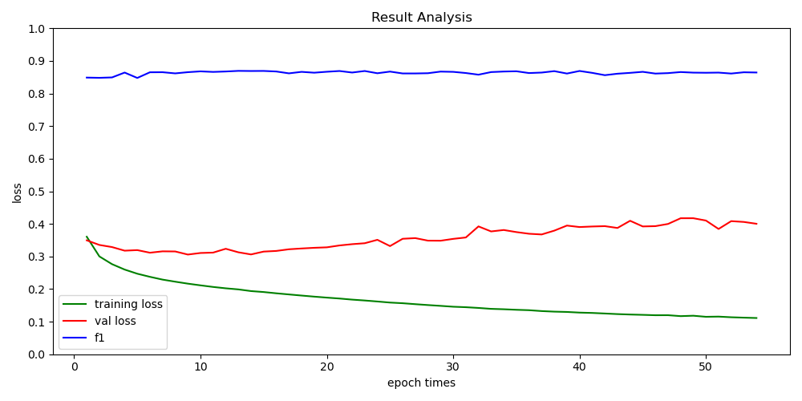

**修改数据集比例后的结果**

995：256：540

|               | F1      | accuracy | recall  | precision |
| ------------- | ------- | -------- | ------- | --------- |
| 验证集（180） | 88.593% | 90.016%  | 89.050% | 88.141%   |
| 测试集（180） | 86.585% | 88.058%  | 89.008% | 84.290%   |

| 旧数据集                             |   F1    |
| :----------------------------------- | :-----: |
| 使用自己的最大值和最小值、均值和方差 | 16.089% |

发现WorldFloods数据在计算水体指数时存在问题

对于 `(a-b)/(a+b)`，当a和b都大于0时，结果在[0,1]之间，但是实际计算的结果存在大于1的数值。

经过调试发现该错误与数据类型有关：

最后在计算之前将数据转为float32类型，就不存在这种问题了。

**修改数据集比例后的结果**

|               | F1      | accuracy | recall  | precision |
| ------------- | ------- | -------- | ------- | --------- |
| 验证集（256） | 85.732% | 88.666%  | 85.407% | 86.060%   |
| 测试集（540） | 88.404% | 89.411%  | 87.255% | 89.585%   |

| 旧数据集                                       |   F1    |
| :--------------------------------------------- | :-----: |
| 使用自己的最大值和最小值、均值和方差           | 45.985% |
| 使用自己的最大值和最小值，新数据集的均值和方差 | 19.144% |
| 使用新数据集的最大值和最小值、均值和方差       | 69.225% |
| 使用新数据集的最大值和最小值，自己的均值和方差 | 19.887% |

将旧数据按照4：1：5分为训练集、验证集和测试集，在训练好的模型上进行再次训练。train:test=1:9

|                     | F1      | accuracy | recall  | precision |
| ------------------- | ------- | -------- | ------- | --------- |
| 新数据测试集（540） | 81.681% | 86.184%  | 77.257% | 86.643%   |
| 旧数据测试集（192） | 87.081% | 97.936%  | 85.347% | 88.887%   |

将旧数据和新数据混合训练（train比例995:152，val比例256:40 ）

|                     | F1      | accuracy | recall  | precision |
| ------------------- | ------- | -------- | ------- | --------- |
| 新数据测试集（540） | 88.516% | 89.555%  | 87.006% | 90.078%   |
| 旧数据测试集（192） | 77.962% | 95.699%  | 70.828% | 86.694%   |
