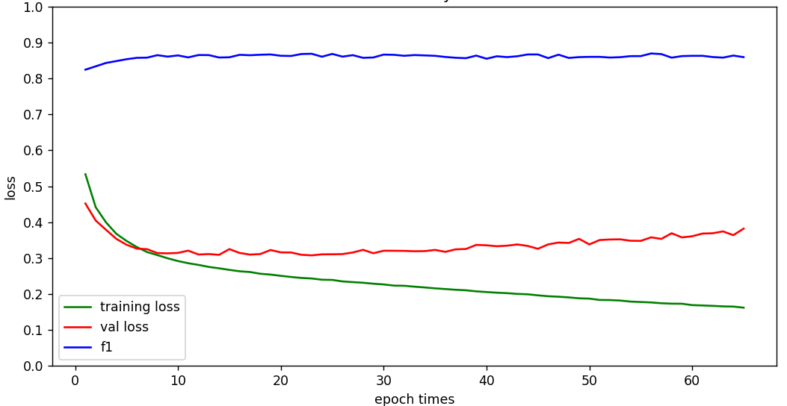
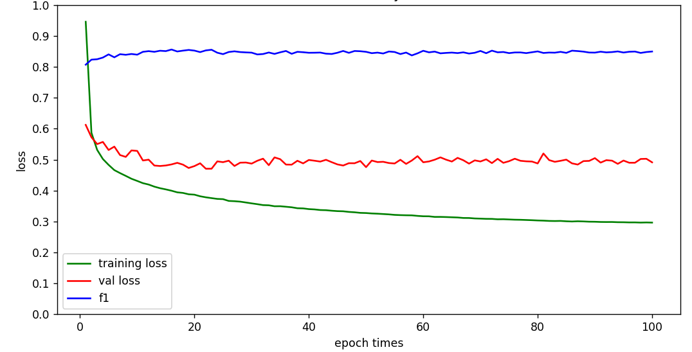

**本周跑的模型，在随机采样时去掉了，对像素占比的限制，可以发现模型的泛化性得到提升。**

**去掉过滤限制，不在限制patch中每个类的占比**

# UNet方法

|                          | F1      | accuracy | recall  | precision |
| ------------------------ | ------- | -------- | ------- | --------- |
| WorldFloods测试集（540） | 89.027% | 88.028%  | 88.028% | 90.049%   |
| S2测试集（192）          | 76.145% | 95.310%  | 69.693% | 83.914%   |

|                          | F1      | accuracy | recall  | precision |
| ------------------------ | ------- | -------- | ------- | --------- |
| WorldFloods测试集（540） | 88.967% | 89.910%  | 87.935% | 90.024%   |
| S2测试集（192）          | 77.967% | 95.552%  | 73.275% | 83.301%   |

# UNet+原型方法

**每个类的原型数量：10**

|                          | F1      | accuracy | recall  | precision |
| ------------------------ | ------- | -------- | ------- | --------- |
| WorldFloods测试集（540） | 89.676% | 90.393%  | 90.188% | 89.170%   |
| S2测试集（192）          | 77.889% | 95.467%  | 74.331% | 81.804%   |

|                          | F1      | accuracy | recall  | precision |
| ------------------------ | ------- | -------- | ------- | --------- |
| WorldFloods测试集（540） | 89.434% | 90.295%  | 88.787% | 90.092%   |
| S2测试集（192）          | 78.372% | 95.661%  | 73.194% | 84.339%   |

**每个类的原型数量：15**

|                          | F1      | accuracy | recall  | precision |
| ------------------------ | ------- | -------- | ------- | --------- |
| WorldFloods测试集（540） | 89.988% | 90.749%  | 89.863% | 90.113%   |
| S2测试集（192）          | 81.477% | 96.146%  | 78.913% | 84.213%   |

|                          | F1      | accuracy | recall  | precision |
| ------------------------ | ------- | -------- | ------- | --------- |
| WorldFloods测试集（540） | 89.855% | 90.616%  | 89.830% | 89.880%   |
| S2测试集（192）          | 79.732% | 95.917%  | 74.779% | 85.389%   |

**每个类的原型数量：20**

|                          | F1      | accuracy | recall  | precision |
| ------------------------ | ------- | -------- | ------- | --------- |
| WorldFloods测试集（540） | 89.253% | 89.976%  | 89.971% | 88.546%   |
| S2测试集（192）          | 79.410% | 95.847%  | 74.568% | 84.923%   |

训练指标曲线

# DeepLabV3

|                          | F1      | accuracy | recall  | precision |
| ------------------------ | ------- | -------- | ------- | --------- |
| WorldFloods测试集（540） | 87.977% | 89.092%  | 86.261% | 89.762%   |
| S2测试集（192）          | 69.537% | 94.265%  | 60.945% | 80.950%   |

