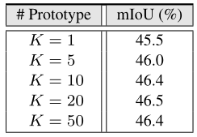
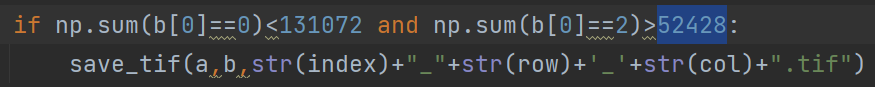
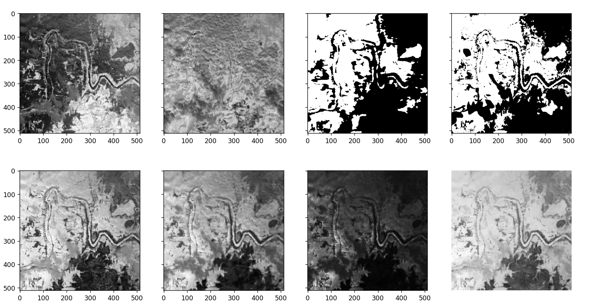
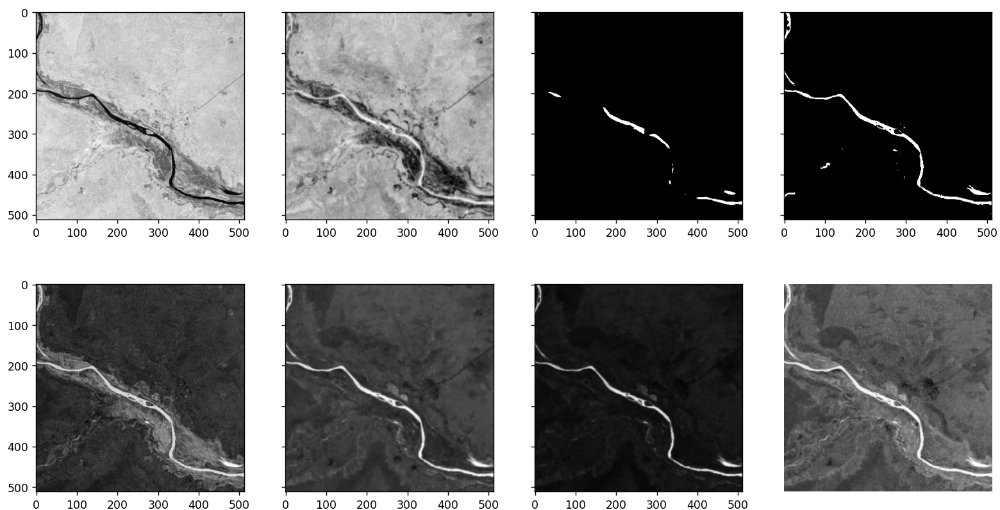
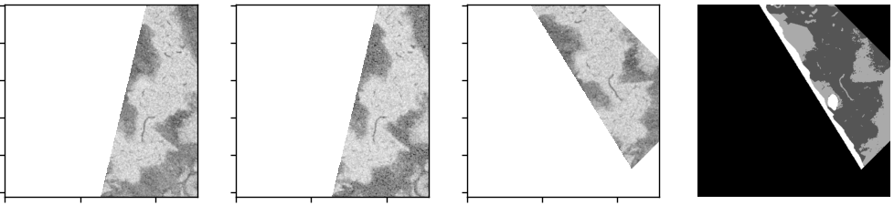

# 一、原型数量自适应

## 1. 理论上不太重要

1. 首先，原型的数量越多，理论上性能越好。原型数量多，带来的结果时，类内部分的更细，增加矩阵计算时间。论文中给出结果如下：K=50时，mIOU略微下降，不能说明K增大后导致的。

   

2. 每一轮训练后，原型会更新，如果当前原型不合适，模型自动就修改了。

将K设置为50

|                          | F1      | accuracy | recall  | precision |
| ------------------------ | ------- | -------- | ------- | --------- |
| WorldFloods测试集（540） | 89.974% | 90.651%  | 90.675% | 89.283%   |
| S2测试集（192）          | 79.315% | 95.891%  | 73.347% | 86.342%   |

## 2. 实现复杂

1. 原型的数量类似于网络层数，需要提前设定好，如果每一个类的原型数量不统一，则无法利用矩阵运算。
2. 对于问题1，也可以解决。我们需要设定原型最大数量，这样一开始时，每一个类的原型都是最大数量，我们通过一个mask控制原型是否激活。
3. 对于2中的实现方式，仍然有问题。我们应该**通过什么**，**判断哪一个原型**应该关闭。还有就是，这个原型一定要关闭吗，原始网络本身会更新原型的，是否能够保证更新后的原型不好呢。如果我们直接把它关闭了，后面是否还要开启，又通过什么判断它是否开启。开启后它的值是什么，是关闭时候的值，还是我们重新赋值，那这样的值，还有必要开启吗？

# 二、WorldFloods与S2的数据分布

## 2.1 Sentinel2

| 水体像素占比                | >=20%   | >=10% and <20% | >=5% and <10% | >=2% and <5% | <2%     |
| --------------------------- | ------- | -------------- | ------------- | ------------ | ------- |
| 图像数量（张）              | 29      | 25             | 25            | 35           | 78      |
| 在WorldFloods模型上的F1得分 | 80.215% | 62.555%        | 49.374%       | 25.729%      | 21.040% |

## 2.2 WorldFloods

该数据在分块时，选择水体像素占比大于20%且nan像素占比小于50%的图像块进行保存。

# 三、细节识别不好

# 四、训练S2数据

## 4.1 单分支

|                          | F1      | accuracy | recall  | precision |
| ------------------------ | ------- | -------- | ------- | --------- |
| WorldFloods测试集（540） | 81.069% | 83.926%  | 74.393% | 89.061%   |
| S2测试集（192）          | 89.981% | 97.873%  | 88.923% | 91.065%   |

## 4.2 多分支

|                          | F1      | accuracy | recall  | precision |
| ------------------------ | ------- | -------- | ------- | --------- |
| WorldFloods测试集（540） | 80.740% | 83.680%  | 73.944% | 88.912%   |
| S2测试集（192）          | 88.140% | 97.528%  | 85.516% | 90.930%   |

## 4.3 不加原型，单分支

|                          | F1      | accuracy | recall  | precision |
| ------------------------ | ------- | -------- | ------- | --------- |
| WorldFloods测试集（540） | 81.397% | 84.107%  | 75.155% | 88.770%   |
| S2测试集（192）          | 89.676% | 97.796%  | 89.137% | 90.221%   |

## 4.4 原型个数50

|                          | F1      | accuracy | recall  | precision |
| ------------------------ | ------- | -------- | ------- | --------- |
| WorldFloods测试集（540） | 81.657% | 84.176%  | 76.132% | 88.046%   |
| S2测试集（192）          | 88.508% | 97.501%  | 89.601% | 87.441%   |

## 4.5 原型个数30，c0与c9结合

| best_f1                  | F1      | accuracy | recall  | precision |
| ------------------------ | ------- | -------- | ------- | --------- |
| WorldFloods测试集（540） | 81.223% | 83.974%  | 74.919% | 88.685%   |
| S2测试集（192）          | 90.662% | 97.999%  | 90.456% | 90.869%   |

| best_loss                | F1      | accuracy | recall  | precision |
| ------------------------ | ------- | -------- | ------- | --------- |
| WorldFloods测试集（540） | 81.589% | 84.247%  | 75.452% | 88.813%   |
| S2测试集（192）          | 90.417% | 97.982%  | 88.623% | 92.284%   |

# 六、目前S2数据训练的模型存在的问题

弯曲河流识别不好

# 七、增加旋转增强

下面的数据重新划分了数据集，将每一个地区，按照4.5：1.5：4划分为训练集、验证集和测试集。(原来是将数据整体按照比例划分，没有考虑每个地区的均衡性)

原型个数30，c0与c9结合

| best_f1_r                | F1      | accuracy | recall  | precision |
| ------------------------ | ------- | -------- | ------- | --------- |
| WorldFloods测试集（540） | 81.296% | 84.024%  | 75.046% | 88.681%   |
| S2测试集（188）          | 91.187% | 98.601%  | 89.962% | 92.445%   |

| best_f1_r_no             | F1      | accuracy | recall  | precision |
| ------------------------ | ------- | -------- | ------- | --------- |
| WorldFloods测试集（540） | 81.478% | 84.193%  | 75.152% | 88.968%   |
| S2测试集（188）          | 91.256% | 98.618%  | 89.627% | 92.945%   |

