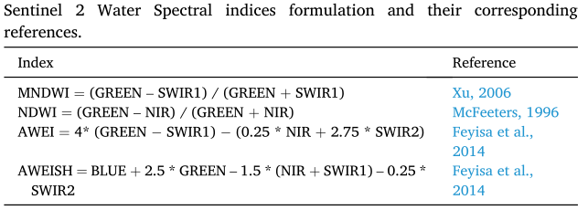
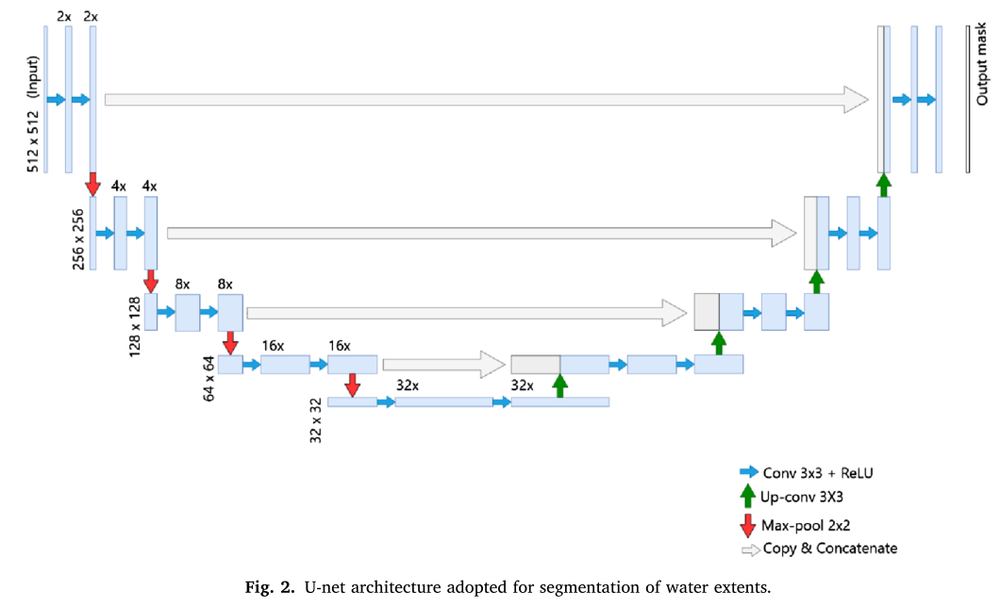

题目：Exploring Sentinel-1 and Sentinel-2 diversity for flood inundation mapping using deep learning

# Abstract

从卫星图像中识别洪水范围历来依赖于**合成孔径雷达（SAR）或多光谱（MS）图像**。MS传感器仅限于无云条件，而SAR图像则受到斑点等噪声的困扰。先前的研究使用MS和SAR数据的组合来克服这些传感器的个别局限性，但尚未充分检查SAR和MS衍生光谱指数的不同组合或颜色空间中的波段变换对洪水测绘性能的敏感度的影响。 本研究通过建立完善的水指数和哨兵1（S1）衍生SAR图像及其组合，探索哨兵2（S2）不同波段的使用，以评估其生成准确洪水淹没图的能力。S-1和S-2波段组合性能的稳健性通过使用446幅手标洪水淹没图像进行评估，这些图像跨越了Sen1Floods11数据集的11次洪水事件，这些数据集在土地覆盖和位置方面具有高度多样性。一种改进的K-折叠交叉验证方法用于评估32个S1和S2波段组合的性能，使用一种称为U-Net的全连接深度卷积神经网络。我们的结果表明，高程信息的使用提高了S1图像生成更准确洪水淹没图的能力。**与仅使用S1波段时F1中位数为0.62相比，S1和海拔信息的联合使用使F1中位数提高到了0.73。与S1相比，基于S2波段的水提取指数具有统计显著的优越性能。在所有波段组合中，S2波段的HSV（色调、饱和度、值）变换提供的F1中位数分数为0.9，由于HSV变换具有优越的对比度分辨能力，因此优于常用的水光谱指数。此外，U-Net算法能够学习基于原始S2的水提取指数与其对应的原始S2波段之间的关系，但由于后者涉及相对复杂的计算，因此无法了解HSV。**论文结果为在大空间范围内扩展基于S1和S2数据的洪水淹没制图工作建立了重要基准。

# 一、Introduction

​		尽管NDWI与SAR结合使用在洪水测绘中取得了一定程度的成功，但融合方法尚未系统地研究洪水测绘性能指标对S1和S2衍生光谱指数或颜色空间波段变换的不同组合的敏感性。

​		尽管S1和S2图像组合已用于绘制洪水淹没图，但仍然需要对S1和S2的最佳组合进行系统研究。此外，在近实时环境下生成洪水淹没图时，有关最佳组合的先验知识将节省时间和计算资源。

​		最近，由于深度学习算法的发展，尤其是卷积神经网络的引入，计算机视觉任务（如分类和分割）取得了重大进展。与基于像素的学习方法不同，CNN还可以利用目标段的空间结构（如洪水淹没遮罩）。同样，CNN已成功应用于各种洪水绘图研究中。**鉴于CNN在一系列领域的相对成功，我们认为，系统研究CNN在混合S1和S2不同波段方面的应用可能有助于我们确定改进洪水淹没图的最佳组合。**提出了基于深度学习技术的光学和雷达卫星图像组合，以解决土地覆盖变化问题（Ienco等人，2019年）。然而，在洪水淹没测绘任务中，尚未充分利用同样的机会。

​		**因此，在本研究中，我们采用了一种称为U-Net的特殊类型的CNN（Ronneberger等人，2015年），成功地完成了二元分割任务，利用覆盖全球11次洪水事件的手标洪水淹没数据，从S1和S2波段学习洪水淹没图。**通过在跨多个土地覆盖区域的数据集上对S1和S2的不同组合进行U-Net训练，我们开发了一种比以前的研究更稳健的分类方法，之前的研究训练的数据较少，分类算法更简单。

通过本研究，我们旨在解决以下问题：

- 通过深度学习方法绘制洪水淹没图时，S1和S2波段的最佳组合是什么？
- S1和S2的组合是否比S1和S2的单独性能更好？

# 二、Data

在这项研究中，我们使用了最近引入的地理参考洪水标签数据。Sen1Floods11（Bonafilia et  al.，2020），提供跨越全球11次洪水事件的洪水淹没标签。**在我们的研究中，我们使用了所有446幅手工标注的图像来评估我们的深度学习模型。**由于Sentinel 2具有不同分辨率的波段，因此所有波段都以10 m的分辨率进行线性重采样，以便进行常规比较

# 三、Preprocessing of S2 data

​		由于S1  SAR只有两个具有VV和VH极化的可用波段，我们直接在机器学习设置中使用它们，而无需进行任何进一步的组合/索引。但是，S2中的12个频带允许指定多个频带组合。

​		我们评估基于一组S2波段的光谱指数，这些光谱指数可以检测指定波长范围内的水体特征。

​		**除了光谱指数外，S2短波红外辐射（SWIR2）、近红外辐射（NIR）、红色波段可以转换为HSV（色调、饱和度和值）颜色空间。通过定义H、S和V分量之间的关系，可以有效地描述水体。随后，根据HSV值对卫星数据进行手动分类，绘制全球水资源图。**将SWIR2、NIR、red值分别指定给红色、绿色和蓝色（RGB），并使用标准化色度变换将其转换为HSV颜色空间。公式如下：
$$
V=max(R,G,B)\\
S=V-min(R,G,B)\\
H=\begin{cases}
0& \text if\ V=min(R,G,B)\\
(60^o\times \frac{G-B}{V-min(R,G,B)}+360^o)mod\  360^o& \text if\ V=G\\
60^o\times \frac{B-R}{V-min(R,G,B)}+120^o \text if\ V=G\\
60^o\times \frac{R-G}{V-min(R,G,B)}+120^o \text if\ V=B
\end{cases}
$$

> 色调（H）以度表示，范围为0◦–360◦, 表示颜色的光谱组成；
>
> 值（V）可定义为颜色的亮度；
>
> 饱和度量化颜色与亮度相等的灰色之间的距离。

# 四、Experimental setup

在本研究中，我们采用改进的k-折叠交叉验证方法来训练和测试我们的实验装置。这种改进的k-fold方法实现如下：

pass

# 五、U-Net Architecture

​		U-Net最初设计用于分割生物医学图像的任务（Ronneberger等人，2015年），目标是用于训练集相对较少的应用，并使用与输入图像相同的分辨率进行分割。U-Net体系结构由两部分组成（即编码器和解码器）。**通过下采样过程，通过U-Net模型的编码器部分提取重要特征。解码器使用这些特征作为输入，并通过上采样过程构建输入的空间信息。**U-Net体系结构的这种上采样和下采样过程可以系统地结合低级特征和高级特征，同时从多个特征中执行元素分割。U-Net还包括跳过连接，以捕获解码器每一步的精确位置，如下图所示：

**这些跳过连接将解码器层的输出与编码器在同一级别上的特征映射连接在一起，使得像素的分割更加精确。**
