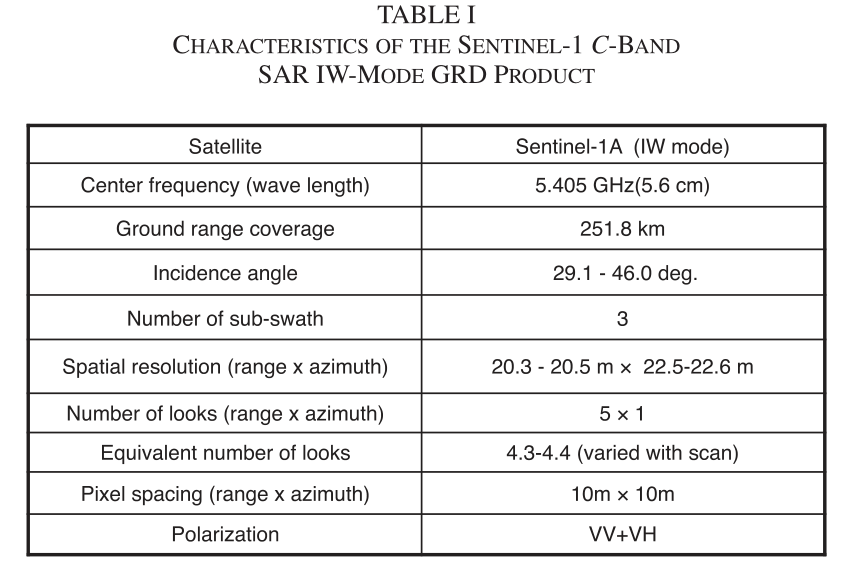
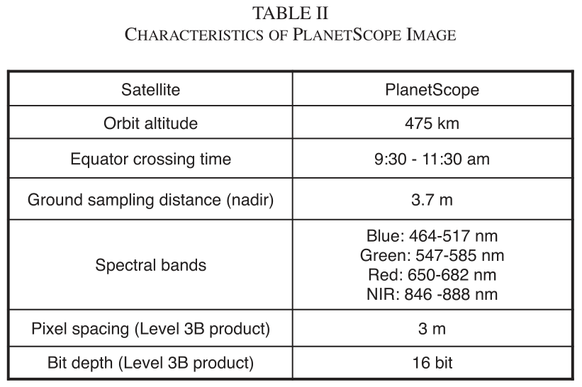
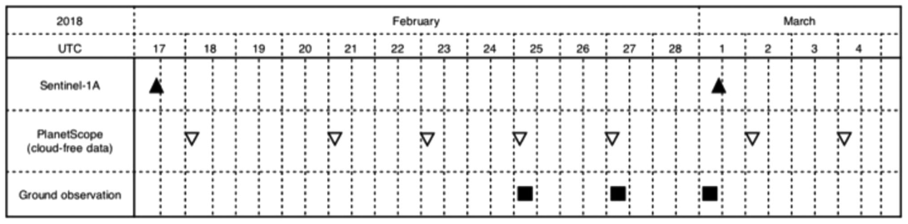

# Abstract

本研究旨在利用2018年春季Bojongsoang 的Tegallar地区发生的相对广泛的洪水的遥感数据检测印度尼西亚的水灾稻田，该洪水由Sentinel-1和PlanetScope卫星观测。**我们提出了一种利用Sentinel-1  C波段合成孔径雷达（SAR）在水灾前和水灾期间采集的数据进行水灾面积自动阈值检测的方法。**洪水探测精度通过PlanetScope卫星采集的可见光和近红外图像进行验证。该方法表明，在相关比和判别精度方面，VV（发送V和接收V极化）数据优于VH（发送V和接收H极化）数据。非洪水区和洪水区的总体分类精度达到VV数据为84.7%，VH数据为80.6%，包括由Sentinel-1和PlanetScope采集的数据中的时差引起的误差。对SAR数据使用斑点抑制滤波器可以将总体分类精度提高5%。

# 一、Introduction

​		在SAR图像中，由于镜面反射，完全淹没的稻田被视为低后向散射区域。**该方法使用阈值将区域划分为洪水区和非洪水区，低后向散射表示洪水，高后向散射表示非洪水植被区或非建筑物区。探测淹没区的另一种方法是使用干涉SAR分析中计算的干涉相干性。**干涉相干性可以在两个数据采集周期内感知后向散射机制的变化，淹没区在非建成区和建成区的相干性都较低。**从灰度共生矩阵（GLCM）导出的纹理信息也可用于检测洪水区域。**GLCM中的每个元素表示两个不同灰度级的相对出现，使用固定距离分隔的像素，从GLCM元素计算的统计数据提供定量纹理信息。结合使用后向散射和纹理信息可以提高洪水检测的准确性。

​		本研究调查了印度尼西亚一个试验场的Sentinel-1  SAR数据，以检测2018年雨季期间被洪水淹没的地区。利用PlanetScope卫星图像，通过比较基于SAR和基于光学传感器的方法获得的分类结果，验证了提取淹没区的结果。

# 二、Test site

# 三、Remote sensing data

## 3.1.Sentinel-1 SAR Data

​		Sentinel-1 C波段SAR数据用于检测水淹稻田，因为在几乎所有天气条件下都可以获得相对高分辨率的数据。2月17日和3月1日，在研究区域获得了干涉宽（IW）条带模式下具有上升轨道的SAR数据。IW模式采用渐进式扫描SAR技术进行地形观测，以获取250  km范围内的数据，空间分辨率约为20  m。地面距离探测（GRD）数据用于我们的分析。下图总结了Sentinel-1上IW模式GRD产品的特征。被盖区中心的入射角约为43°。本研究使用了VV（发射V和接收V极化）和VH（发射V和接收H极化）极化数据。

## 3.2 PlanetScope Image

​		PlanetScope卫星图像用于评估Sentinel-1 SAR数据洪水探测的准确性。因为PlanetScope卫星星座由130多个活动卫星组成，装载的传感器有四个可见光和近红外波段，像素间距为3米。我们使用3B级产品或“PlanetScope正交场景产品”进行分析。这些产品是经过处理、正射校正和缩放的大气顶部辐射图像产品，适用于分析和视觉应用。

​		**获得了2018年洪水事件发生期间的七幅无云图像。**下图是Sentinel-1A和PlanetScope卫星获取的数据的时间线。

# 四、Data processing and flood detection

## 4.1 flood area detection methods with SAR Data

​		由于洪水前和洪水期间的Sentinel-1 SAR数据都可用，因此可以使用后向散射和干涉测量法来检测淹没的稻田引起的散射变化。首先，比较了测试点的后向散射图像和相干图像。后向散射的变化很容易识别，但相干性的差异不容易观察到。因此，本研究选择了后向散射法。

​		已经提出了许多方法来优化后向散射阈值，例如应用于TerraSAR-X数据的基于分割的自动阈值程序、应用于CosmoSkyMed X 波段SAR数据的图像分割和表面散射模型的组合，以及使PALSAR-2数据的kappa系数最大化的阈值。这些方法的共同思想是通过考虑地表和入射角来优化阈值。这是因为后向散射通常与这些参数有关。

​		由于本研究旨在利用遥感数据对农业保险进行损害评估，因此需要一种简单且计算成本较低的实施方法。因此，我们研究了最佳阈值的自动确定。**在确定阈值时，使用伽马零（gamma-0：$\gamma^0$）代替后向散射系数（σ0），以降低对入射角的敏感性。**对于平坦地区，例如我们的试验场地和稻田，$\gamma^0$和σ0之间的关系由一个简单的方程给出
$$
\gamma^0 = \frac{σ0}{cos\theta}
$$
其中θ是地球的椭球入射角。然后，可以很容易地将导出的阈值转换为σ0阈值。

​		基于Kittler和Illingworth（KI）和Otsu的方法中描述的统计方法的自动阈值确定，先前已应用于洪水探测的CANDX波段SAR数据。本研究中使用了大津的方法，因为它具有双峰分布的快速性和鲁棒性。

## 4.2 Proposed Method for Change Detection and Automatic Thresholding With SAR Data
​		每个SAR数据集均经辐射校准至γ0，并投影到UTM坐标（区域S48）。考虑到试验现场稻田的大小，UTM坐标上的像素间距设置为10 m。

​		由于水淹稻田的$\gamma^0$通常低于非水淹稻田，**因此我们的变化检测方法利用了描述非水淹稻田和水淹稻田的两个等级的$\gamma^0$值差异**。检测$\gamma^0$值差值大于预定阈值的位置（预设差异：$\gamma^t$），并提取满足以下$\gamma^0$等式的位置：
$$
\gamma^0_1 -\gamma^0_2 >= \gamma^t
$$
式中，$\gamma^0_1$和$\gamma^0_2$分别表示在非洪水和洪水情况下提取的$\gamma^0$样品。

​		接下来，采用大津阈值法，通过将两个类划分为最大类间方差来确定γ0值。使用两类具有明显双峰分布的样本直方图确定两类的阈值$\gamma^t$。最后，使用$\gamma^t$阈值提取被淹没的稻田。