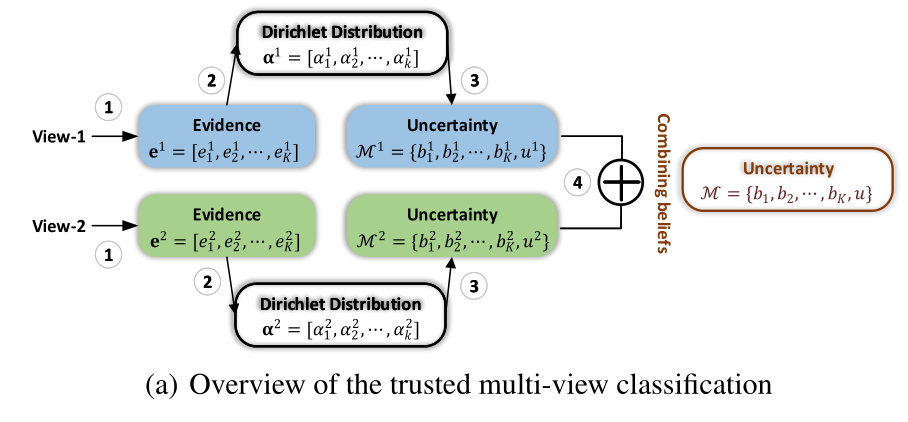

题目：TRUSTED MULTI-VIEW CLASSIFICATION

# 一、Introduction

​		真实世界中，多视图数据通常与多模态或多类型的特征相关。最先进的多视图学习方法在广泛的实际应用中取得了巨大的成功。然而，这种成功通常依赖于复杂模型，这些模型倾向于将多视图信息与深度神经网络相结合。 尽管这些模型可以提供准确的分类结果，但它们通常容易产生不可靠的预测，特别是当呈现的视图没有很好地表示时（例如信息来自异常传感器）。因此，它们在安全关键应用（例如，计算机辅助诊断或自动驾驶）中的部署受到限制。这启发我们引入一种新的多视图分类范式，以产生可信的决策。 

​		对于多视图学习，传统算法通常假定不同视图的值相等，或为每个视图分配/学习固定权重。潜在的假设是，对于所有样本，这些视图的质量或重要性基本上是稳定的。 通常，我们不仅需要知道分类结果，还应该能够回答“这个决定有多自信？”以及“为什么对决策的信心如此之高/如此之低？”。为此，模型应为每个样本的预测提供准确的不确定性，甚至为每个样本的不同视图提供不确定性。

​		基于不确定性的算法可以大致分为两大类，即贝叶斯方法和非贝叶斯方法。传统的贝叶斯方法通过推断参数的后验分布来估计不确定性 。然而，与普通的神经网络相比，由于模型参数的加倍和收敛困难，这些方法的计算成本很高。最近的算法通过在测试阶段引入dropout来估计不确定性，从而降低计算成本。已经提出了几种非贝叶斯算法，包括深度集成（Lakshminarayanan等人，2017年）、证据深度学习（Sensoy等人，2018年）和确定性不确定性估计（van  Amersfoort等人，2020年）。不幸的是，所有这些方法都侧重于估计单视图数据的不确定性，尽管通过不确定性融合多个视图可以提高性能和可靠性。 

​		在本文中，我们提出了一种新的多视图分类算法，旨在优雅地集成多视图信息以进行可信决策。我们的模型在证据级别组合不同的视图，而不是像以前那样在特征或输出级别，这产生了稳定和合理的不确定性估计，从而提高了分类可靠性和鲁棒性。 Dirichlet分布用于模拟类别概率的分布，通过不同观点的证据进行参数化，并与Dempster-Shafer理论相结合。

# 二、Related Work

## 2.1 Uncertainty-based Learning

​		深度神经网络在各种任务中取得了巨大的成功。然而，由于大多数深层模型本质上是确定性函数，因此无法获得模型的不确定性。 贝叶斯神经网络（BNNs）通过用分布代替确定性权重参数，赋予深度模型不确定性。

## 2.2 Multi-View Learning

事实证明，使用多视图学习数据在各种任务中都是有效的。 

## 2.3 Dempster-Shafer Evidence Theory(DST)

DST是一种关于信念函数的理论，最早由Dempster（Dempster，1967）提出，是贝叶斯理论对主观概率的推广。后来，它被发展成一个通用框架来模拟认知不确定性。与贝叶斯神经网络不同，DST直接对不确定性建模，贝叶斯神经网络通过对权重参数进行多次随机抽样间接获得不确定性。DST允许将来自不同来源的信念与各种融合算子相结合，以获得考虑所有可用证据的新信念。当面对来自不同来源的信念时，Dempster的组合规则试图融合它们的共享部分，并通过规范化因素忽略冲突的信念。

# 三、TRUSTEDMULTI-VIEWCLASSIFICATION

​		已经证明使用softmax输出作为预测的置信度通常会导致高置信度，即使是错误的预测也会高置信度，这是因为最大的softmax输出会作为最终的预测。因此，我们引入了一种基于证据的不确定性估计技术，该技术可以提供更准确的不确定性，并允许我们灵活地集成多个视图以进行可信决策。

## 3.1 Uncertainty and the theory of evidence

​		在这个小节中，我们详细阐述了证据深度学习来量化每一个视图的分类不确定性，同时建模每个类的概率和当前预测的总体不确定性。

​		我们需要确定与不确定度密切相关的浓度参数。我们详细阐述了主观逻辑，它定义了一个理论框架，以获得不同类别的概率(信念质量)和能够从数据中收集证据的多分类问题的总体不确定性。具体来说，**对于K分类问题，主观逻辑试图根据证据为每个类别标签分配一个信念质量，并为整个框架分配一个总体不确定性质量。**

1. 对于第v个视图，K+1个质量值都是非负数且它们之和为1。

$$
u^v+\sum _{k=1}^Kb_k^v=1
$$

> $ u^v>=0,b_k^v>=0$ 分别表示整体不确定性和第k类的概率。

2. 对于第v个视图，主观逻辑将证据$e^v=[e_1^v,…,e_K^v]$和狄利克雷分布$\alpha ^v=[\alpha_1^v,…,\alpha_K^v]$的参数联系起来。具体来说，狄利克雷分布的参数是由证据导出的：$\alpha_k^v=e_k^v+1$
   $$
   b_k^v=\frac{e_k^v}{S^v}=\frac{\alpha_k^v-1}{S^v},u^v=\frac{K}{S^v} \\
   S^v=\sum_{i=1}^K(e_i^v+1)=\sum_{i=1}^K\alpha_i^v
   $$
   

   > $S^v$是狄利克雷强度
   >
   > 上面的式子描述了一个现象，第k类的证据越多，类别k的概率就越大。相应地，观察到的全部证据越少，总的不确定性就越大。

## 3.2 Dempster rule of combination for multi-view classification

在为单视图案例引入了证据和不确定性之后，我们现在关注的是它们对多视图数据的适应性。Dempster-Shafer证据理论允许将来自不同来源的证据组合在一起，得到一个考虑了所有可用证据的信念程度(由一个叫做信念函数的数学对象表示)。具体来说，我们需要结合V个独立的概率质量分配集合${M^v}_1^V,M^v=\{\{b_k^v\}_{k=1}^K,u^v\}$，最后获得一个联合质量$M=\{\{b_k\}_{k=1}^K,u\}$

**定义3.1(两个独立质量集的Dempster组合规则)**

联合质量M由两个质量集合M1和M2计算来的：
$$
M=M1\bigoplus M2
$$
更具体的计算规则：
$$
b_k=\frac{1}{1-C}(b_k^1b_k^2+b_k^1u^2+b_k^2u^1),u=\frac{1}{1-C}u^1u^2\\
C=\sum_{i\neq j}b_i^1b_j^2
$$

> C是两个质量集中冲突量的度量（两个视图预测不同的数量），$\frac{1}{1-C}$用于标准化。

组合规则确保：

1. 当两个视图都具有高不确定性时，最终的预测一定为低信度；
2. 当两个视图都是低不确定性时，最终的预测可能时高信度；
3. 当只有一个视图的不确定性较低，最终预测仅依赖于信度视图。

**根据上述组合规则，我们可以得到估计的多视图联合证据和联合Dirichlet分布α的相应参数，从而得到每一类的最终概率和总体不确定性。**

## 3.3 LEARNING TO FORM OPINIONS

在本节中，我们将讨论如何训练神经网络来获取每个视图的证据，然后利用这些证据获得相应的质量$\{M^v\}_{v=1}^V$和M。神经网络可以从输入中捕获证据，从而归纳出分类意见，传统的基于神经网络的分类器可以很自然地转化为基于证据的分类器，变化很小。**具体来说，将传统的基于神经网络的分类器的softmax层替换为激活函数层(即RELU)，以保证网络输出的是非负值作为证据向量。据此，可以得到狄利克雷分布的参数。**
