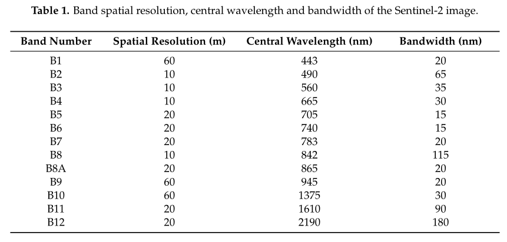
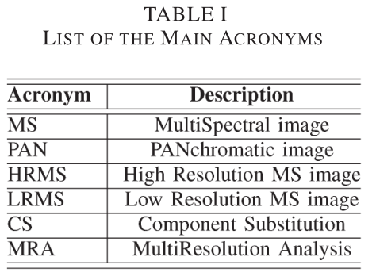
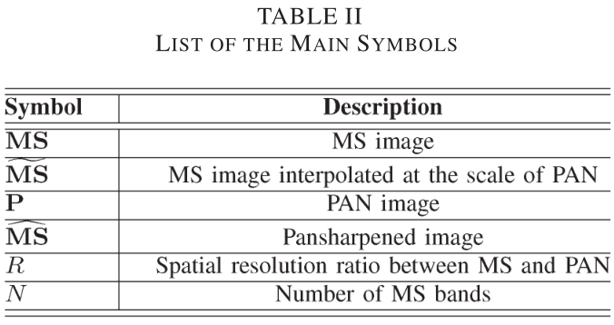

# 003

在水田中识别管理洪水最常用于遥感探测水稻。像这样的洪水过后，紧跟着的就是植被的快速生长，是鉴别水稻的可靠指标。这样的任务中经常使用光谱指标。然而，在确定哪种归一化差分光谱指数（NDSI）形式的光谱组合最适合地表水检测或哪种阈值最适合在操作环境中区分水和其他地表部分方面，几乎很少做过什么工作。为了解决这个问题，我们对来自农业实验田中的卫星和田间光谱数据以及不同土壤和植被条件下的实际耕作情况进行了分析。

- 首先，我们回顾并选择了文献中提出的NDSI，包括可见光和短波红外波段的新组合。
- 第二，我们分析光谱辐射场数据和卫星数据来评估混合像素的效果。
- 第三，我们分析了欧洲和亚洲的四个站点的MODIS数据和陆地卫星数据，以评估NDSI在现实条件下的性能。
- 最后，我们测试了在四个站点的MODIS时间序列上测试了NDSI的性能。

我们还将NDSI与以前用于农业洪水检测的综合指标进行了比较。分析表明，使用MODIS波段4和7、1和7、4和6或1和6的NDSI表现最好。在所有站点上共用DNSI阈值比使用局部自适应阈值更合适。一般来说，使用波段7的NDSI比使用波段6的NDSI的误差增加可忽略不计，但在中等空间分辨率分析的典型混合土地覆盖条件下，NDSI对水的存在更为敏感。表现最好的NDSI可与综合指数相比较，但各站点之间的性能变化较小，这表明该洪水检测方法更简洁、更稳健。

# 16

## Abstract

​		准确监测开放水体是遥感的一个重要和基本应用。为了从多光谱图像中提取水体，已经开发了各种水体映射方法。**基于光谱水指数，特别是从绿色和短波红外（SWIR）波段计算的修正归一化差分水指数（MDNWI）的方法是最流行的方法之一。**最近发射的Sentinel-2卫星可以提供精细空间分辨率的多光谱图像。这一新数据集由于其自由访问和频繁重访的能力，对区域水体制图具有潜在的重要意义。值得注意的是，Sentinel-2的绿色和SWIR波段分别具有10 m和20 m的不同空间分辨率。直接来说，通过将10米绿带相应放大到20米，可以从Sentinel-2以20米的空间分辨率生成MNDWI。然而，该方案浪费了10米分辨率下可用的详细信息。**在本文中，为了充分利用Sentinel-2图像提供的10m信息，通过基于pan锐化将20m分辨率的SWIR波段缩小到10m，从Sentinel-2图像生成一种新的10m空间分辨率MNDWI。本研究采用了四种常用的pan锐化算法，包括主成分分析（PCA）、亮度-色调饱和度（IHS）、高通滤波器（HPF）和小波变换（ATWT）。**使用位于威尼斯海岸的Sentinel-2图像对所提出方法的性能进行了实验评估。在实验中，比较了四种pan锐化算法产生的6个水指标，包括10-m NDWI、20-m  MNDWI和10-m  MNDWI。定量分析了三个层次的结果，包括锐化图像、生成的MNDWI图像和最终绘制的水体。**结果表明，MNDWI比NDWI能更有效地增强水体和抑制建筑物特征。**此外，**所有四种泛锐化算法生成的10-m  MNDWI比原始图像生成的20-m  MNDWI能够更详细地表示水体的空间信息。**因此，**10米分辨率的MNDWI可以提取比10米NDWI和20米MNDWI更精确的水体图**。此外，尽管HPF可以生成比其他三种基准pan锐化算法更精确的锐化图像和MNDWI图像，**但ATWT算法可以获得最佳的10米水体测绘结果。**在经过锐化的MNDWI图像的精度和生成的水体图的地图级精度之间没有必要的正相关性。

## 一、Introduction

​		为了从不同的遥感图像中提取水体，开发了各种方法，包括单波段密度切片、无监督和监督分类和光谱水指数。在所有现有的水体制图方法中，基于光谱水指数的方法是一种可靠的方法，因为它用户友好、高效且计算成本低。在过去几十年中，已经提出了不同的水指标。具体而言，McFeeters（1996）提出了归一化差分水指数（NDWI），利用遥感图像的绿色和近红外（NIR）波段，基于水体在可见光到红外波长范围内具有强吸收能力和低辐射的现象。在大多数情况下，NDWI可以有效地增强水信息，但它对已建土地非常敏感，常常导致水体估计过高。**为了克服NDWI的缺点，Xu（2006）开发了改进的归一化差异水指数（MNDWI），该指数使用短波红外（SWIR）波段来取代NDWI中使用的近红外波段。**许多以前的研究工作已经证明，MNDWI更适合增强水信息，可以比NDWI更准确地提取水体。

​		在过去的几十年中，MNDWI被广泛应用于绘制不同比例尺的水体图。在实践中，用于计算MNDWI的SWIR和绿色波段的光谱信息以及这两个波段的空间分辨率直接影响绘制水体的精度。例如，中分辨率成像光谱仪（MODIS）图像已广泛用于绘制全球和区域尺度的水体图。与MODIS相比，Landsat TM、ETM+和OLI图像具有更高的空间分辨率（30米），可以提取具有更明确和准确边界的开放水体。然而，陆地卫星系列图像的空间分辨率仍然不足以识别较小的开放水体，如城市地区的狭窄排水沟和小水池。通过探索SPOT6/7、IKONOS和Quick  bird等遥感图像，可以绘制这些小型水体的地图。然而，这些精细的空间分辨率图像没有SWIR波段，因此无法使用MNDWI方法。

​		值得注意的是，欧洲航天局（ESA）于2015年6月23日发射了一颗新的光学精细空间分辨率卫星，即Sentinel-2。Sentinel-2可以提供系统的全球采集，获得具有良好重访频率的精细空间分辨率多光谱图像。Sentinel-2图像由于其吸引人的特性（即四个波段的10米空间分辨率和10天的重访频率）和自由访问，对于区域水体制图无疑具有重要意义。**Sentinel-2多光谱图像共有13个波段，其中4个波段（蓝色、绿色、红色和NIR）的空间分辨率为10米，6个波段（包括SWIR波段）的空间分辨率为20米。MNDWI方法可用于从Sentinel-2图像中提取水体，因为其中包括绿色和SWIR波段。**然而，值得注意的是，绿色和SWIR波段的空间分辨率分别为10m和20m。在这种情况下，通过简单地将绿带从10m放大到20m，很容易产生分辨率为20m的MNDWI。然而，这种方案会丢失空间信息。

​		**使用Sentinel-2图像增强水体制图性能的另一种可行方法是，通过将SWIR波段从20m降尺度到10m，生成分辨率为10m的MNDWI。**显然，关键问题是如何准确地提高SWIR波段的空间分辨率。一般来说，**空间插值和图像融合（例如，平移锐化）是用于提高遥感图像空间分辨率的两种最常用的方法**。空间插值方法通常直接应用于粗略的空间分辨率图像，并且不使用任何附加数据集。相比之下，图像融合（如pan锐化）以同一场景的精细空间分辨率全色（pan）波段的可用性为前提，旨在将粗略的多光谱图像缩小到pan波段的空间分辨率。泛锐化广泛应用于具有粗糙多光谱波段和精细空间分辨率泛波段的遥感图像，如MODIS、Landsat  TM/ETM、SPOT、IKONOS和QuickBird图像。更具体地说，图像融合也被广泛应用于制作精细的空间分辨率水体图。为了从Sentinel-2生成10米MNDWI，只需提高SWIR波段的空间分辨率。更重要的是，Sentinel-2图像中的波段2、3、4和8都具有10米的分辨率。因此，Sentinel-2图像中的10米波段可以被视为泛像波段，它们可以提供重要的精细空间分辨率信息，将20米波段缩小到10米。**基于此，本文选择了平移锐化技术，利用直接观测到的10米波段2、3、4和8提供的信息，将SWIR波段11的空间分辨率提高到10米，以匹配10米绿色波段3。**

本研究的目的是：

- 通过锐化SWIR波段，从Sentinel-2图像生成10-m MNDWI；
- 比较各种流行的平移锐化算法在生成10-m  MNDWI时的性能；
- 通过将生成的10米MNDWI与10米NDWI和20米MNDWI进行比较，评估其在水体制图中的性能；
- 探索经过锐化的SWIR波段或MNDWI图像的精度与生成的水体图的地图级精度之间的关系。

## 二、Methodology

### 2.1 Spectral Water Indexes

#### 2.1.1 NDWI

# 34

题目：A Critical  Comparison Among Pansharpening Algorithms

## 一、Introduction

泛锐化旨在融合多光谱图像和全色图像，处理的结果是将前者的光谱分辨率和后者的空间分辨率结合起来。[详细理解RGB图像、全色图像、多光谱图像、高光谱图像](https://blog.csdn.net/Chaolei3/article/details/79404806)

> PAN：全色图像，具有高分辨率；
>
> MS：多光谱图像，具有不同波段的光谱信息。

此外，泛锐化是许多遥感任务（如变化检测、目标识别、视觉图像分析和场景解释）中增强图像的重要初步步骤。

本文重点介绍两种方法：成分替代（CS）和多分辨率分析（MRA）。

① 成分替代：依赖于用PAN图像替换成分（例如，通过MS数据的光谱变换获得）。这类算法包括强度-色调-饱和度（IHS）、主成分分析（PCA）和Gram–Schmidt（GS）光谱锐化；

② 多分辨率分析：基于将通过PAN图像的多分辨率分解获得的空间细节注入到重新采样的MS波段。

## 二、 Pansharpening techniques

### 2.1 符号约定

① 向量使用粗体小写字母表示，第i个元素表示为**xi** ；

② 二维或三维数组使用粗体大写字母表示 ；

例如：MS图像 **X** = **{Xk}**k=1,…,N 是三维数组，**Xk**表示**X**的第k个波段。

一般 PAN图像是二维矩阵，表示为**Y**。

### 2.2 CS

# 37

题目：Towards operational near real-time flood detection using a split-based automatic thresholding procedure on high resolution TerraSAR-X data

## Abstract

**本文针对单极化高分辨率合成孔径雷达（SAR）卫星数据的分析，提出了一种结合直方图阈值和基于无监督图像分割的近实时洪水自动检测方法。**基于SAR的洪水检测的挑战是以完全无监督的方式解决的，这种方式假设没有训练数据，因此没有关于调查区域的类统计的先验信息。这通常是NRT灾害管理中的情况，由于时间限制，地面真相信息的收集不可行。在大多数情况下，可以使用简单的阈值算法来区分高分辨率SAR图像中的“洪水”和“非洪水”像素，以检测淹没区域的最大部分。**由于在大型卫星场景中，局部灰度变化可能无法通过全局阈值技术进行区分，因此通过分析和组合分割的固有信息，将阈值算法集成到基于分割的方法中，以推导全局阈值。然后将导出的全局阈值集成到多尺度分割步骤中，该步骤结合了小尺度、中尺度和大尺度每个地块分割的优点。**2007年夏季，在英格兰西南部的TerraSAR-X带状地图场景上进行的实验研究表明，结合图像分割和数字高程模型的可选集成，所提出的基于分割的方法具有较高的分类精度。

## 一、Introduction

​		在监督分类（例如Townsend等人，2002年）、各种变化检测方法（例如Bazi等人，2005年；Brivio等人，2002年；Nico等人，2000年）和活动轮廓模型的应用（例如Mason等人，2007年）中，**阈值化是用于在SAR图像中分离水淹和非水淹区域的最流行的图像处理技术之一**（例如，Chenetal.，1999；Briviotal.，2002；Matgen  et  al.，2007）。**通常，这种分类是通过将散射截面低于给定阈值的SAR强度图像的所有元素指定给“flood”类来执行的**。这种方法的主要优点之一是计算成本相对较低，因此适用于快速映射目的。其结果通常是可靠的，通常可以得出淹没区的大部分范围。使用SAR传感器检测漫滩的阈值程序的适用性取决于洪水区和非洪水区之间的对比度。对于平静水面，其结果是令人满意的，可以将其视为具有低后向散射值的镜面反射器。相反，由于表面粗糙度增加，周围地形通常表现出较高的信号返回。由于波浪、降水以及植被漫反射和双反射的影响，水体表面粗糙度升高，降低了类别可分性，也使适当阈值的确定变得复杂。

​		由于洪水分割阈值取决于许多因素，例如环境和卫星系统参数，因此它可能是高度可变的，必须针对每个卫星场景单独确定。**在大多数情况下，通过目视检查图像的直方图并随后微调阈值，可以从遥感数据中获得基于阈值的淹没区域推导。然而，这种手动试错操作通常比较耗时；此外，其结果的质量在很大程度上取决于视觉解释以及操作员的主观印象。因此，这种交互式阈值确定缺乏客观性和可追溯性。**自动阈值程序可以克服这些问题。在自动图像阈值的上下文中，Sahoo等人（1988年）、Pal和Pal（1993年）以及Bazi等人（2007年）提供了广泛的方法学审查。阈值算法要么基于全局信息（如整个数据集的灰度直方图），要么基于图像的局部信息（如共生矩阵）。与使用的算法无关，**对整个数据集中的每个图像元素使用单个阈值称为全局阈值**（Pal和Pal，1993）。另一方面，**将数据集划分为子区域并推导每个子图像的阈值被称为局部阈值**（Sahoo等人，1988）。

​		由于这些限制，采用了一种基于分割的方法（SBA），用于SAR数据中的无监督洪水检测，最初由Bovolo和Bruzzone（2007）提出，用于识别多时相图像中海啸引起的变化。该方法包括将卫星图像平铺成用户定义大小的较小子场景，并对有限数量的很可能包含大量“洪水”和“非洪水”类图像的分割进行连续的局部阈值分析。测试了三种基于KI最小误差阈值算法的阈值方法（Kittler和Illingworth，1986）。应用不同的组合技术从所选图像分割的分析中提取一个全局阈值。然后将全局阈值集成到多尺度分割过程中，该过程结合了小尺度、中尺度和大尺度每个地块分割的优点，因此应该能够对SAR数据进行更精确的分类。此外，采用高分辨率数字高程模型（DEM）提高分类精度。

## 二、A split-based automatic thresholding approach for unsupervised NRT-flood detection

# 43

记录全球地表水的位置和季节性变化的数据集由清单和国家描绘、区域数据的统计外推和卫星图像制定的，但是以高分辨率测量地表水的长期变化仍然是一个挑战。在这里，我们使用三百万张Landsat卫星图像，以30米分辨率测量过去32年里全球地表水的变化。我们记录了水出现的年份和月份，发生变化的地点，季节性和持续性方面的变化形式。

Landsat中的1823TB数据的每一个像素都被一个专家系统分为`开放水域`、`陆地`或`无效观测（雪、冰、云）`。

> 开放水域：是指任何大于30mx30m的露天水域，包括淡水和咸水。

我们使用40000多个参考点来测量分类性能，结果表明：分类器水域误检（将非水区域检测为水）低于1%，水域漏检低于5%。

**利用专家系统的方式检测水体。**
